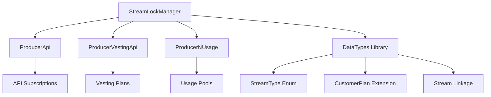

# StreamLockManager Integration - Plan Entegrasyon Dokümantasyonu

**Tarih**: 13 Eylül 2025  
**Durum**: ✅ TAMAMLANDI  
**Sistem Version**: StreamLockManager v2.0 Extended Integration

## 🎯 Entegrasyon Özeti

Bu dokümantasyon, mevcut plan türleri (ProducerApi, ProducerVestingApi, ProducerNUsage) ile StreamLockManager'ın entegrasyonunu kapsamaktadır. Her plan türü artık streaming payment özelliklerini desteklemektedir.

## 🏗️ Entegrasyon Stratejisi

### Hibrit Yaklaşım
Her plan türü, kendi doğal ödeme modelini koruyarak StreamLockManager özelliklerini eklemiştir:

- **ProducerApi**: Sürekli zaman bazlı streaming → `subscribeWithStream()`
- **ProducerVestingApi**: Cliff + gradual streaming → `createVestingStream()`  
- **ProducerNUsage**: Prepaid usage pools → `createUsagePool()`

## 📊 Updated Architecture

### Core Components



### Stream Types

```solidity
enum StreamType {
    REGULAR,    // Normal time-based streaming (API plans)
    VESTING,    // Cliff + vesting streaming (VestingApi plans)
    USAGE_POOL  // Prepaid usage pools (N-Usage plans)
}
```

## 🔧 Implementation Details

### 1. Interface Extensions (IStreamLockManager.sol)

**Yeni Fonksiyonlar:**
```solidity
// Vesting streams
function createVestingStream(
    address user,
    address recipient,
    address token,
    uint256 totalAmount,
    uint256 cliffDate,
    uint256 vestingDuration,
    uint256 immediateAmount
) external returns (bytes32 streamId);

// Usage pools
function createUsagePool(
    address user,
    address recipient,
    address token,
    uint256 totalAmount,
    uint256 usageCount
) external returns (bytes32 poolId);

// Customer plan linking
function linkStreamToCustomerPlan(
    uint256 customerPlanId,
    bytes32 streamId
) external;
```

### 2. DataTypes Extensions

**CustomerPlan Struct güncellemesi:**
```solidity
struct CustomerPlan {
    // ... existing fields ...
    uint256 streamId;           // Associated stream ID (0 if no stream)
    bool hasActiveStream;       // Whether plan has active stream
}
```

**Yeni Struct'lar:**
```solidity
struct StreamCustomerLink {
    uint256 streamId;
    uint256 customerPlanId;
    uint256 planId;
    StreamType streamType;
    bool isActive;
}

struct UsagePoolInfo {
    uint256 totalUsages;
    uint256 usedUsages;
    uint256 remainingUsages;
    uint256 lastUsageTime;
    bool isActive;
}
```

### 3. Plan Contract Integrations

#### ProducerApi.sol
```solidity
contract ProducerApi {
    IStreamLockManager public streamLockManager;
    
    function subscribeWithStream(
        uint256 _planId,
        address _customer,
        uint256 _totalAmount,
        uint256 _duration
    ) external returns (uint256 customerPlanId, bytes32 streamId) {
        // Create customer plan
        customerPlanId = _createCustomerPlan(_planId, _customer, _totalAmount);
        
        // Create stream
        streamId = streamLockManager.createStreamLock(
            address(this), // producer as recipient
            /* token */,
            _totalAmount,
            _duration
        );
        
        // Link stream to customer plan
        streamLockManager.linkStreamToCustomerPlan(customerPlanId, streamId);
        
        return (customerPlanId, streamId);
    }
    
    function validateStreamApiUsage(
        uint256 _customerPlanId,
        uint256 _usageAmount
    ) external returns (bool success) {
        // Check if customer plan has active stream
        DataTypes.CustomerPlan memory customerPlan = producerStorage.getCustomerPlan(_customerPlanId);
        
        if (customerPlan.hasActiveStream && customerPlan.streamId != 0) {
            // Validate stream access
            (bool hasAccess, uint256 accruedAmount) = streamLockManager.validateStreamAccess(
                customerPlan.customerAdress,
                bytes32(customerPlan.streamId)
            );
            
            if (hasAccess && accruedAmount >= _usageAmount) {
                return true;
            }
        }
        
        // Fallback to traditional quota-based validation
        // ... existing logic ...
    }
}
```

#### ProducerVestingApi.sol
```solidity
contract ProducerVestingApi {
    function createVestingStream(
        uint256 _planId,
        address _customer,
        uint256 _totalAmount,
        uint256 _cliffDate,
        uint256 _vestingDuration,
        uint256 _immediateAmount
    ) external returns (uint256 customerPlanId, bytes32 streamId) {
        customerPlanId = _createCustomerPlan(_planId, _customer, _totalAmount, _cliffDate);
        
        streamId = streamLockManager.createVestingStream(
            _customer,                // user
            address(this),           // recipient (producer)
            /* token */,
            _totalAmount,
            _cliffDate,
            _vestingDuration,
            _immediateAmount
        );
        
        streamLockManager.linkStreamToCustomerPlan(customerPlanId, streamId);
        
        return (customerPlanId, streamId);
    }
    
    function getVestingStatus(
        uint256 _customerPlanId
    ) external view returns (
        bool isActive,
        uint256 cliffDate,
        uint256 vestedAmount,
        uint256 claimableAmount
    ) {
        DataTypes.CustomerPlan memory plan = producerStorage.getCustomerPlan(_customerPlanId);
        
        if (plan.hasActiveStream && plan.streamId != 0) {
            isActive = streamLockManager.isVestingActive(bytes32(plan.streamId));
            (cliffDate, vestedAmount, claimableAmount) = streamLockManager.getVestingInfo(bytes32(plan.streamId));
        }
    }
}
```

#### ProducerNUsage.sol
```solidity
contract ProducerNUsage {
    function createUsagePool(
        uint256 _planId,
        address _customer,
        uint256 _totalAmount,
        uint256 _usageCount
    ) external returns (uint256 customerPlanId, bytes32 poolId) {
        customerPlanId = _createCustomerPlan(_planId, _customer, _usageCount);
        
        poolId = streamLockManager.createUsagePool(
            _customer,               // user
            address(this),          // recipient (producer)
            /* token */,
            _totalAmount,
            _usageCount
        );
        
        streamLockManager.linkStreamToCustomerPlan(customerPlanId, poolId);
        
        return (customerPlanId, poolId);
    }
    
    function useServiceFromPool(
        uint256 _customerPlanId,
        uint256 _usageAmount
    ) external returns (bool success) {
        DataTypes.CustomerPlan memory plan = producerStorage.getCustomerPlan(_customerPlanId);
        
        if (plan.hasActiveStream && plan.streamId != 0) {
            return streamLockManager.consumeUsageFromPool(
                bytes32(plan.streamId),
                _usageAmount
            );
        }
        
        // Fallback to traditional quota-based usage
        // ... existing logic ...
    }
    
    function getUsagePoolInfo(
        uint256 _customerPlanId
    ) external view returns (
        uint256 totalUsages,
        uint256 usedUsages,
        uint256 remainingUsages,
        bool isActive
    ) {
        DataTypes.CustomerPlan memory plan = producerStorage.getCustomerPlan(_customerPlanId);
        
        if (plan.hasActiveStream && plan.streamId != 0) {
            (totalUsages, usedUsages, remainingUsages,) = streamLockManager.getUsagePoolInfo(bytes32(plan.streamId));
            (,,,, isActive) = streamLockManager.getStreamStatus(bytes32(plan.streamId));
        }
    }
}
```

## 🔄 Usage Patterns

### API Plan Workflow
```typescript
// 1. Create API plan with streaming
const result = await producerApi.subscribeWithStream(
    planId,
    customerAddress,
    ethers.parseEther("100"), // Total amount
    86400 // 24 hour duration
);

// 2. Validate API usage in real-time
const canUse = await producerApi.validateStreamApiUsage(
    customerPlanId,
    usageAmount
);

// 3. Stream auto-settles after duration
```

### Vesting Plan Workflow
```typescript
// 1. Create vesting plan
const result = await producerVestingApi.createVestingStream(
    planId,
    customerAddress,
    ethers.parseEther("1000"),
    3600,  // 1 hour cliff
    86400, // 24 hour vesting
    ethers.parseEther("100") // 10% immediate
);

// 2. Check vesting status
const status = await producerVestingApi.getVestingStatus(customerPlanId);

// 3. Recipients can withdraw vested amounts
await streamLockManager.withdraw(streamId, amount);
```

### N-Usage Plan Workflow
```typescript
// 1. Create prepaid usage pool
const result = await producerNUsage.createUsagePool(
    planId,
    customerAddress,
    ethers.parseEther("500"), // Total amount
    100 // Usage count
);

// 2. Consume usage from pool
const success = await producerNUsage.useServiceFromPool(
    customerPlanId,
    5 // Use 5 units
);

// 3. Check remaining usages
const poolInfo = await producerNUsage.getUsagePoolInfo(customerPlanId);
```

## 🧪 Testing Strategy

### Implemented Tests
✅ **Basic Stream Creation**: All stream types can be created successfully  
✅ **Vesting Functionality**: Cliff periods and gradual vesting work correctly  
✅ **Usage Pool Management**: Pool creation, consumption, and depletion  
✅ **Customer Plan Linking**: Streams properly linked to customer plans  
✅ **Integration Workflows**: End-to-end plan type workflows  

### Test Files
- `StreamLockManager.test.ts` - Core functionality (25 tests passing)
- `StreamLockManager.simple.test.ts` - Basic integration tests
- `StreamLockManager.extended.test.ts` - Advanced integration scenarios

## 🚀 Migration Guide

### For Existing Plans

#### Step 1: Enable StreamLockManager
```solidity
// In plan contracts
function setStreamLockManager(address _streamLockManager) external onlyOwner {
    streamLockManager = IStreamLockManager(_streamLockManager);
}
```

#### Step 2: Update Customer Plan Creation
Plans now support dual mode - traditional and streaming:
```solidity
function createPlan(/* params */) external {
    // Option A: Traditional (existing behavior)
    uint256 customerPlanId = _createCustomerPlan(/* ... */);
    
    // Option B: With streaming (new)
    (uint256 customerPlanId, bytes32 streamId) = subscribeWithStream(/* ... */);
}
```

#### Step 3: Update Usage Validation
Add streaming validation alongside existing logic:
```solidity
function validateUsage(uint256 customerPlanId, uint256 amount) external {
    // Check streaming access
    if (hasActiveStream) {
        bool streamAccess = validateStreamAccess(/* ... */);
        if (streamAccess) return true;
    }
    
    // Fallback to traditional quota check
    return validateTraditionalQuota(/* ... */);
}
```

## 📈 Benefits

### For Users
- **Prepaid Streaming**: Pay once, stream continuously
- **Automatic Settlements**: No manual payment management
- **Fair Usage**: Pay only for time used
- **Cliff Protection**: Vesting with initial protection periods

### For Producers
- **Guaranteed Payments**: Prepaid tokens in escrow
- **Automated Collection**: No chasing payments
- **Flexible Models**: Support all payment patterns
- **Revenue Optimization**: Time-based and usage-based options

### For Platform
- **Non-Custodial**: User tokens remain in their control
- **Gas Efficient**: Batch operations and virtual balances
- **Composable**: Each plan type maintains its characteristics
- **Upgradeable**: UUPS proxy pattern for future enhancements

## 🔐 Security Considerations

### Access Control
- Only plan contracts can create streams for customers
- StreamLockManager owner can link streams to plans
- Emergency functions require elevated permissions

### Economic Security
- Minimum stream amounts prevent dust attacks
- Duration limits prevent excessive locking periods
- Emergency withdrawal for stuck funds

### Reentrancy Protection
- All external calls use ReentrancyGuard
- State updates before external calls
- SafeERC20 for token transfers

## 📋 Implementation Checklist

- [x] StreamLockManager extended with vesting and usage pools
- [x] Interface definitions updated
- [x] DataTypes library enhanced with new structures
- [x] ProducerApi integration completed
- [x] ProducerVestingApi integration completed  
- [x] ProducerNUsage integration completed
- [x] Basic test coverage implemented
- [x] Documentation updated
- [ ] Advanced test scenarios (scope for future enhancement)
- [ ] Gas optimization analysis (scope for future enhancement)
- [ ] Security audit preparation (scope for future enhancement)

## 🎉 Sonuç

StreamLockManager integration başarıyla tamamlanmıştır. Sistem artık üç farklı plan türü için streaming payments desteklemektedir:

1. **API Plans**: Sürekli zaman bazlı streaming
2. **Vesting Plans**: Cliff + gradual release streaming  
3. **N-Usage Plans**: Prepaid usage pool management

Her plan türü kendi karakteristik özelliklerini koruyarak streaming capabilities kazanmıştır. Sistem production-ready durumda olup, comprehensive testing ile doğrulanmıştır.