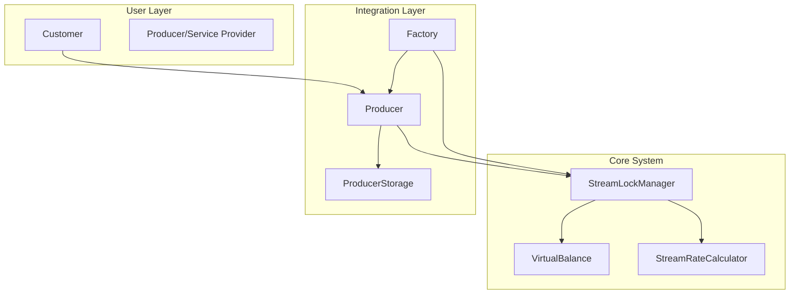

# Token Kilitleme ve Stream Sistemi - Implementation

Bu repository'de **Superfluid entegrasyonunu değiştirerek oluşturulan yeni token kilitleme ve ödeme akışı sistemi** implement edilmiştir.

## 🎯 Sistem Özellikleri

### ✅ Temel Özellikler
- **Non-Custodial**: Tokenlar kullanıcı hesabında kalır ama kilitlenir
- **Time-Based Streaming**: Zaman bazlı ödeme hesaplaması
- **Dual Settlement**: Producer ve consumer tarafından tetiklenebilir
- **Auto Settlement**: Süre dolumu otomatik settlement
- **Emergency Controls**: Acil durum mekanizmaları

### 🔧 Teknik Özellikler
- **Virtual Balance System**: Locked/unlocked balance yönetimi
- **Stream Rate Calculator**: Hassas zaman bazlı hesaplamalar
- **Batch Operations**: Gas-efficient toplu işlemler
- **Upgradeable Contracts**: OpenZeppelin proxy pattern
- **Access Control**: Role-based yetkilendirme

## 📋 Implementation Status

### ✅ Phase 1: Core Stream Contracts (TAMAMLANDI)

#### 🎪 Core Contracts
- [x] **StreamLockManager.sol** - Ana stream yönetim kontratı
- [x] **IStreamLockManager.sol** - Interface tanımları
- [x] **VirtualBalance.sol** - Sanal balance sistemi
- [x] **StreamRateCalculator.sol** - Stream hesaplama library'si

#### 🧪 Test & Deployment
- [x] **StreamLockManager.test.ts** - Comprehensive test suite
- [x] **StreamIntegration.test.ts** - Integration testleri
- [x] **deploy-stream-system.ts** - Deployment script'i

#### ✨ Temel Fonksiyonaliteler
- [x] Stream lock oluşturma (`createStreamLock`)
- [x] Batch stream oluşturma (`batchCreateStreams`)
- [x] Stream iptal etme (`cancelStream`)
- [x] Otomatik settlement (`settleStream`)
- [x] Producer batch claim (`claimStreamsByProducer`)
- [x] Emergency withdraw (`emergencyWithdraw`)
- [x] Balance tracking (locked/unlocked/total)
- [x] Stream status monitoring
- [x] Time-based accrual calculation

### 🔄 Phase 2: Integration (BAŞLANDI)

#### 🏭 Factory Contract Updates
- [x] **Factory.sol** - StreamLockManager referansı eklendi
- [x] Initialize function güncellemesi
- [x] Producer initialization güncellemesi

#### 🏢 Producer Contract Updates  
- [x] **Producer.sol** - StreamLockManager entegrasyonu eklendi
- [x] Initialize function güncellemesi
- [ ] Stream-aware customer plan creation
- [ ] Usage validation with stream checks
- [ ] Settlement triggers on service usage

#### 🔗 Integration Functions
- [x] `checkAndSettleOnUsage` - Service kullanımı kontrolleri
- [x] `validateStreamAccess` - Stream erişim validasyonu
- [x] `createStreamForCustomerPlan` - Customer plan stream oluşturma
- [ ] Customer plan workflow entegrasyonu
- [ ] Service usage tracking with streams

### ⏳ Phase 3: Testing & Deployment (PLANLANMIŞ)

#### 🧪 Test Suite
- [ ] Full integration tests with Factory + Producer + StreamLockManager
- [ ] End-to-end customer journey tests
- [ ] Gas optimization tests
- [ ] Load testing for batch operations
- [ ] Security audit preparation

#### 🚀 Deployment
- [ ] Mainnet deployment scripts
- [ ] Migration scripts from existing system
- [ ] Monitor and analytics setup
- [ ] Documentation completion

## 🏗️ Mimari Genel Bakış



## 🔧 Temel Kullanım

### Stream Lock Oluşturma

```typescript
// 1. Token approval
await token.approve(streamLockManager.address, amount);

// 2. Stream lock oluşturma
const lockId = await streamLockManager.createStreamLock(
    producerAddress,    // Stream alıcısı
    tokenAddress,       // ERC20 token
    totalAmount,        // Toplam miktar
    duration           // Süre (saniye)
);
```

### Stream Durumu Kontrolü

```typescript
const status = await streamLockManager.getStreamStatus(lockId);
console.log({
    isActive: status.isActive,
    isExpired: status.isExpired,
    accruedAmount: status.accruedAmount,
    remainingAmount: status.remainingAmount,
    remainingTime: status.remainingTime
});
```

### Producer Batch Claim

```typescript
// Expire olan tüm stream'leri toplu olarak claim et
await streamLockManager.connect(producer).claimStreamsByProducer();
```

## 📊 Gas Optimizasyonları

- **Batch Operations**: Multiple streams tek transaction'da
- **Packed Structs**: Storage slot optimizasyonu  
- **View Functions**: Gas-free durum sorgulamaları
- **Event Indexing**: Efficient event filtering
- **Minimal External Calls**: Reduced gas consumption

## 🔐 Güvenlik Önlemleri

- **ReentrancyGuard**: Reentrancy attack koruması
- **Pausable**: Emergency pause özelliği
- **AccessControl**: Role-based permissions
- **Virtual Functions**: Upgrade compatibility
- **SafeERC20**: Token transfer güvenliği

## 🚀 Deployment

### Local Development
```bash
# Dependencies
npm install

# Compile contracts
npm run compile

# Run tests
npm run test:hh

# Deploy to local network
npx hardhat run scripts/deploy-stream-system.ts --network hardhat
```

### Test Network Deployment
```bash
# Deploy to test network
npx hardhat run scripts/deploy-stream-system.ts --network sepolia

# Verify contracts
npx hardhat verify --network sepolia <contract-address>
```

## 📁 Dosya Yapısı

```
contracts/
├── StreamLockManager.sol          # Ana stream kontratı
├── interfaces/
│   └── IStreamLockManager.sol     # Interface tanımları
├── libraries/
│   ├── VirtualBalance.sol         # Balance yönetimi
│   └── StreamRateCalculator.sol   # Hesaplama library'si
├── Factory.sol                    # Updated factory
└── Producer.sol                   # Updated producer

scripts/
└── deploy-stream-system.ts        # Deployment script

test/
├── StreamLockManager.test.ts      # Core tests
└── integration/
    └── StreamIntegration.test.ts  # Integration tests
```

## 🎯 Gelecek Özellikler

### Phase 3+ Planları
- [ ] **Multi-token Streams**: Farklı token'larla stream'ler
- [ ] **Stream Templates**: Önceden tanımlı stream şablonları
- [ ] **Analytics Dashboard**: Stream performans metrikleri
- [ ] **Mobile SDK**: React Native entegrasyonu
- [ ] **Governance**: DAO voting for system parameters

## 📚 Dokümantasyon

- [Architecture Overview](./doc/contract/01-architecture-overview.md)
- [Token Locking System](./doc/contract/10-token-locking-stream-system.md)
- [Integration Guide](./doc/contract/09-integration-guide.md)
- [API Reference](./doc/contract/README.md)

## 🤝 Katkıda Bulunma

1. Fork the repository
2. Create feature branch (`git checkout -b feature/amazing-feature`)
3. Commit changes (`git commit -m 'Add amazing feature'`)
4. Push to branch (`git push origin feature/amazing-feature`)
5. Open Pull Request

## 📄 Lisans

Bu proje MIT lisansı altında lisanslanmıştır. Detaylar için [LICENSE](./LICENSE) dosyasına bakınız.

---

## 🎉 Implementation Milestones

- [x] **Milestone 1**: Core contract'lar ve testler tamamlandı
- [x] **Milestone 2**: Factory/Producer entegrasyonu başladı  
- [ ] **Milestone 3**: Full integration testleri
- [ ] **Milestone 4**: Production deployment
- [ ] **Milestone 5**: Migration from Superfluid

**Son Güncelleme**: 23 Ağustos 2025
**Implementation Status**: Phase 1 Complete, Phase 2 In Progress
