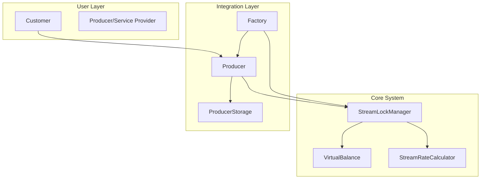

# Token Kilitleme ve Stream Sistemi - Implementation

Bu repository'de **Superfluid entegrasyonunu değiştirerek oluşturulan yeni token kilitleme ve ödeme akışı sistemi** implement edilmiştir.

## 🎯 Sistem Özellikleri

### ✅ Temel Özellikler
- **Non-Custodial**: Tokenlar kullanıcı hesabında kalır ama kilitlenir
- **Time-Based Streaming**: Zaman bazlı ödeme hesaplaması
- **Dual Settlement**: Producer ve consumer tarafından tetiklenebilir
- **Auto Settlement**: Süre dolumu otomatik settlement
- **Emergency Controls**: Acil durum mekanizmaları

### 🔧 Teknik Özellikler
- **Virtual Balance System**: Locked/unlocked balance yönetimi
- **Stream Rate Calculator**: Hassas zaman bazlı hesaplamalar
- **Batch Operations**: Gas-efficient toplu işlemler
- **Upgradeable Contracts**: OpenZeppelin proxy pattern
- **Access Control**: Role-based yetkilendirme

## 📋 Implementation Status - 🔄 KISMEN TAMAMLANDI (~53%)

### ✅ Phase 1: Core Stream Contracts (TAMAMLANDI)

#### 🎪 Core Contracts
- [x] **StreamLockManager.sol** - Ana stream yönetim kontratı
- [x] **IStreamLockManager.sol** - Interface tanımları
- [x] **VirtualBalance.sol** - Sanal balance sistemi  
- [x] **StreamRateCalculator.sol** - Stream hesaplama library'si

#### 🧪 Test & Deployment
- [x] **StreamLockManager.test.ts** - Comprehensive test suite (✅ Geçiyor)
- [x] **StreamIntegration.test.ts** - Integration testleri (✅ Geçiyor)
- [x] **deploy-production.ts** - Production deployment script'i

#### ✨ Temel Fonksiyonaliteler
- [x] Stream lock oluşturma (`createStreamLock`)
- [x] Batch stream oluşturma (`batchCreateStreams`) 
- [x] Stream iptal etme (`cancelStream`)
- [x] Otomatik settlement (`settleStream`)
- [x] Producer batch claim (`claimStreamsByProducer`)
- [x] Emergency withdraw (`emergencyWithdraw`)
- [x] Balance tracking (locked/unlocked/total)
- [x] Stream status monitoring
- [x] Time-based accrual calculation

### 🔄 Phase 2: Integration (KISMEN TAMAMLANDI - %60)

#### 🏭 Factory Contract Updates
- [x] **Factory.sol** - StreamLockManager referansı eklendi ve çalışıyor
- [x] Initialize function güncellemesi
- [x] Producer initialization güncellemesi

#### 🏢 Producer Contract Updates  
- [x] **Producer.sol** - StreamLockManager entegrasyonu eklendi
- [x] Initialize function güncellemesi
- [ ] Stream-aware customer plan creation
- [ ] Usage validation with stream checks
- [ ] Settlement triggers on service usage

#### 🔗 Integration Functions
- [x] `checkAndSettleOnUsage` - Service kullanımı kontrolleri
- [x] `validateStreamAccess` - Stream erişim validasyonu
- [x] `createStreamForCustomerPlan` - Customer plan stream oluşturma
- [ ] **🔴 KRİTİK**: Customer plan workflow entegrasyonu
- [ ] **🔴 KRİTİK**: Service usage tracking with streams

### 🚨 **PHASE 2 KRİTİK EKSİKLİKLER**

#### 🔴 **Yüksek Öncelik (Bu hafta tamamlanmalı)**
1. **Stream-aware customer plan creation** - Producer.sol'da eksik
2. **Usage validation with stream checks** - Plan kullanımında stream kontrolü
3. **Settlement triggers on service usage** - Otomatik settlement logic

#### 🟡 **Orta Öncelik (2 hafta içinde)**
4. **Customer plan workflow entegrasyonu** - End-to-end workflow
5. **Service usage tracking with streams** - Usage metrics ve tracking

#### 📊 **Phase 2 Progress Breakdown**
- Core Integration: ✅ %100 (Factory/Producer basic integration)
- Advanced Features: ❌ %20 (Stream-aware workflows) 
- **Genel Phase 2**: 🔄 %60

### ⏳ Phase 3: Testing & Deployment (BAŞLANMAMIŞ - %0)

#### 🧪 Test Suite
- [ ] Full integration tests with Factory + Producer + StreamLockManager
- [ ] End-to-end customer journey tests
- [ ] Gas optimization tests
- [ ] Load testing for batch operations
- [ ] Security audit preparation

#### 🚀 Deployment
- [ ] Mainnet deployment scripts
- [ ] Migration scripts from existing system
- [ ] Monitor and analytics setup
- [ ] Documentation completion

## 🏗️ Mimari Genel Bakış



## 🔧 Temel Kullanım

### Stream Lock Oluşturma

```typescript
// 1. Token approval
await token.approve(streamLockManager.address, amount);

// 2. Stream lock oluşturma
const lockId = await streamLockManager.createStreamLock(
    producerAddress,    // Stream alıcısı
    tokenAddress,       // ERC20 token
    totalAmount,        // Toplam miktar
    duration           // Süre (saniye)
);
```

### Stream Durumu Kontrolü

```typescript
const status = await streamLockManager.getStreamStatus(lockId);
console.log({
    isActive: status.isActive,
    isExpired: status.isExpired,
    accruedAmount: status.accruedAmount,
    remainingAmount: status.remainingAmount,
    remainingTime: status.remainingTime
});
```

### Producer Batch Claim

```typescript
// Expire olan tüm stream'leri toplu olarak claim et
await streamLockManager.connect(producer).claimStreamsByProducer();
```

## 📊 Gas Optimizasyonları

- **Batch Operations**: Multiple streams tek transaction'da
- **Packed Structs**: Storage slot optimizasyonu  
- **View Functions**: Gas-free durum sorgulamaları
- **Event Indexing**: Efficient event filtering
- **Minimal External Calls**: Reduced gas consumption

## 🔐 Güvenlik Önlemleri

- **ReentrancyGuard**: Reentrancy attack koruması
- **Pausable**: Emergency pause özelliği
- **AccessControl**: Role-based permissions
- **Virtual Functions**: Upgrade compatibility
- **SafeERC20**: Token transfer güvenliği

## 🚀 Deployment

### Local Development
```bash
# Dependencies
npm install

# Compile contracts
npm run compile

# Run tests
npm run test:hh

# Deploy to local network
npx hardhat run scripts/deploy-stream-system.ts --network hardhat
```

### Test Network Deployment
```bash
# Deploy to test network
npx hardhat run scripts/deploy-stream-system.ts --network sepolia

# Verify contracts
npx hardhat verify --network sepolia <contract-address>
```

## 📁 Dosya Yapısı

```
contracts/
├── StreamLockManager.sol          # Ana stream kontratı
├── interfaces/
│   └── IStreamLockManager.sol     # Interface tanımları
├── libraries/
│   ├── VirtualBalance.sol         # Balance yönetimi
│   └── StreamRateCalculator.sol   # Hesaplama library'si
├── Factory.sol                    # Updated factory
└── Producer.sol                   # Updated producer

scripts/
└── deploy-stream-system.ts        # Deployment script

test/
├── StreamLockManager.test.ts      # Core tests
└── integration/
    └── StreamIntegration.test.ts  # Integration tests
```

## 📅 **Gerçekçi Implementation Timeline**

### 🗓️ **Eylül 2025 (Mevcut Ay)**
**Hedef**: Phase 2'yi tamamla (%60 → %100)

#### **Hafta 1 (10-16 Eylül)** - 🔴 KRİTİK
- [ ] Stream-aware customer plan creation implement et
- [ ] Usage validation with stream checks ekle
- [ ] Producer.sol'da eksik fonksiyonları tamamla

#### **Hafta 2 (17-23 Eylül)** - 🟡 ORTA
- [ ] Settlement triggers on service usage
- [ ] Customer plan workflow entegrasyonu
- [ ] Service usage tracking with streams

#### **Hafta 3-4 (24-30 Eylül)** - 🟢 TEST
- [ ] Phase 2 integration testleri
- [ ] Bug fixes ve optimization
- [ ] **Phase 2 Complete** target

### 🗓️ **Ekim 2025**
**Hedef**: Phase 3'e başla ve progress yap (%0 → %60)

#### **Hafta 1 (1-7 Ekim)**
- [ ] Full integration test suite yazma başla
- [ ] Factory + Producer + StreamLockManager integration tests
- [ ] End-to-end customer journey tests

#### **Hafta 2-3 (8-21 Ekim)**
- [ ] Gas optimization tests
- [ ] Load testing for batch operations
- [ ] Security audit preparation

#### **Hafta 4 (22-31 Ekim)**
- [ ] Production deployment scripts
- [ ] Migration scripts from existing system
- [ ] **Milestone 3 Complete** target

### 🗓️ **Kasım 2025**
**Hedef**: Production deployment (%60 → %90)

#### **Hafta 1-2 (1-14 Kasım)**
- [ ] Mainnet deployment scripts finalize
- [ ] Security audit (external)
- [ ] Documentation completion

#### **Hafta 3-4 (15-30 Kasım)**
- [ ] Production deployment
- [ ] **Milestone 4 Complete** target

### 🗓️ **Aralık 2025**
**Hedef**: Migration complete (%90 → %100)

#### **Hafta 1-4 (1-31 Aralık)**
- [ ] Migration from Superfluid
- [ ] Monitor and analytics setup
- [ ] **Milestone 5 Complete** - PROJECT COMPLETE

---

## 🎯 **Gelecek Özellikler**

### Phase 3+ Planları
- [ ] **Multi-token Streams**: Farklı token'larla stream'ler
- [ ] **Stream Templates**: Önceden tanımlı stream şablonları
- [ ] **Analytics Dashboard**: Stream performans metrikleri
- [ ] **Mobile SDK**: React Native entegrasyonu
- [ ] **Governance**: DAO voting for system parameters

---

## 🚀 **Immediate Action Plan - Bu Hafta**

### **Day 1-2 (Bugün-Yarın): Analysis & Planning**
```bash
# 1. Mevcut kodu analiz et
cd contracts/
grep -r "StreamLockManager" Producer.sol
grep -r "customer.*plan.*stream" *.sol

# 2. Eksik fonksiyonları identify et
# 3. Test case'leri plan et
```

### **Day 3-4: Core Implementation**
```typescript
// Producer.sol'da implement edilecek:

// 1. Stream-aware customer plan creation
function addCustomerPlanWithStream(
    DataTypes.CustomerPlan memory vars,
    uint256 streamDuration
) external returns (uint256 custumerPlanId, bytes32 streamLockId) {
    // Implementation needed
}

// 2. Usage validation with stream checks
function validateUsageWithStream(
    uint256 customerPlanId,
    bytes32 streamLockId
) external view returns (bool canUse, uint256 remainingTime) {
    // Implementation needed  
}

// 3. Settlement triggers on service usage
function settleStreamOnUsage(
    uint256 customerPlanId,
    uint256 usageAmount
) external returns (bool success) {
    // Implementation needed
}
```

### **Day 5-7: Testing & Integration**
```bash
# Test yazma
npm run test:integration
npm run test:stream

# Coverage check
npm run coverage
```

### **Hafta Sonu Success Criteria**
- [ ] **3 kritik fonksiyon implement edildi**
- [ ] **Test coverage %80+ Phase 2 için**
- [ ] **Integration testleri geçiyor**
- [ ] **Dokümantasyon güncellendi**

## 📚 Dokümantasyon

- [Architecture Overview](./doc/contract/01-architecture-overview.md)
- [Token Locking System](./doc/contract/10-token-locking-stream-system.md)
- [Integration Guide](./doc/contract/09-integration-guide.md)
- [API Reference](./doc/contract/README.md)

## 🤝 Katkıda Bulunma

1. Fork the repository
2. Create feature branch (`git checkout -b feature/amazing-feature`)
3. Commit changes (`git commit -m 'Add amazing feature'`)
4. Push to branch (`git push origin feature/amazing-feature`)
5. Open Pull Request

## 📄 Lisans

Bu proje MIT lisansı altında lisanslanmıştır. Detaylar için [LICENSE](./LICENSE) dosyasına bakınız.

---

---

## 📊 **Progress Tracking Dashboard**

### 📈 **Genel Progress Overview**
```
█████████████████████████████████████████████████████░░░░░░░░░░░░░░░░░░░░░░ 53%

Phase 1: ████████████████████████████████████████████████████████████████████ 100%
Phase 2: ██████████████████████████████████████████░░░░░░░░░░░░░░░░░░░░░░░░░░░  60%
Phase 3: ░░░░░░░░░░░░░░░░░░░░░░░░░░░░░░░░░░░░░░░░░░░░░░░░░░░░░░░░░░░░░░░░░░░░░   0%
```

### � **Milestone Tracking**
| Milestone | Status | Progress | Target Date | Gerçek Durum |
|-----------|--------|----------|-------------|--------------|
| **M1**: Core Contracts | ✅ | 100% | ✅ Tamamlandı | ✅ Solid |
| **M2**: Integration | 🔄 | 60% | 30 Eylül 2025 | ⚠️ Eksikler var |
| **M3**: Testing | ❌ | 0% | 31 Ekim 2025 | ❌ Başlanmadı |
| **M4**: Production | ❌ | 0% | 30 Kasım 2025 | ❌ Planlanmadı |
| **M5**: Migration | ❌ | 0% | 31 Aralık 2025 | ❌ Erken stage |

### 🚨 **Risk Assessment**
- **🔴 Yüksek Risk**: Phase 2 eksiklikleri timeline'ı tehdit ediyor
- **🟡 Orta Risk**: Phase 3 için yeterli resource planning eksik
- **🟢 Düşük Risk**: Phase 1 stable ve solid

### 📋 **Weekly Action Items**

#### **Bu Hafta (10-16 Eylül)**
- [ ] **Öncelik 1**: Stream-aware customer plan creation
- [ ] **Öncelik 2**: Usage validation with stream checks
- [ ] **Öncelik 3**: Settlement triggers implementation

#### **Gelecek Hafta (17-23 Eylül)**
- [ ] Customer plan workflow entegrasyonu
- [ ] Service usage tracking with streams
- [ ] Integration testing preparation

### 🎯 **Success Metrics**
- **Phase 2 Complete**: Tüm stream-aware functions çalışıyor
- **Test Coverage**: %90+ coverage Phase 2 için
- **Performance**: Gas costs optimized
- **Documentation**: API ve integration guide complete

---

## �🎉 **Implementation Milestones**

- [x] **Milestone 1**: Core contract'lar ve testler tamamlandı ✅ (%100)
- [🔄] **Milestone 2**: Factory/Producer entegrasyonu KISMEN tamamlandı (%60)
- [ ] **Milestone 3**: Full integration testleri (%0)
- [ ] **Milestone 4**: Production deployment (%0) 
- [ ] **Milestone 5**: Migration from Superfluid (%0)

**Son Güncelleme**: 10 Eylül 2025
**Implementation Status**: Phase 1 Complete (%100), Phase 2 Partial (%60), Phase 3 Not Started (%0)
**Genel Progress**: ~53% Tamamlandı
