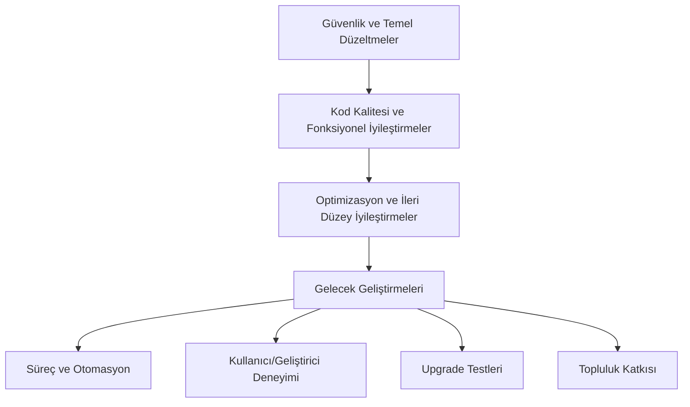

# Akıllı Kontrat Geliştirme Planı

## 1. Giriş

Bu geliştirme planı, `contracts` klasöründeki mevcut Solidity akıllı kontrat kod tabanı ve `contracts_documentation.md` dosyasında belirtilen öneriler dikkate alınarak oluşturulmuştur. Plan, kod tabanının güvenliğini, verimliliğini, bakım kolaylığını ve genel kalitesini artırmayı amaçlayan bir dizi eylemi ve önceliği özetlemektedir.

## 2. Önceliklendirme

Geliştirme görevleri aşağıdaki öncelik seviyelerine göre sınıflandırılmıştır:

*   **Yüksek Öncelik**: Sistemin güvenliği, temel işlevselliği veya kullanıcı deneyimi için kritik olan, acil dikkat gerektiren maddeler.
*   **Orta Öncelik**: Sistemin kalitesini, verimliliğini veya bakım kolaylığını önemli ölçüde artıracak, ancak acil olmayan maddeler.
*   **Düşük Öncelik**: Gelecekteki geliştirmeler veya küçük iyileştirmeler için değerlendirilebilecek maddeler.

## 3. Geliştirme Alanları ve Görevler

### 3.1. Güvenlik ve Sağlamlık

Bu alan, kontratların güvenliğini artırmaya ve beklenmedik davranışlara karşı daha dirençli hale getirmeye odaklanır.

*   **Görev 1.1: Kapsamlı Test Kapsamının Artırılması (Yüksek Öncelik)**
    *   **Açıklama**: Mevcut testlerin gözden geçirilmesi ve eksik kalan senaryolar için yeni birim ve entegrasyon testlerinin yazılması. Özellikle erişim kontrolü, yeniden giriş (reentrancy), aritmetik taşmalar, mantıksal hatalar, ekonomik saldırı vektörleri ve kenar durumlar (edge cases) kapsamalıdır.
    *   **İlgili Kontratlar**: Tümü.
    *   **Önerilen Eylem**: Test kapsamı araçları (örn: `solidity-coverage`) kullanarak mevcut kapsamı belirleyin. Eksik alanlar için detaylı test senaryoları oluşturun ve uygulayın.

*   **Görev 1.2: Profesyonel Güvenlik Denetimi (Yüksek Öncelik)**
    *   **Açıklama**: Ana ağa (mainnet) dağıtımdan önce, kod tabanının tamamının saygın bir güvenlik firması tarafından denetlenmesi.
    *   **İlgili Kontratlar**: Tümü.
    *   **Önerilen Eylem**: Güvenlik denetimi için bütçe ve zaman planlaması yapın. Denetim firmasıyla iletişime geçin.

*   **Görev 1.3: Girdi Doğrulamalarının Gözden Geçirilmesi ve İyileştirilmesi (Orta Öncelik)**
    *   **Açıklama**: Tüm `public` ve `external` fonksiyonlardaki girdi parametrelerinin (örn: `address(0)` kontrolü, sayısal değerler için mantıksal aralıklar) titizlikle doğrulanması.
    *   **İlgili Kontratlar**: Tümü.
    *   **Önerilen Eylem**: Her fonksiyonun girdilerini analiz edin ve eksik doğrulamaları ekleyin.

*   **Görev 1.4: `DelegateCall.sol` - `onlyProxy` Kontrolünün Değerlendirilmesi (Orta Öncelik)**
    *   **Açıklama**: `onlyProxy` değiştiricisindeki yorum satırında bulunan `_getImplementation() != __self` kontrolünün kasıtlı olup olmadığının değerlendirilmesi. Eğer mantık kontratının yalnızca aktif proxy uygulaması tarafından çağrılması hedefleniyorsa, bu kontrolün aktif edilmesi.
    *   **İlgili Kontratlar**: `DelegateCall.sol`.
    *   **Önerilen Eylem**: Kontrolün amacını netleştirin ve gerekiyorsa aktifleştirin, ardından ilgili testleri güncelleyin.

*   **Görev 1.5: `Factory.sol` - `setProducerImplementation` Adres Kontrolü (Orta Öncelik)**
    *   **Açıklama**: `setProducerImplementation` fonksiyonunda `_ProducerImplementationAddress` parametresi için `address(0)` kontrolünün eklenmesi.
    *   **İlgili Kontratlar**: `Factory.sol`.
    *   **Önerilen Eylem**: `require(_ProducerImplementationAddress != address(0), "Zero address");` gibi bir kontrol ekleyin.

*   **Görev 1.6: `Producer.sol` - `addCustomerPlan` ERC20 `approve` Akışının Düzeltilmesi (Yüksek Öncelik)**
    *   **Açıklama**: `NUsage` tipi planlar için ödeme mantığındaki ERC20 `approve` çağrısının gözden geçirilmesi. `approve` işlemi müşteri tarafından (zincir dışı veya ayrı bir işlemle) yapılmalı, `Producer` kontratı yalnızca `transferFrom` ile tokenları çekmelidir.
    *   **İlgili Kontratlar**: `Producer.sol`.
    *   **Önerilen Eylem**: `Producer` kontratı içindeki `approve` çağrısını kaldırın. Ön uç (UI) veya müşteri etkileşim dokümantasyonunda doğru `approve` akışının belirtildiğinden emin olun.

### 3.2. Kod Kalitesi ve Bakım Kolaylığı

Bu alan, kodun okunabilirliğini, anlaşılırlığını ve gelecekteki bakımını kolaylaştırmaya odaklanır.

*   **Görev 2.1: Kapsamlı NatSpec Dokümantasyonunun Tamamlanması (Orta Öncelik)**
    *   **Açıklama**: Tüm `public` ve `external` fonksiyonlar, olaylar ve durum değişkenleri için `@notice`, `@dev`, `@param`, `@return` gibi NatSpec yorumlarının eksiksiz ve detaylı bir şekilde eklenmesi.
    *   **İlgili Kontratlar**: Tümü.
    *   **Önerilen Eylem**: Kod tabanını gözden geçirerek eksik NatSpec yorumlarını tamamlayın.

*   **Görev 2.2: Özel Hataların (Custom Errors) Tutarlı Kullanımı (Orta Öncelik)**
    *   **Açıklama**: Proje genelinde `require` ifadelerindeki string mesajlar yerine, gaz verimliliği ve daha iyi hata ayıklama için özel hataların (Solidity 0.8.4+) tutarlı bir şekilde kullanılması.
    *   **İlgili Kontratlar**: Tümü.
    *   **Önerilen Eylem**: Mevcut `require` stringlerini analiz edin ve uygun yerlerde özel hatalara dönüştürün.

*   **Görev 2.3: `Factory.sol` - Kullanılmayan `producerLogicAddress` Değişkeninin Kaldırılması (Düşük Öncelik)**
    *   **Açıklama**: Eğer `producerLogicAddress` durum değişkeni kullanılmıyorsa ve gelecekte bir kullanım planı yoksa, kod temizliği açısından kaldırılması.
    *   **İlgili Kontratlar**: `Factory.sol`.
    *   **Önerilen Eylem**: Değişkenin kullanımını kontrol edin ve gereksizse kaldırın.

*   **Görev 2.4: `Producer.sol` - Gereksiz `ERC1155Upgradeable` Kalıntılarının Kaldırılması (Düşük Öncelik)**
    *   **Açıklama**: Eğer `Producer` kontratı doğrudan ERC1155 fonksiyonlarını kullanmıyorsa (bu işlevsellik `URIGenerator.sol`'de ise), yorum satırındaki `ERC1155Upgradeable` importu ve `__ERC1155_init("")` çağrısının kaldırılması.
    *   **İlgili Kontratlar**: `Producer.sol`.
    *   **Önerilen Eylem**: İlgili kısımların gerekliliğini doğrulayın ve gereksizse kaldırın.

*   **Görev 2.5: `URIGenerator.sol` - Token URI Oluşturma Fonksiyonlarının Düzeltilmesi (Orta Öncelik)**
    *   **Açıklama**: `constructTokenUriApi`, `constructTokenUriVestingApi`, `constructTokenUriNUsage` fonksiyonlarının doğrudan SVG dizesi yerine, tam JSON meta verisini döndürmek için `constructTokenURI(params)` fonksiyonunu çağırmasının sağlanması.
    *   **İlgili Kontratlar**: `URIGenerator.sol`.
    *   **Önerilen Eylem**: İlgili fonksiyonların dönüş değerlerini `constructTokenURI(params)` çağrısı ile değiştirin.

### 3.3. Gaz Optimizasyonu ve Performans

Bu alan, kontratların gaz maliyetlerini düşürmeye ve işlem hızlarını artırmaya odaklanır.

*   **Görev 3.1: Genel Gaz Optimizasyonu Gözden Geçirmesi (Orta Öncelik)**
    *   **Açıklama**: Özellikle döngüler, depolama erişimleri (SSTORE/SLOAD optimizasyonları, gereksiz okuma/yazmalardan kaçınma), zincir üstü SVG oluşturma ve sık çağrılan fonksiyonlar açısından gaz maliyetlerinin analizi ve optimizasyonu.
    *   **İlgili Kontratlar**: Tümü, özellikle `URIGenerator.sol` ve `ProducerStorage.sol` ile etkileşimler.
    *   **Önerilen Eylem**: Gaz profilleme araçları kullanın. Veri tiplerini optimize edin (örn: `uint256` yerine daha küçük `uint`'ler), gereksiz depolama işlemlerinden kaçının.

*   **Görev 3.2: `URIGenerator.sol` - SVG Oluşturma ve Gaz Maliyeti Değerlendirmesi (Orta Öncelik)**
    *   **Açıklama**: Zincir üstü SVG oluşturmanın gaz maliyetlerinin detaylı analizi. Eğer maliyetler kabul edilemez derecede yüksekse, alternatif meta veri stratejilerinin (örn: temel özellikler zincir üstü, karmaşık görseller IPFS) değerlendirilmesi.
    *   **İlgili Kontratlar**: `URIGenerator.sol`.
    *   **Önerilen Eylem**: Farklı karmaşıklıktaki SVG'ler için gaz maliyetlerini ölçün. Maliyet-fayda analizi yapın.

### 3.4. Fonksiyonellik ve Mantıksal Düzeltmeler

Bu alan, kontratların beklenen şekilde çalışmasını sağlamak için mantıksal hataların ve işlevsel eksikliklerin giderilmesine odaklanır.

*   **Görev 4.1: `URIGenerator.sol` - NFT Basım Miktarının (`amount`) Düzeltilmesi (Yüksek Öncelik)**
    *   **Açıklama**: `_mint` ve `_burn` fonksiyonlarına `amount` parametresi olarak `0` yerine, bir aboneliği temsil eden benzersiz bir NFT için genellikle `1` geçilmesi.
    *   **İlgili Kontratlar**: `URIGenerator.sol`.
    *   **Önerilen Eylem**: `_mint` ve `_burn` çağrılarındaki `amount` parametresini `1` olarak güncelleyin ve ilgili testleri yapın.

*   **Görev 4.2: `URIGenerator.sol` - `uri()` Fonksiyonunda Üretici Bilgisi Alımının Düzeltilmesi (Yüksek Öncelik)**
    *   **Açıklama**: `uri()` fonksiyonunda üretici bilgisinin (`producerStorage.getProducer(capi.customerAdress)`) müşteri adresi yerine, planla veya klon adresiyle ilişkili doğru kaynaktan alınmasının sağlanması.
    *   **İlgili Kontratlar**: `URIGenerator.sol`, `ProducerStorage.sol` (dolaylı).
    *   **Önerilen Eylem**: `Producer` bilgisini almak için doğru anahtarın (örn: `capi.cloneAddress` veya `plan.producerAddress` gibi bir alan) kullanıldığından emin olun. `DataTypes.sol` ve `ProducerStorage.sol`'daki veri yapılarını gözden geçirin.

### 3.5. Potansiyel Yeni Özellikler ve Geliştirmeler (Düşük Öncelik / Gelecek Değerlendirmesi)

Bu maddeler, sistemin gelecekteki yeteneklerini artırabilecek ancak mevcut sürüm için kritik olmayan geliştirmelerdir.

*   **Görev 5.1: Rol Tabanlı Erişim Kontrolü (RBAC) Entegrasyonu**
    *   **Açıklama**: `OwnableUpgradeable` yerine daha granüler erişim kontrolü için OpenZeppelin'in `AccessControlUpgradeable` kontratının entegrasyonunu değerlendirin.
*   **Görev 5.2: Toplu İşlemler (Batch Operations)**
    *   **Açıklama**: Yöneticiler veya üreticiler için belirli işlemleri toplu halde yapabilme (örn: birden fazla planı güncelleme) yeteneğini değerlendirin. Gaz limitleri dikkate alınmalıdır.
*   **Görev 5.3: Gelişmiş Sorgu Fonksiyonları (Depolama Kontratları İçin)**
    *   **Açıklama**: `ProducerStorage` gibi depolama kontratlarına, zincir dışı servislerin veri çekmesini kolaylaştıracak daha fazla `view` fonksiyonu (örn: filtreleme, sıralama yetenekleri) eklemeyi değerlendirin.
*   **Görev 5.4: Standart Arayüzlere Uyum**
    *   **Açıklama**: EIP-2981 NFT Royalty Standardı gibi ilgili ERC standartlarına veya topluluk tarafından kabul görmüş diğer arayüzlere uyum sağlamayı değerlendirin.

## 4. Önerilen Yol Haritası

Aşağıda görevlerin uygulanması için önerilen genel bir yol haritası bulunmaktadır:

### Faz 1: Kritik Düzeltmeler ve Güvenlik Temelleri (Acil)

1.  **Görev 1.6**: `Producer.sol` - ERC20 `approve` Akışının Düzeltilmesi.
2.  **Görev 4.1**: `URIGenerator.sol` - NFT Basım Miktarının Düzeltilmesi.
3.  **Görev 4.2**: `URIGenerator.sol` - `uri()` Fonksiyonunda Üretici Bilgisi Alımının Düzeltilmesi.
4.  **Görev 1.1**: Kapsamlı Test Kapsamının Artırılması (bu fazda başlanmalı ve sürekli devam etmeli).

### Faz 2: Kod Kalitesi ve Fonksiyonel İyileştirmeler (Kısa-Orta Vade)

1.  **Görev 1.3**: Girdi Doğrulamalarının Gözden Geçirilmesi ve İyileştirilmesi.
2.  **Görev 1.4**: `DelegateCall.sol` - `onlyProxy` Kontrolünün Değerlendirilmesi.
3.  **Görev 1.5**: `Factory.sol` - `setProducerImplementation` Adres Kontrolü.
4.  **Görev 2.1**: Kapsamlı NatSpec Dokümantasyonunun Tamamlanması.
5.  **Görev 2.2**: Özel Hataların (Custom Errors) Tutarlı Kullanımı.
6.  **Görev 2.5**: `URIGenerator.sol` - Token URI Oluşturma Fonksiyonlarının Düzeltilmesi.
7.  **Görev 3.1**: Genel Gaz Optimizasyonu Gözden Geçirmesi (başlangıç).

### Faz 3: Optimizasyon ve İleri Düzey İyileştirmeler (Orta-Uzun Vade)

1.  **Görev 3.2**: `URIGenerator.sol` - SVG Oluşturma ve Gaz Maliyeti Değerlendirmesi ve Gerekirse İyileştirilmesi.
2.  **Görev 2.3**: `Factory.sol` - Kullanılmayan `producerLogicAddress` Değişkeninin Kaldırılması.
3.  **Görev 2.4**: `Producer.sol` - Gereksiz `ERC1155Upgradeable` Kalıntılarının Kaldırılması.
4.  **Görev 1.2**: Profesyonel Güvenlik Denetimi (bu fazda veya ana ağ dağıtımından hemen önce planlanmalı).

### Faz 4: Gelecek Geliştirmeleri (Uzun Vade / Sürekli Değerlendirme)

1.  **Görev 5.1 - 5.4**: Potansiyel Yeni Özellikler ve Geliştirmeler (ihtiyaç ve kaynaklara göre değerlendirilir).

## 6. Süreç ve Otomasyon İyileştirmeleri

- **Görev 6.1: CI/CD Entegrasyonu (Orta Öncelik)**
  - **Açıklama**: Kodun her değişikliğinde otomatik test, lint ve derleme işlemlerinin çalıştığı bir CI/CD pipeline kurulması.
  - **Önerilen Eylem**: GitHub Actions, GitLab CI veya benzeri bir araç ile otomasyonun sağlanması.

- **Görev 6.2: Otomatik Dokümantasyon ve API Referansı (Düşük Öncelik)**
  - **Açıklama**: Koddan otomatik olarak güncel dokümantasyon ve API referansı üretilmesi.
  - **Önerilen Eylem**: Solidity NatSpec ve docgen araçlarının entegrasyonu.

## 7. Kullanıcı ve Geliştirici Deneyimi

- **Görev 7.1: Geliştirici Kılavuzu ve Kullanıcı Belgeleri (Düşük Öncelik)**
  - **Açıklama**: Sistemin kurulumu, test edilmesi ve dağıtımı için adım adım rehberlerin hazırlanması.
  - **Önerilen Eylem**: README ve ek markdown dosyalarının güncellenmesi.

## 8. Upgrade ve Geri Dönüş Testleri

- **Görev 8.1: Proxy Upgrade Testleri (Orta Öncelik)**
  - **Açıklama**: Proxy tabanlı kontratların yükseltme ve geri dönüş (rollback) senaryolarının test edilmesi.
  - **Önerilen Eylem**: Testlerde upgrade ve rollback işlemlerinin simüle edilmesi.

## 9. Topluluk ve Açık Kaynak Katkısı

- **Görev 9.1: Katkı Rehberi ve Issue Şablonları (Düşük Öncelik)**
  - **Açıklama**: Açık kaynak katkılarını teşvik etmek için katkı rehberi ve issue/PR şablonlarının eklenmesi.

---

## 10. Geliştirme Planı Akış Diyagramı

## 5. Sonuç

Bu geliştirme planı, akıllı kontrat sisteminin genel kalitesini, güvenliğini ve verimliliğini artırmak için bir çerçeve sunmaktadır. Görevlerin düzenli olarak gözden geçirilmesi, önceliklendirilmesi ve projenin ihtiyaçlarına göre ayarlanması önemlidir. Başarılı bir uygulama, dikkatli planlama, titiz testler ve sürekli iyileştirme gerektirecektir.
