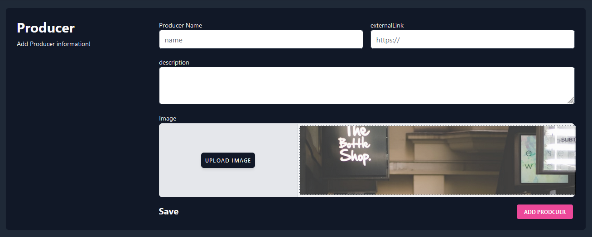

# iş akışı

## Üretici kısmı

üretici sitemize girdiği zaman producer sayfasına yönlenir.

bu sayfaya ulaştığı zaman  eğer kayıtlı bir  üretici değilse  kayıt ekranına yönlenir. Burada temel bilgileri girmesi istenir

üretici adı 

site adı (varsa üretci adresi)

acıklama:Kendi bulunduğu iş ile alakalı acıklama

bu kısım doldurulduktan sonra kaydedildekten sonra bizi üreticiye ait özel sayfaya yönlendirir.

bu sayfada 

üst kısımda istatistik kısmı görünecektir. bu kısımda üreticinin planlarının kaç tanesinin  kullanımda olduğunun , toplam kaç  tüketicinin işlem yaptığı gibi temel istatistik verileri görüncektir. (bu kısım graph ile yapılacaktır.)

sonraki kısımda ise istenirse  üreticinin kendi bilgilerini güncelleye bileceği bir segme vardır

eğer  mevcut planları varsa planları listelenir. eğer mevcut bir plana sahip değilse  yeni bir plan oluşturmak için butona tıklanır.

bizi 3 farklı tipte plan oluşturabileceğimiz, plan vardır.

# **Plan Api**

üretici api planı seçtiği zaman ;Bir hizmetin o hizmeti aldıkça belirli bir saat, gün ay gibi zaman aralıklarında belirli bir akış içinde hizmet bedelinin kullanıcıdan hizmet sağlayıcıya doğru gitmesini sağlar. 

 

kısaca üretici plan  ismini varsa dış linkini  acıklamasını girecektir.

totalsuply ile bu planın en fazla nekadar kullanılmasına izin  vereceğini  price adress ile hangi  erc20 tipi ile ücretlendirme yapılacağını belirler.

startdate ile bu planın ne zamandan sonra aktif olacağını da belirtebilir. 

status ile belirli bir  aktif duruma gecmiş planı  kapatmak istiyorsa pasif duruma alıp kullanıcıların bu planı almalarını engelleye bilir.

flowrate calc ile

istenirse o erc20 tokenin  saatlik ,günlük  veya aylık olarak değişen hızlarda kullanıcıdan üreticiye doğru akışının  gercekleşmesini sağlar.

örneğin ayda 10 dai  olacak şekilde planlanan bir planın flowratei 3858024691358 olarak hesaplanır.

plan Month limit ile bu plana aylık bir kota uygulanabilir.

backgroundColor ve image ise bu planı plan listesi içinde görünmesi için vede  widget olarak  başka sitelerde görünmesi  için  kullanılacak arayüzlerde kullanılmak için düzenlenebilir.

# vesting api:

 Bir hizmetin Gelecekte belirtilen bir zaman aralığında başlatılması istenildiği durumlarda kullanılabilir. 

Üretici Bu plan tipini oluştururken api plan dan varklı olarak  

cliffDate ve startAmount girecektir.

cliffDate : planı kullanıcı  gelecekte bir zaman başlatacak ; sectiği zamanda tetiklenene kadar gecen zaman için üreticiye bir ödeme  yapılabilir. bunu hesaplamak için  girilen değerdir. 

startamount ise kısaca başlangıç ücretidir.

# N usage Plan Api:

ürün ve hizmetinizin kullanımı için hizmet bedeli oluşturma imkanı sağlar.  Bu hizmetin her kullanımı için bir bedel oluşturmanızı  ve  her plan için bir limit oluşturmanıza imkan sağlar

bu planda farklı olarak

oneUsagePrice: tek kullanım için belirlenecek ücreti belirleriz

minUsageLimit: minimum kullanım  limiti

maxUsageLimit: maximum kullanım limiti

Üretici  eğer mevcut bir planı oluşturmuşsa mevut planları  ana sayfasında görünür

# Kullanıcı  iş akışı

Yeni bir kullanıcı olduğu zaman mevcut üreticiler arasında aradığı ürünü seçebilmesine olanak tanınır.

Mevcut kullancı sayfasına geçildiğinde  mevcut planları listelenir. 

isterse add plan ile producer listesine ulaşabilir

Bu kısımda üretici arama kısmı düzenlenecektir.

kullanıcı bir üreticiyi seçtiği zaman o üreticiye ait sayfaya yönlenecektir.

kullanıcı  kullanmak istediği planı secince 

eksik kısımlar

1. ödeme olarak kullanılacak erc20 türü ve bunun onayları gerekiyor.
    - superfluid kullanan yapılar için
        
        örneğin dai to fdai dönüşüm.
        
        kontrata fdai izni
        
        likidasyon
        
2. dai icin izin  dönüşümü
3. Secilen plan tipine göre farklı ekran görünmesi