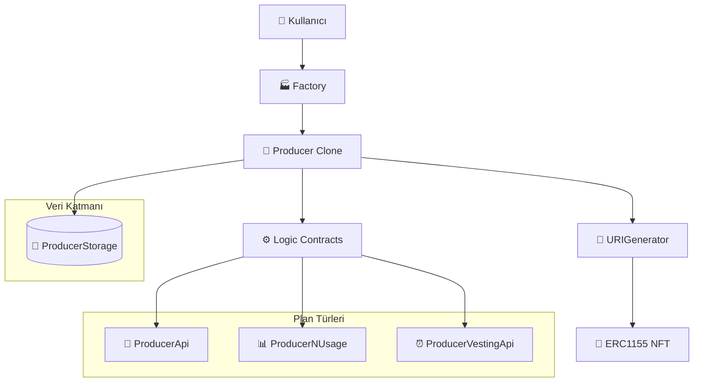

# BliContract Sistem Mimarisi - Genel Bakış

## İçindekiler
- [Giriş](#giriş)
- [Mimari Katmanları](#mimari-katmanları)
- [Veri Akışı](#veri-akışı)
- [Kontrat İlişkileri](#kontrat-i̇lişkileri)
- [Güvenlik Modeli](#güvenlik-modeli)
- [Dokümantasyon Haritası](#dokümantasyon-haritası)

## Giriş

BliContract, merkezi olmayan bir abonelik ve hizmet platformu oluşturmak için tasarlanmış kapsamlı bir akıllı kontrat sistemidir. Sistem, hizmet sağlayıcıların (üreticiler) farklı plan türleri oluşturmasına ve müşterilerin bu planlara abone olmasına olanak tanır.

## Mimari Katmanları

Sistem altı ana katmandan oluşur:

### 1. Core Layer (Temel Katman)
Sistemin temel kontratlarını içerir:
- **[`Factory.sol`](./02-core-contracts.md#factory)**: Yeni Producer kontratları oluşturur
- **[`Producer.sol`](./02-core-contracts.md#producer)**: Üretici iş mantığını yönetir  
- **[`StreamLockManager.sol`](./02-core-contracts.md#streamlockmanager)**: Token kilitleme ve ödeme akışları
- **[`URIGenerator.sol`](./02-core-contracts.md#urigenerator)**: NFT meta verilerini oluşturur
- **[`DelegateCall.sol`](./02-core-contracts.md#delegatecall)**: Proxy güvenliğini sağlar

### 2. Interface Layer (Arayüz Katmanı)
Kontratlar arası etkileşimi standardize eder:
- **[Arayüz Kontratları](./03-interface-layer.md)**: Tüm `I*.sol` dosyaları

### 3. Logic Layer (Mantık Katmanı)
Plan türlerine özgü iş mantığını içerir:
- **[`ProducerApi.sol`](./04-logic-layer.md#producerapi)**: API tabanlı planlar
- **[`ProducerNUsage.sol`](./04-logic-layer.md#producernusage)**: Kullanım kotası planları
- **[`ProducerVestingApi.sol`](./04-logic-layer.md#producervestingapi)**: Vesting planları

### 4. Storage Layer (Depolama Katmanı)
Kalıcı veri yönetimini sağlar:
- **[`ProducerStorage.sol`](./05-storage-layer.md)**: Tüm sistem verilerini saklar

### 5. Streaming Layer (Akış Katmanı)
Token kilitleme ve ödeme akışlarını yönetir:
- **[`StreamLockManager.sol`](./10-token-locking-stream-system.md)**: Ana streaming kontratı
- **[`VirtualBalance.sol`](./10-token-locking-stream-system.md)**: Sanal balance sistemi
- **[`StreamRateCalculator.sol`](./10-token-locking-stream-system.md)**: Stream hesaplamaları

### 6. Library Layer (Kütüphane Katmanı)
Yardımcı fonksiyonlar ve veri türlerini içerir:
- **[Kütüphaneler](./06-library-layer.md)**: Utilities, DataTypes, SafeTransfer vb.

## Veri Akışı

## Kontrat İlişkileri

### Factory → Producer İlişkisi
- Factory, EIP-1167 minimal proxy kullanarak Producer klonları oluşturur
- Her üretici kendine ait bir Producer kontrat klonuna sahiptir

### Producer → Logic İlişkisi  
- Producer, plan türüne göre uygun mantık kontratını çağırır
- API planları: [`ProducerApi`](./04-logic-layer.md#producerapi)
- Kullanım planları: [`ProducerNUsage`](./04-logic-layer.md#producernusage)
- Vesting planları: [`ProducerVestingApi`](./04-logic-layer.md#producervestingapi)

### Storage Merkezli Mimari
- Tüm kalıcı veriler [`ProducerStorage`](./05-storage-layer.md) içinde saklanır
- Diğer kontratlar veri okuma/yazma için storage kontratını kullanır

### NFT Entegrasyonu
- [`URIGenerator`](./02-core-contracts.md#urigenerator) abonelikleri temsil eden NFT'ler basar
- NFT'ler devredilemez (soulbound) özelliğindedir
- Dinamik SVG tabanlı görseller zincir üzerinde oluşturulur

## Güvenlik Modeli

### Erişim Kontrolü
- **Sahiplik Tabanlı**: OpenZeppelin'in `OwnableUpgradeable` kullanılır
- **Modifier Kontrolü**: `onlyOwner`, `onlyProducer`, `onlyCustomer` gibi kontroller
- **Proxy Güvenliği**: [`DelegateCall`](./02-core-contracts.md#delegatecall) ile delegatecall koruması

### Yeniden Giriş Koruması
- OpenZeppelin'in `ReentrancyGuard` kullanılır
- Kritik fonksiyonlarda CEI (Checks-Effects-Interactions) paterni

### Duraklatılabilirlik
- [`PausableUpgradeable`](./02-core-contracts.md) ile acil durum kontrolü
- Kritik operasyonları durdurma yeteneği

## Plan Türleri

### 1. API Planları
- **Amaç**: API erişimi için abonelik
- **Özellikler**: Superfluid stream tabanlı ödemeler
- **Kontrat**: [`ProducerApi.sol`](./04-logic-layer.md#producerapi)

### 2. Kullanım Planları (NUsage)
- **Amaç**: Kota tabanlı hizmet kullanımı  
- **Özellikler**: Ön ödemeli token sistemi
- **Kontrat**: [`ProducerNUsage.sol`](./04-logic-layer.md#producernusage)

### 3. Vesting Planları
- **Amaç**: Zaman tabanlı hak ediş sistemi
- **Özellikler**: VestingScheduler entegrasyonu
- **Kontrat**: [`ProducerVestingApi.sol`](./04-logic-layer.md#producervestingapi)

## Dokümantasyon Haritası

1. **[Temel Kontratlar](./02-core-contracts.md)** - Factory, Producer, URIGenerator, DelegateCall
2. **[Arayüz Katmanı](./03-interface-layer.md)** - Tüm interface tanımları ve API spesifikasyonları
3. **[Mantık Katmanı](./04-logic-layer.md)** - Plan türlerine özgü iş mantığı kontratları
4. **[Depolama Katmanı](./05-storage-layer.md)** - ProducerStorage veri yönetimi
5. **[Kütüphane Katmanı](./06-library-layer.md)** - Yardımcı kontratlar ve veri türleri
6. **[Veri Türleri](./07-data-types.md)** - Struct'lar, enum'lar ve veri modelleri
7. **[Dağıtım Rehberi](./08-deployment-guide.md)** - Kurulum ve başlatma süreçleri
8. **[Entegrasyon Rehberi](./09-integration-guide.md)** - Kullanım örnekleri ve best practices

## Teknik Özellikler

- **Solidity Version**: ^0.8.17
- **Proxy Pattern**: EIP-1167 (Minimal Proxy) + UUPS
- **NFT Standard**: ERC1155 (Soulbound NFTs)
- **Payment Integration**: Superfluid streams
- **Upgrade Strategy**: UUPS Proxy pattern
- **Gas Optimization**: Clone factory pattern

## Sistem Akışı

1. **Kurulum**: Factory ve diğer temel kontratlar dağıtılır
2. **Üretici Kaydı**: Factory.newBcontract() ile yeni Producer klonu oluşturulur
3. **Plan Oluşturma**: Producer.addPlan() ile hizmet planları tanımlanır
4. **Müşteri Aboneliği**: Producer.addCustomerPlan() ile abonelik başlatılır
5. **NFT Basımı**: URIGenerator.mint() ile abonelik NFT'si oluşturulur
6. **Hizmet Kullanımı**: Plan türüne göre ilgili mantık kontratları devreye girer

---

*Bu dokümantasyon, BliContract sisteminin teknik mimarisini ve kontrat yapısını anlamak için başlangıç noktasıdır. Detaylı bilgiler için ilgili bölümlere başvurun.*