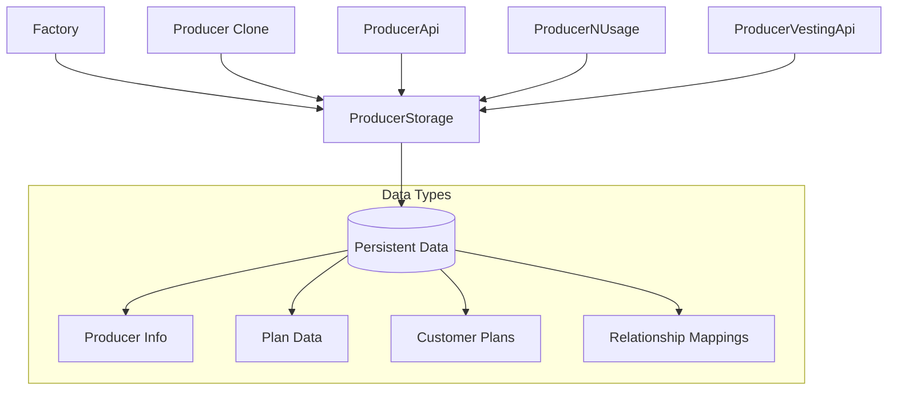

# Depolama Katmanı (Storage Layer)

Bu dokümantasyon, BliContract sisteminin merkezi veri depolama kontratını detaylarıyla açıklamaktadır.

## İçindekiler
- [Genel Bakış](#genel-bakış)
- [ProducerStorage](#producerstorage)
- [Veri Modelleri](#veri-modelleri)
- [Erişim Kontrolü](#erişim-kontrolü)
- [Performans Düşünceleri](#performans-düşünceleri)
- [Güvenlik Analizi](#güvenlik-analizi)

---

## Genel Bakış

ProducerStorage kontratı, BliContract sisteminin tüm kalıcı verilerini merkezi olarak yönetir. Bu yaklaşım:

- **Veri Tutarlılığı**: Tek gerçek kaynağı (single source of truth)
- **Modülerlik**: Mantık ve depolama ayrımı
- **Upgrade Safety**: Storage layout'unu koruma
- **Gas Optimization**: Tekrarlanan storage işlemlerini azaltma

### Mimari Rolü



---

## ProducerStorage

### Genel Bakış
[`ProducerStorage.sol`](../../contracts/storage/ProducerStorage.sol) kontratı, sistemin tüm veri yönetimini merkezi olarak gerçekleştirir.

### Kalıtım
```solidity
contract ProducerStorage is IProducerStorage, Ownable
```

**Basit Kalıtım**: Yalnızca `Ownable` kullanarak karmaşıklığı minimize eder.

### Durum Değişkenleri

#### Sistem Referansları
```solidity
IFactory factory;
address public producerApi;
address public producerNUsage;
address public producerVestingApi;
```

#### ID Yönetimi
```solidity
uint private PR_ID; // Producer ID sayacı
```

#### Ana Veri Mapping'leri
```solidity
// Producer verisi
mapping(address => DataTypes.Producer) internal producers;
mapping(uint256 => address) public cloneId;
mapping(address => address) public producertoCloneAddress;

// Plan verisi
mapping(address => DataTypes.Plan[]) internal prPlans;
mapping(uint256 => DataTypes.Plan) internal plans;

// Plan detayları
mapping(uint256 => DataTypes.PlanInfoVesting) internal planInfoVesting;
mapping(uint256 => DataTypes.PlanInfoNUsage) internal planInfoNUsage;
mapping(uint256 => DataTypes.PlanInfoApi) internal planInfoApi;

// Müşteri verisi
mapping(address => DataTypes.Customer) internal customers;
mapping(uint256 => DataTypes.CustomerPlan) internal customerPlans;
```

### Başlatma ve Yapılandırma

#### `setFactory()`
```solidity
function setFactory(
    IFactory _factory,
    address _producerApi,
    address _producerUsageApi,
    address _producervestingApi
) external onlyOwner
```

**Amaç**: Sistem bileşenlerinin adreslerini ayarlar
**Yetki**: Yalnızca sahip çağırabilir
**Kullanım**: Deployment sonrası bir kez çağrılır

### Olaylar

#### Producer Olayları
```solidity
event LogProducer(address producerAddress, string name, uint256 producerId, address cloneAddress);
event LogProducerSet(address producerAddress, string name, uint256 producerId, address cloneAddress);
```

#### Plan Olayları
```solidity
event LogAddPlan(uint256 planId, address producerAddress, string name, DataTypes.PlanTypes planType);
event LogSetPlan(uint256 planId, address producerAddress, string name, DataTypes.PlanTypes planType);
```

#### Müşteri Olayları
```solidity
event LogAddCustomerPlan(address customerAdress, uint256 planId, uint256 custumerPlanId, address cloneAddress);
event loguseFromQuota(uint256 planId, address customerAdress, address cloneAddress, uint256 remainingQuota);
event logUpdateCustomerPlan(uint256 planId, address customerAdress, address cloneAddress, DataTypes.Status status);
```

### Erişim Kontrolü Modifier'ları

#### Sistem Bileşeni Kontrolleri
```solidity
modifier onlyFactory() {
    require(msg.sender == address(factory), "Only factory can call this function");
    _;
}

modifier onlyProdcuerApi() {
    require(msg.sender == address(producerApi), " onlyProdcuerApi can call this function");
    _;
}

modifier onlyProdcuerNUsage() {
    require(msg.sender == address(producerNUsage), "onlyProdcuerNUsage can call this function");
    _;
}

modifier onlyProdcuerVestingApi() {
    require(msg.sender == address(producerVestingApi), "  onlyProdcuerVestingApi can call this function");
    _;
}
```

#### Producer Durum Kontrolleri
```solidity
modifier onlyProducer() {
    require(producers[msg.sender].cloneAddress == msg.sender, "Only producer  can call this function");
    _;
}

modifier onlyExistProducer() {
    require(!exsistProducer(msg.sender), "onlyExistProducer  can call this function");
    _;
}

modifier onlyNonExistProducer() {
    require(exsistProducer(msg.sender), "onlyExistProducer  can call this function");
    _;
}

modifier onlyRegisteredProducer() {
    require(producers[msg.sender].cloneAddress != address(0), "producer: not registered");
    _;
}
```

#### Müşteri Varlık Kontrolü
```solidity
modifier onlyExistCustumer(uint256 planId, address customerAddress, address cloneAddress) {
    require(exsitCustomerPlan(planId, customerAddress, cloneAddress) == true, "Customer plan not exist");
    _;
}
```

### Producer Yönetimi

#### Varlık Kontrolleri
```solidity
function exsistProducer(address _cloneAddress) public view returns (bool) {
    return producers[_cloneAddress].exists;
}

function exsistProducerClone(address producerAddres) public view returns (bool) {
    address _cloneAddress = producertoCloneAddress[producerAddres];
    return producers[_cloneAddress].exists;
}
```

#### Producer CRUD İşlemleri

##### `addProducer()`
```solidity
function addProducer(DataTypes.Producer calldata vars) external onlyFactory
```

**İş Akışı:**
1. Clone address üzerinden producer storage'ını alır
2. Producer bilgilerini storage'a yazar
3. Mapping'leri günceller
4. `LogProducer` olayını yayınlar

**Mapping Güncellemeleri:**
```solidity
producers[vars.cloneAddress] = producer;
producertoCloneAddress[vars.producerAddress] = cloneAddress;
```

##### `setProducer()`
```solidity
function setProducer(DataTypes.Producer calldata vars) 
    external onlyProducer onlyNonExistProducer
```

Mevcut producer bilgilerini günceller. Yalnızca producer kontratının kendisi çağırabilir.

#### Producer Sorgulama
```solidity
function getProducer(address cloneAddress) external view returns (DataTypes.Producer memory);
function getProducerInfo(address producerAddres) external view returns (DataTypes.Producer memory);
```

**Fark**: 
- `getProducer`: Clone address ile sorgular
- `getProducerInfo`: Producer address ile sorgular (mapping üzerinden)

### Plan Yönetimi

#### Plan CRUD İşlemleri

##### `addPlan()`
```solidity
function addPlan(DataTypes.Plan calldata vars) 
    external onlyNonExistProducer returns (uint256 planId)
```

**İş Akışı:**
1. Plan ID'nin benzersizliğini kontrol eder
2. Plan struct'ını oluşturur
3. İki mapping'e ekler:
   - `plans[planId]`: Global plan lookup
   - `prPlans[cloneAddress]`: Producer'a özgü planlar
4. `LogAddPlan` olayını yayınlar

**Çift Mapping Stratejisi:**
- `plans[planId]`: O(1) plan lookup
- `prPlans[cloneAddress]`: Producer'ın tüm planlarını listeleme

##### `setPlan()`
```solidity
function setPlan(DataTypes.Plan calldata vars) external onlyNonExistProducer
```

**Güncelleme Süreci:**
1. Global `plans` mapping'ini günceller
2. Producer'ın plan dizisinde ilgili planı bulur ve günceller
3. `LogSetPlan` olayını yayınlar

**Performans Notu**: Producer plan dizisinde linear search yapılır (O(n)).

#### Plan Detay Yönetimi

##### Plan Türüne Özgü Bilgi Ekleme
```solidity
function addPlanInfoApi(DataTypes.PlanInfoApi calldata vars) 
    external onlyProducer onlyNonExistProducer

function addPlanInfoNUsage(DataTypes.PlanInfoNUsage calldata vars) 
    external onlyProducer onlyNonExistProducer

function addPlanInfoVesting(DataTypes.PlanInfoVesting calldata vars) 
    external onlyProducer onlyNonExistProducer
```

Her plan türü için ayrı mapping'lerde detay bilgileri saklanır.

#### Plan Sorgulama
```solidity
function getPlan(uint256 _planId) public view returns (DataTypes.Plan memory plan);
function getPlans(address cloneAddress) public view returns (DataTypes.Plan[] memory);

function getPlanInfoApi(uint256 _planId) public view returns (DataTypes.PlanInfoApi memory);
function getPlanInfoNUsage(uint256 _planId) public view returns (DataTypes.PlanInfoNUsage memory);
function getPlanInfoVesting(uint256 _planId) public view returns (DataTypes.PlanInfoVesting memory);
```

### Müşteri Yönetimi

#### Müşteri Plan ID Üretimi
```solidity
function getCustomerPlanId(
    uint256 planid,
    address customeraddress,
    address producerAddress
) public pure returns (uint) {
    return uint(keccak256(abi.encodePacked(planid, customeraddress, producerAddress)));
}
```

**Deterministic ID**: Aynı parametreler her zaman aynı ID üretir.

#### Müşteri Plan Ekleme

##### `addCustomerPlan()`
```solidity
function addCustomerPlan(DataTypes.CustomerPlan calldata vars) external
```

**Karmaşık İş Akışı:**
1. **ID Üretimi**: Keccak256 hash ile benzersiz ID
2. **Müşteri Güncelleme**: Customer struct'ına plan ekleme
3. **Plan Güncelleme**: Plan'ın customer plan ID'lerini güncelleme
4. **Global Mapping**: CustomerPlan'ı global mapping'e ekleme
5. **Producer Plan Güncelleme**: Producer'ın plan dizisini güncelleme

**Veri Tutarlılığı**: Aynı bilgiyi birden fazla yerde saklar:
```solidity
// 1. Müşteri mapping'inde
customer.customerPlans.push(customerPlan);

// 2. Global plan mapping'inde
plan.custumerPlanIds.push(customerPlanId);

// 3. Global customer plan mapping'inde
customerPlans[customerPlanId] = customerPlan;

// 4. Producer plan dizisinde
prplan.custumerPlanIds.push(customerPlanId);
```

#### Kota Kullanımı

##### `useFromQuota()`
```solidity
function useFromQuota(DataTypes.CustomerPlan calldata vars)
    external onlyExistCustumer(...) returns (uint256)
```

**İş Akışı:**
1. Customer plan ID'yi hesaplar
2. Kalan kotayı kontrol eder
3. Kotayı 1 azaltır
4. `loguseFromQuota` olayını yayınlar
5. Kalan kotayı döndürür

**Atomicity**: Tek işlemde kontrol ve güncelleme.

#### Müşteri Plan Güncelleme

##### `updateCustomerPlan()`
```solidity
function updateCustomerPlan(DataTypes.CustomerPlan calldata vars)
    external onlyExistCustumer(...)
```

**Durum Güncelleme:**
- **Inactive**: Kota sıfırlanır
- **Active**: Yeni kota ayarlanır

**Çift Güncelleme**: Hem global hem de customer mapping'i güncellenir.

#### Müşteri Sorgulama
```solidity
function getCustomer(address customerAddress) external view returns (DataTypes.Customer memory);
function getCustomerPlan(uint custumerPlanId) public view returns (DataTypes.CustomerPlan memory);
```

#### Varlık Kontrolü
```solidity
function exsitCustomerPlan(uint256 planId, address customerAddress, address cloneAddress) 
    public view returns (bool)
```

**Kontrol Mantığı**: 
1. Customer plan ID'yi hesaplar
2. Global mapping'de varlığını kontrol eder

### Clone Yönetimi

#### Clone Mapping İşlemleri
```solidity
function SetCloneId(uint256 _producerId, address _cloneAddress) external onlyFactory;
function getCloneId(uint256 _producerId) external view returns (address);
function getClones() public view returns (address[] memory);
```

##### `getClones()` Performans Analizi
```solidity
function getClones() public view returns (address[] memory) {
    uint256 length = currentPR_ID() + 1;
    address[] memory data = new address[](length);
    for (uint256 i = 1; i < length; i++) {
        data[i] = cloneId[i];
    }
    return data;
}
```

**Performans Riski**: O(n) loop, yüksek gaz tüketimi potansiyeli.

### ID Sayacı Yönetimi

```solidity
function currentPR_ID() public view returns (uint256) {
    return PR_ID;
}

function incrementPR_ID() public returns (uint256) {
    PR_ID++;
    return PR_ID;
}
```

**Basit Sayaç**: Global producer ID'leri için merkezi sayaç.

---

## Veri Modelleri

### Producer Verisi
```solidity
struct Producer {
    uint256 producerId;        // Benzersiz ID
    address producerAddress;   // Gerçek sahip adresi
    string name;              // Producer adı
    string description;       // Açıklama
    string image;            // Logo/resim URL
    string externalLink;     // Harici link
    address cloneAddress;    // Clone kontrat adresi
    bool exists;            // Varlık flag'i
}
```

### Plan Hiyerarşisi
```
Plan (Temel bilgiler)
├── PlanInfoApi (API planlar için)
├── PlanInfoNUsage (Kullanım planlar için)
└── PlanInfoVesting (Vesting planlar için)
```

### Müşteri İlişkileri
```
Customer
├── customerPlans[] (Müşterinin tüm planları)
└── CustomerPlan
    ├── Temel bilgiler
    ├── Plan referansı
    └── Clone referansı
```

---

## Erişim Kontrolü

### Yetki Matrisi

| Fonksiyon Türü | Factory | Producer | Logic Contracts | Owner | Public |
|----------------|---------|----------|-----------------|-------|--------|
| Producer Add | ✅ | ❌ | ❌ | ❌ | ❌ |
| Producer Set | ❌ | ✅ | ❌ | ❌ | ❌ |
| Plan Add/Set | ❌ | ✅ | ❌ | ❌ | ❌ |
| Plan Info Add | ❌ | ✅ | ❌ | ❌ | ❌ |
| Customer Plan Add | ❌ | ❌ | ✅ | ❌ | ❌ |
| Customer Plan Update | ❌ | ❌ | ✅ | ❌ | ❌ |
| Use Quota | ❌ | ❌ | ✅ | ❌ | ❌ |
| View Functions | ❌ | ❌ | ❌ | ❌ | ✅ |
| System Config | ❌ | ❌ | ❌ | ✅ | ❌ |

### Güvenlik Katmanları

1. **Modifier Kontrolü**: Çağıran adresin yetkisi
2. **Existence Checks**: Varlık kontrolleri
3. **State Validation**: Durum tutarlılığı
4. **Parameter Validation**: Giriş doğrulama

---

## Performans Düşünceleri

### Gas Optimizasyonları

#### Pozitif Yönler
1. **Single Storage**: Tekrarlanan storage call'ları minimized
2. **Batch Updates**: İlgili verileri beraber güncelleme
3. **View Functions**: Gas-free sorgular

#### Performance Bottlenecks

##### 1. Producer Plan Updates
```solidity
// O(n) complexity - Plan dizisinde arama
for (uint256 i = 0; i < prPlans[cloneAddress].length; i++) {
    if (prPlans[cloneAddress][i].planId == vars.planId) {
        prPlans[cloneAddress][i] = plan;
    }
}
```

**Optimization**: Plan index mapping'i eklenebilir.

##### 2. Customer Plan Creation
```solidity
// Birden fazla storage write
customer.customerPlans.push(customerPlan);           // Storage write
plan.custumerPlanIds.push(customerPlanId);          // Storage write  
customerPlans[customerPlanId] = customerPlan;       // Storage write
prplan.custumerPlanIds.push(customerPlanId);        // Storage write + loop
```

**Optimization**: Critical path'leri minimize etmek.

##### 3. Get All Clones
```solidity
// Potentially expensive for many producers
for (uint256 i = 1; i < length; i++) {
    data[i] = cloneId[i];
}
```

**Optimization**: Pagination veya lazy loading.

### Storage Layout Considerations

#### Efficient Packing
```solidity
// Struct'larda efficient packing
struct CustomerPlan {
    address customerAdress;    // 20 bytes
    uint256 planId;           // 32 bytes - new slot
    uint256 custumerPlanId;   // 32 bytes - new slot
    // ...
    uint32 startDate;         // 4 bytes
    uint32 endDate;          // 4 bytes - same slot with startDate
    Status status;           // 1 byte - same slot
    PlanTypes planType;      // 1 byte - same slot
}
```

#### Storage Slot Analysis
- **Hot Data**: Sık erişilen veriler aynı slot'ta
- **Cold Data**: Nadiren erişilen veriler ayrı slot'larda
- **Enum Packing**: Status ve type alanları beraber

---

## Güvenlik Analizi

### Kritik Güvenlik Noktaları

#### 1. Merkezi Storage Riski
**Risk**: Tek nokta arızası
**Mitigation**: 
- Comprehensive access control
- Input validation
- State consistency checks

#### 2. ID Collision Riski
```solidity
// CustomerPlan ID generation
uint(keccak256(abi.encodePacked(planid, customeraddress, producerAddress)))
```

**Risk**: Hash collision (teorik)
**Mitigation**: Keccak256'nın güvenliği (2^256 space)

#### 3. State Inconsistency
**Risk**: Aynı veriyi birden fazla yerde saklama
**Mitigation**:
- Atomic updates
- Consistent error handling
- Event emission

#### 4. Access Control Bypass
**Risk**: Modifier'ların yanlış kullanımı
**Mitigation**:
- Strict modifier hierarchy
- Double verification
- Regular security audits

### Data Integrity Checks

#### 1. Producer Existence
```solidity
modifier onlyNonExistProducer() {
    require(exsistProducer(msg.sender), "onlyExistProducer  can call this function");
    _;
}
```

#### 2. Customer Plan Validation
```solidity
modifier onlyExistCustumer(uint256 planId, address customerAddress, address cloneAddress) {
    require(exsitCustomerPlan(planId, customerAddress, cloneAddress) == true, "Customer plan not exist");
    _;
}
```

#### 3. Quota Sufficiency
```solidity
require(customerPlans[customerPlanId].remainingQuota >= 1, "Not enough remaining quota!");
```

### Upgrade Safety

#### Storage Layout Stability
- **No Struct Reordering**: Mevcut struct'lar değiştirilmemeli
- **Append Only**: Yeni alanlar struct sonuna eklenmeli
- **Mapping Preservation**: Mapping key'leri değiştirilmemeli

#### Migration Strategies
- **Data Migration**: Gerektiğinde veri aktarımı
- **Backward Compatibility**: Eski format desteği
- **Version Management**: Schema versiyon kontrolü

---

## Sonuç

ProducerStorage kontratı, BliContract sisteminin merkezi veri katmanıdır. Güçlü yanları:

### Avantajlar
- **Merkezi Veri Yönetimi**: Tek gerçek kaynak
- **Modüler Tasarım**: Logic/storage ayrımı
- **Kapsamlı Access Control**: Katmanlı güvenlik
- **Rich Event System**: Comprehensive logging

### İyileştirme Alanları
- **Performance Optimization**: O(n) operasyonları optimize etme
- **Storage Efficiency**: Struct packing iyileştirmeleri
- **Gas Cost Reduction**: Batch operations
- **Data Consistency**: Cross-mapping sync improvements

### Kritik Önemde Noktalar
1. **Access Control**: Modifier'ların doğru kullanımı
2. **State Consistency**: Cross-mapping senkronizasyonu
3. **Performance**: Large-scale deployment considerations
4. **Upgrade Safety**: Storage layout compatibility

Bu kontrat, sistemin güvenilirliği ve performansı için kritik öneme sahiptir.