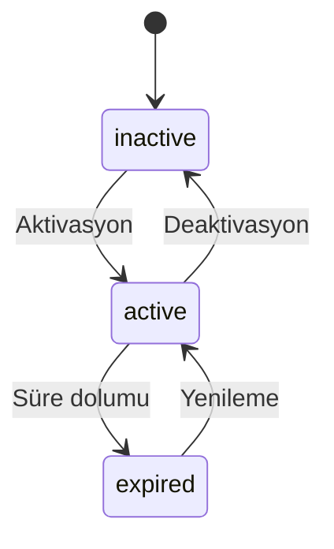
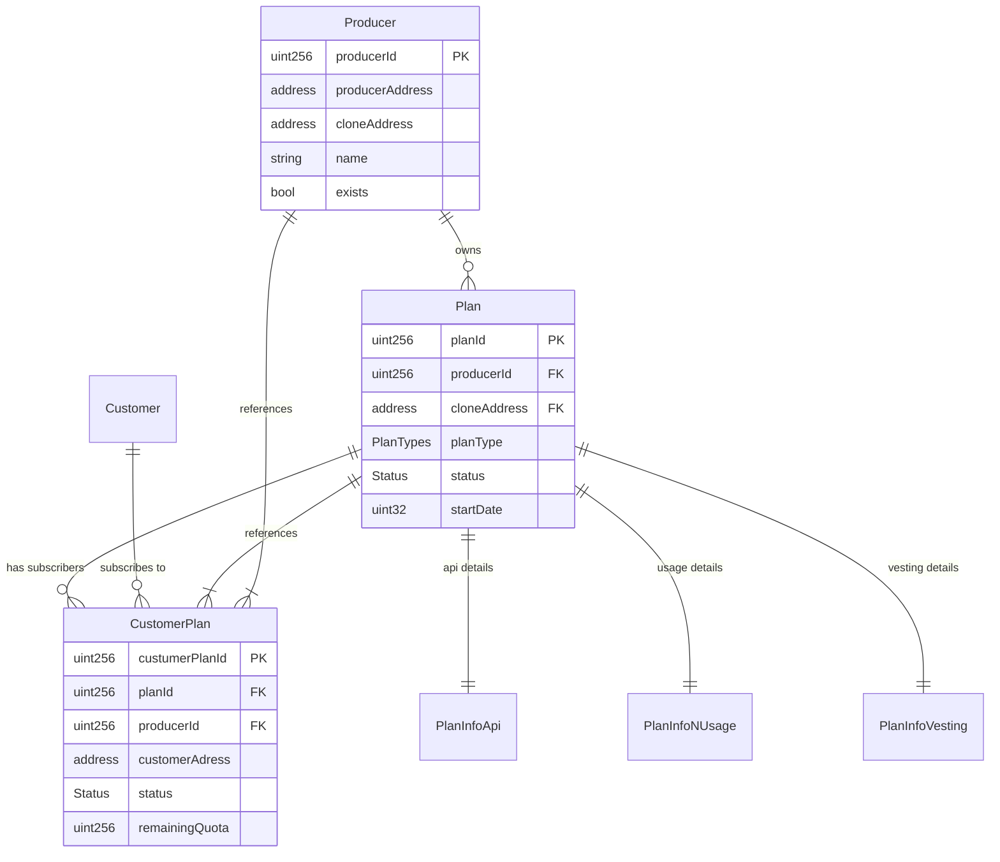

# Veri Türleri ve Yapıları (Data Types & Structures)

Bu dokümantasyon, BliContract sisteminde kullanılan tüm veri yapılarını, enum'ları ve type tanımlarını detaylarıyla açıklamaktadır.

## İçindekiler
- [Genel Bakış](#genel-bakış)
- [Temel Enumerations](#temel-enumerations)
- [Producer Veri Yapıları](#producer-veri-yapıları)
- [Plan Veri Yapıları](#plan-veri-yapıları)
- [Müşteri Veri Yapıları](#müşteri-veri-yapıları)
- [URI Meta Veri Yapıları](#uri-meta-veri-yapıları)
- [Veri İlişkileri](#veri-i̇lişkileri)
- [Storage Optimizasyonları](#storage-optimizasyonları)

---

## Genel Bakış

[`DataTypes.sol`](../../contracts/libraries/DataTypes.sol) kütüphanesi, BliContract sisteminin tüm veri modellerini tanımlar. Bu merkezi yaklaşım:

- **Type Safety**: Güçlü tip kontrolü
- **Code Reusability**: Ortak veri yapıları
- **Maintainability**: Merkezi veri modeli yönetimi
- **Documentation**: Açık veri structure tanımları

### Import Dependencies
```solidity
import "@superfluid-finance/ethereum-contracts/contracts/interfaces/superfluid/ISuperToken.sol";
```

**Superfluid Integration**: Vesting plan'ları için ISuperToken referansı.

---

## Temel Enumerations

### Status Enum
```solidity
enum Status {
    inactive,    // 0 - Deaktif durum
    active,      // 1 - Aktif durum  
    expired      // 2 - Süresi dolmuş durum
}
```

#### Kullanım Alanları
- **Plan Status**: Plan'ların aktiflik durumu
- **Customer Plan Status**: Müşteri aboneliklerinin durumu
- **Lifecycle Management**: Durum geçişleri

#### Durum Geçişleri


### PlanTypes Enum
```solidity
enum PlanTypes {
    api,         // 0 - API kullanım planları
    nUsage,      // 1 - Kullanım kotası planları  
    vestingApi   // 2 - Vesting API planları
}
```

#### Plan Türü Özellikleri ✨ **GÜNCEL**

| Tür | Açıklama | Ödeme Modeli | Stream Desteği | Özel Özellikler |
|-----|----------|--------------|----------------|-----------------|
| `api` | API erişim abonelikleri | Stream-based payment | ✅ **TAM DESTEK** | Unlimited quota, sürekli stream |
| `nUsage` | Kota tabanlı kullanım | Upfront + stream | ✅ **TAM DESTEK** | Quota tracking, stream settlement |
| `vestingApi` | Vesting tabanlı haklar | Cliff + stream | ✅ **TAM DESTEK** | Cliff payment + time vesting |

#### Stream Integration Details ✨ **YENİ**

**API Plans Stream Flow:**
```solidity
// Stream amount = flowRate * streamDuration
uint256 totalAmount = uint256(int256(pInfoApi.flowRate)) * streamDuration;

// Unlimited service access with time-based payment
vars.remainingQuota = type(uint256).max;
vars.endDate = uint32(block.timestamp + streamDuration);
```

**NUsage Plans Stream Flow:**
```solidity
// Stream amount = oneUsagePrice * quota
uint256 totalAmount = pInfoNUsage.oneUsagePrice * vars.remainingQuota;

// Traditional quota with stream payment backing
uint256 streamDuration = _calculateStreamDuration(vars.planId, vars.remainingQuota);
```

**VestingApi Plans Stream Flow:**
```solidity
// Stream amount = cliff + (flowRate * duration)
uint256 streamAmount = uint256(int256(pInfoVesting.flowRate)) * streamDuration;
uint256 totalAmount = pInfoVesting.startAmount + streamAmount;

// Cliff validation + unlimited access
require(pInfoVesting.cliffDate > block.timestamp, "Cliff date must be in the future");
vars.remainingQuota = type(uint256).max;
vars.endDate = uint32(pInfoVesting.cliffDate + streamDuration);
```

---

## Producer Veri Yapıları

### Producer Struct
```solidity
struct Producer {
    uint256 producerId;        // Benzersiz producer ID
    address producerAddress;   // Gerçek sahip adresi
    string name;              // Producer adı
    string description;       // Açıklama
    string image;            // Logo/resim URL'i
    string externalLink;     // Harici web sitesi
    address cloneAddress;    // Clone kontrat adresi
    bool exists;            // Varlık kontrolü flag'i
}
```

#### Alan Açıklamaları

**`producerId`** (`uint256`):
- Sistemde benzersiz ID
- Factory tarafından otomatik atanır
- Storage mapping'lerinde key olarak kullanılır

**`producerAddress`** (`address`):
- Producer'ın gerçek sahip adresi
- Orijinal hesap adresi
- Clone'dan farklı olabilir

**`name`** (`string`):
- Producer'ın görünen adı
- NFT meta verilerinde kullanılır
- UI'da gösterilir

**`description`** (`string`):
- Producer hakkında açıklayıcı bilgi
- Marketing materyali olarak kullanılabilir

**`image`** (`string`):
- Logo veya profil resmi URL'i
- IPFS hash veya HTTP URL olabilir
- NFT görsellerinde kullanılabilir

**`externalLink`** (`string`):
- Producer'ın web sitesi veya dokümantasyon linki
- Ek bilgi kaynaği

**`cloneAddress`** (`address`):
- Producer'ın EIP-1167 clone kontrat adresi
- Gerçek işlemler bu adres üzerinden yapılır
- `producerAddress`'ten farklı

**`exists`** (`bool`):
- Producer'ın sistemde var olup olmadığını kontrol eder
- Soft delete için kullanılabilir

#### Kullanım Örnekleri
```solidity
// Producer oluşturma
DataTypes.Producer memory newProducer = DataTypes.Producer({
    producerId: factory.currentPR_ID() + 1,
    producerAddress: msg.sender,
    name: "Acme API Services",
    description: "High-quality API services for developers",
    image: "https://ipfs.io/ipfs/QmHash...",
    externalLink: "https://acme-apis.com",
    cloneAddress: cloneAddress,
    exists: true
});
```

---

## Plan Veri Yapıları

### Plan Struct
```solidity
struct Plan {
    uint256 planId;              // Benzersiz plan ID
    address cloneAddress;        // Producer clone adresi
    uint256 producerId;          // Producer ID referansı
    string name;                // Plan adı
    string description;         // Plan açıklaması
    string externalLink;        // Ek bilgi linki
    int256 totalSupply;         // Toplam supply (-1 = unlimited)
    int256 currentSupply;       // Mevcut supply
    string backgroundColor;     // NFT arka plan rengi
    string image;              // Plan görseli
    address priceAddress;      // Ödeme token adresi
    uint32 startDate;          // Başlangıç tarihi (Unix timestamp)
    Status status;             // Plan durumu
    PlanTypes planType;        // Plan türü
    uint256[] custumerPlanIds; // Müşteri plan ID'leri
}
```

#### Alan Detayları

**Supply Management**:
```solidity
int256 totalSupply;    // -1 = unlimited, >0 = limited supply
int256 currentSupply;  // Mevcut satılan/aktif abonelik sayısı
```

**Temporal Fields**:
```solidity
uint32 startDate;     // Plan başlangıç tarihi, future activation için
```

**Visual Customization**:
```solidity
string backgroundColor; // Hex color code (örn: "#FF5733")
string image;          // Plan-specific görsel URL
```

**Relationships**:
```solidity
uint256[] custumerPlanIds; // Bu plana abone olan müşterilerin ID'leri
```

### Plan Türüne Özgü Bilgiler

#### PlanInfoApi Struct
```solidity
struct PlanInfoApi {
    uint256 planId;          // Plan ID referansı
    int96 flowRate;          // Superfluid akış hızı (token/saniye)
    uint256 perMonthLimit;   // Aylık API çağrı limiti
}
```

**Superfluid Integration**:
- `flowRate`: Token/saniye cinsinden ödeme hızı
- Örnek: 1 DAI/ay = 385802469135802 wei/saniye

**Rate Calculation**:
```solidity
// 1 token per month to wei per second
uint256 monthlyRate = 1 ether; // 1 token
uint256 secondsInMonth = 30 * 24 * 60 * 60; // 2592000
int96 flowRate = int96(monthlyRate / secondsInMonth);
```

#### PlanInfoVesting Struct
```solidity
struct PlanInfoVesting {
    uint256 planId;      // Plan ID referansı
    uint32 cliffDate;    // Cliff tarihi (Unix timestamp)
    int96 flowRate;      // Stream akış hızı
    uint256 startAmount; // Cliff'te ödenecek miktar
    bytes ctx;          // Superfluid context
}
```

**Vesting Mechanics**:
- `cliffDate`: Ani ödeme tarihi
- `startAmount`: Cliff'te ödenecek miktar
- `flowRate`: Cliff sonrası stream hızı

#### PlanInfoNUsage Struct
```solidity
struct PlanInfoNUsage {
    uint256 planId;         // Plan ID referansı
    uint256 oneUsagePrice;  // Tek kullanım fiyatı (wei)
    uint32 minUsageLimit;   // Minimum satın alma miktarı
    uint32 maxUsageLimit;   // Maximum satın alma miktarı
}
```

**Usage Economics**:
```solidity
// Pricing example
uint256 totalCost = oneUsagePrice * usageCount;
require(usageCount >= minUsageLimit, "Below minimum");
require(usageCount <= maxUsageLimit, "Above maximum");
```

---

## Müşteri Veri Yapıları

### CustomerPlan Struct
```solidity
struct CustomerPlan {
    address customerAdress;    // Müşteri adresi (typo: address)
    uint256 planId;           // Plan ID referansı
    uint256 custumerPlanId;   // Benzersiz müşteri plan ID (typo: customer)
    uint256 producerId;       // Producer ID referansı
    address cloneAddress;     // Producer clone adresi
    address priceAddress;     // Ödeme token adresi
    uint32 startDate;         // Abonelik başlangıç tarihi
    uint32 endDate;          // Abonelik bitiş tarihi
    uint256 remainingQuota;   // Kalan kullanım kotası (NUsage için)
    Status status;           // Abonelik durumu
    PlanTypes planType;      // Plan türü
}
```

#### Field Analysis

**Identification Fields**:
```solidity
uint256 custumerPlanId; // keccak256(planId, customerAddress, cloneAddress)
```

**Temporal Management**:
```solidity
uint32 startDate;  // Subscription start
uint32 endDate;    // Subscription end (0 = unlimited)
```

**Usage Tracking**:
```solidity
uint256 remainingQuota; // For nUsage plans, 0 for others
```

#### ID Generation Strategy
```solidity
function generateCustomerPlanId(
    uint256 planId,
    address customerAddress,
    address cloneAddress
) pure returns (uint256) {
    return uint256(keccak256(abi.encodePacked(
        planId,
        customerAddress, 
        cloneAddress
    )));
}
```

### Customer Struct
```solidity
struct Customer {
    address customer;                    // Müşteri adresi
    CustomerPlan[] customerPlans;       // Müşterinin tüm planları
}
```

**Aggregation Structure**: Bir müşterinin tüm aboneliklerini gruplar.

---

## URI Meta Veri Yapıları

### UriMeta Struct (IURIGenerator'da tanımlı)
```solidity
struct UriMeta {
    uint256 custumerPlanId;      // Müşteri plan ID
    uint256 planId;              // Plan ID
    string producerName;         // Producer adı
    address cloneAddress;        // Clone adresi
    string description;          // Açıklama
    string externalLink;         // Harici link
    int256 totalSupply;          // Toplam supply
    int256 currentSupply;        // Mevcut supply
    string backgroundColor;      // Arka plan rengi
    string image;               // Görsel URL
    address priceAddress;       // Ödeme token adresi
    uint32 startDate;           // Başlangıç tarihi
    uint32 endDate;            // Bitiş tarihi
    uint256 remainingQuota;     // Kalan kota
    PlanTypes planType;         // Plan türü
    Status status;             // Durum
}
```

**NFT Generation**: Bu struct NFT meta verisi oluşturmak için kullanılır.

---

## Veri İlişkileri

### Entity Relationship Diagram


### Referential Integrity

#### Primary Keys
- `Producer.producerId`: Auto-increment
- `Plan.planId`: User-defined, globally unique
- `CustomerPlan.custumerPlanId`: Hash-generated

#### Foreign Key Relationships
```solidity
// CustomerPlan referansları
customerPlan.planId → plan.planId
customerPlan.producerId → producer.producerId
customerPlan.cloneAddress → producer.cloneAddress

// Plan referansları
plan.producerId → producer.producerId
plan.cloneAddress → producer.cloneAddress
```

#### Consistency Rules
1. `CustomerPlan` oluşturulabilmesi için `Plan` var olmalı
2. `Plan` oluşturulabilmesi için `Producer` var olmalı
3. `CustomerPlan.custumerPlanId` benzersiz olmalı
4. Plan type ile PlanInfo eşleşmeli

---

## Storage Optimizasyonları

### Struct Packing Analysis

#### Producer Struct (Non-packed)
```solidity
struct Producer {
    uint256 producerId;      // Slot 0: 32 bytes
    address producerAddress; // Slot 1: 20 bytes
    string name;            // Slot 2: String header (dynamic)
    string description;     // Slot 3: String header (dynamic)  
    string image;           // Slot 4: String header (dynamic)
    string externalLink;    // Slot 5: String header (dynamic)
    address cloneAddress;   // Slot 6: 20 bytes
    bool exists;           // Slot 7: 1 byte
}
```

**Optimization Potential**: `exists` bool'u bir önceki address ile aynı slot'ta olabilir.

#### CustomerPlan Struct (Optimized)
```solidity
struct CustomerPlan {
    address customerAdress;  // Slot 0: 20 bytes
    uint256 planId;         // Slot 1: 32 bytes  
    uint256 custumerPlanId; // Slot 2: 32 bytes
    uint256 producerId;     // Slot 3: 32 bytes
    address cloneAddress;   // Slot 4: 20 bytes
    address priceAddress;   // Slot 5: 20 bytes
    uint32 startDate;       // Slot 6: 4 bytes
    uint32 endDate;         // Slot 6: 4 bytes (same slot)
    uint256 remainingQuota; // Slot 7: 32 bytes
    Status status;          // Slot 8: 1 byte
    PlanTypes planType;     // Slot 8: 1 byte (same slot)
}
```

**Storage Cost**: 9 slots toplam

### Gas Optimization Recommendations

#### 1. Struct Field Reordering
```solidity
// Optimized Plan struct
struct Plan {
    uint256 planId;              // Slot 0
    uint256 producerId;          // Slot 1
    address cloneAddress;        // Slot 2: 20 bytes
    address priceAddress;        // Slot 2: 20 bytes (same slot) - ERROR: Overflows!
    
    // Corrected packing:
    address cloneAddress;        // Slot 2: 20 bytes
    address priceAddress;        // Slot 3: 20 bytes  
    uint32 startDate;           // Slot 3: 4 bytes (same slot)
    Status status;              // Slot 3: 1 byte (same slot)
    PlanTypes planType;         // Slot 3: 1 byte (same slot)
    // 7 bytes free in slot 3
}
```

#### 2. Bit Packing for Small Values
```solidity
// Ultra-optimized customer plan status
struct PackedCustomerStatus {
    uint248 custumerPlanId;  // 248 bits for ID
    Status status;           // 2 bits (3 values max)
    PlanTypes planType;      // 2 bits (3 values max)
    bool active;            // 1 bit
    // 3 bits free
}
```

#### 3. Array vs Mapping Trade-offs
```solidity
// Current approach
uint256[] custumerPlanIds;  // Dynamic array

// Alternative: Mapping with counter
mapping(uint256 => uint256) custumerPlanIds;
uint256 custumerPlanCount;
```

**Trade-off Analysis**:
- **Array**: Iteration kolay, gas pahalı
- **Mapping**: Random access hızlı, iteration zor

---

## Best Practices

### 1. Type Safety
```solidity
// Güvenli enum kullanımı
require(planType <= PlanTypes.vestingApi, "Invalid plan type");

// Safe casting
uint32 timestamp = uint32(block.timestamp);
require(block.timestamp <= type(uint32).max, "Timestamp overflow");
```

### 2. Validation Patterns
```solidity
// Struct validation
function validateProducer(DataTypes.Producer memory producer) internal pure {
    require(producer.producerId > 0, "Invalid producer ID");
    require(producer.producerAddress != address(0), "Invalid producer address");
    require(producer.cloneAddress != address(0), "Invalid clone address");
    require(bytes(producer.name).length > 0, "Name required");
}
```

### 3. Memory vs Storage
```solidity
// Memory için: Kısa yaşam süresi, function parameters
DataTypes.Plan memory tempPlan = plans[planId];

// Storage için: Persistent data, state modifications
DataTypes.Plan storage storedPlan = plans[planId];
storedPlan.status = Status.active;
```

### 4. Event Data Inclusion
```solidity
// Efficient event logging
event CustomerPlanCreated(
    uint256 indexed custumerPlanId,
    uint256 indexed planId,
    address indexed customerAddress,
    DataTypes.PlanTypes planType  // Not indexed, saves gas
);
```

---

## Stream Integration Data Structures ✨ **YENİ BÖLÜM**

### Stream-Customer Plan Mappings
```solidity
// Producer.sol içinde tanımlı
mapping(uint256 => bytes32) public customerPlanToStreamLock;
mapping(bytes32 => uint256) public streamLockToCustomerPlan;
```

**Amaç**: Customer plan ID'leri ile stream lock ID'leri arasında çift yönlü ilişki

**Kullanım Örnekleri:**
```solidity
// Customer plan'den stream bul
bytes32 streamLockId = customerPlanToStreamLock[custumerPlanId];

// Stream'den customer plan bul  
uint256 custumerPlanId = streamLockToCustomerPlan[streamLockId];
```

### Stream Events ✨ **YENİ**

#### CustomerPlanWithStreamCreated Event
```solidity
event CustomerPlanWithStreamCreated(
    uint256 indexed customerPlanId,
    bytes32 indexed streamLockId,
    address indexed customer
);
```

**Ne Zaman Emit Edilir:**
- `addCustomerPlanWithStream()` başarılı stream oluşturduğunda
- Her plan türü için stream aktif hale geldiğinde

**Kullanım:**
```solidity
// Event listening
producer.on('CustomerPlanWithStreamCreated', (customerPlanId, streamLockId, customer) => {
    console.log(`Stream ${streamLockId} created for customer plan ${customerPlanId}`);
    // Update UI, database, analytics
});
```

#### StreamUsageValidated Event
```solidity
event StreamUsageValidated(
    uint256 indexed customerPlanId,
    bytes32 indexed streamLockId,
    address indexed customer,
    bool canUse
);
```

**Ne Zaman Emit Edilir:**
- `checkStreamBeforeUsage()` çağrıldığında
- `settleStreamOnUsage()` settlement işleminde
- Stream durumu kontrol edildiğinde

**Kullanım Senaryoları:**
```solidity
// Real-time access monitoring
producer.on('StreamUsageValidated', (customerPlanId, streamLockId, customer, canUse) => {
    if (!canUse) {
        // Send notification to customer
        notifyInsufficientStream(customer, customerPlanId);
    }
});
```

### Enhanced Function Return Types ✨ **YENİ**

#### addCustomerPlanWithStream Return
```solidity
function addCustomerPlanWithStream(
    DataTypes.CustomerPlan memory vars,
    uint256 streamDuration
) external returns (uint256 custumerPlanId, bytes32 streamLockId);
```

**Return Values:**
- `custumerPlanId`: Oluşturulan customer plan'in benzersiz ID'si
- `streamLockId`: Oluşturulan stream'in lock ID'si (bytes32(0) = no stream)

#### validateUsageWithStream Return
```solidity
function validateUsageWithStream(uint256 customerPlanId) 
    external view returns (bool canUse, uint256 remainingTime, bytes32 streamLockId);
```

**Return Values:**
- `canUse`: Servis kullanım izni (true/false)
- `remainingTime`: Stream'de kalan süre (saniye)
- `streamLockId`: İlişkili stream lock ID'si

### Gas Optimization Patterns ✨ **YENİ**

#### Stream Duration Calculation
```solidity
function _calculateStreamDuration(uint256 planId, uint256 quota) 
    internal view returns (uint256 duration) {
    // Optimized calculation based on plan type and quota
    DataTypes.Plan memory plan = producerStorage.getPlan(planId);
    
    if (plan.planType == DataTypes.PlanTypes.nUsage) {
        // Gas-efficient duration tiers
        if (quota <= 10) return 7 days;
        if (quota <= 100) return 30 days;
        return 90 days;
    }
    
    return 30 days; // Default for other plan types
}
```

#### Graceful Stream Fallback
```solidity
function _createCustomerPlanStream(...) internal returns (bytes32 lockId) {
    if (address(streamLockManager) != address(0)) {
        try streamLockManager.createStreamForCustomerPlan(...) returns (bytes32 streamId) {
            lockId = streamId;
        } catch {
            // Graceful fallback: continue without stream
            lockId = bytes32(0);
        }
    }
    return lockId;
}
```

### Integration Best Practices ✨ **YENİ**

#### 1. Stream Validation Pattern
```typescript
// Frontend integration pattern
async function validateAndUseService(custumerPlanId: number) {
    // Always validate before service usage
    const [canUse, remainingTime, streamLockId] = 
        await producer.validateUsageWithStream(custumerPlanId);
    
    if (!canUse) {
        throw new Error('Stream payment insufficient or expired');
    }
    
    // Use service with settlement
    return await producer.settleStreamOnUsage(custumerPlanId, 1);
}
```

#### 2. Multi-Plan Type Handling
```typescript
// Plan type specific logic
function getStreamConfig(planType: number, planData: any) {
    switch (planType) {
        case 0: // API
            return {
                duration: 30 * 24 * 60 * 60, // 30 days
                unlimited: true
            };
        case 1: // nUsage
            return {
                duration: calculateNUsageDuration(planData.quota),
                unlimited: false
            };
        case 2: // vestingApi
            return {
                duration: planData.vestingPeriod,
                cliffRequired: true
            };
    }
}
```

#### 3. Error Handling Patterns
```typescript
// Robust error handling for stream operations
try {
    const result = await producer.addCustomerPlanWithStream(customerPlan, duration);
    
    if (result.streamLockId === ethers.constants.HashZero) {
        console.warn('Plan created without stream - StreamLockManager unavailable');
    }
    
    return result;
} catch (error) {
    if (error.message.includes('Insufficient token balance')) {
        throw new Error('Please ensure sufficient token balance for stream payment');
    }
    throw error;
}
```

---

## Sonuç

BliContract'in veri modeli iyi yapılandırılmış ve kapsamlıdır:

### Güçlü Yönler
- **Clear Separation**: Plan türlerine özgü ayrı struct'lar
- **Relationship Modeling**: FK ilişkileri açık
- **Flexibility**: Genişletilebilir enum'lar
- **Type Safety**: Güçlü tip kontrolü

### İyileştirme Alanları
- **Storage Optimization**: Struct packing iyileştirmeleri
- **Naming Consistency**: Typo düzeltmeleri (custumer → customer)
- **Validation**: Built-in validation fonksiyonları
- **Documentation**: Inline NatSpec yorumları

### Kritik Noktalar
1. **Hash Collisions**: CustomerPlan ID generation güvenliği
2. **Storage Costs**: Büyük struct'ların gas maliyeti
3. **Upgrade Safety**: Struct değişikliklerinin storage üzerindeki etkisi
4. **Data Consistency**: Cross-reference integrity

Bu veri modeli, BliContract sisteminin foundation'ını oluşturur ve dikkatli bir şekilde maintain edilmelidir.