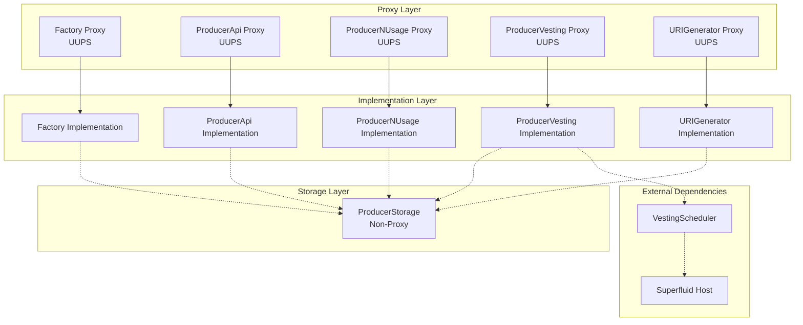
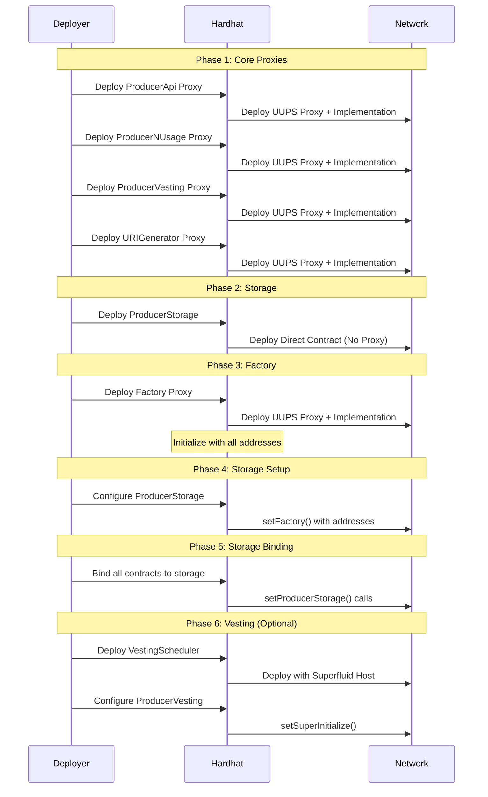
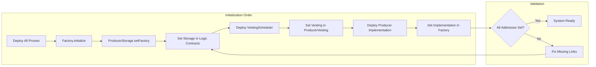
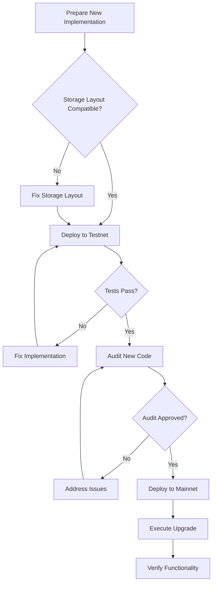

# Deployment ve Initialization Flow

Bu dokümantasyon, BliContract sisteminin deployment sürecini, initialization adımlarını ve upgrade mekanizmalarını detaylarıyla açıklamaktadır.

## İçindekiler
- [Genel Bakış](#genel-bakış)
- [Deployment Mimarisi](#deployment-mimarisi)
- [Deployment Adımları](#deployment-adımları)
- [Initialization Flow](#initialization-flow)
- [Network Konfigürasyonları](#network-konfigürasyonları)
- [Upgrade Mekanizması](#upgrade-mekanizması)
- [Security Considerations](#security-considerations)
- [Troubleshooting](#troubleshooting)

---

## Genel Bakış

BliContract sistemi, **multi-stage deployment** ve **proxy pattern** kullanarak deploy edilir. Sistem:

- **UUPS Proxy Pattern**: Upgradeable kontratlar için
- **EIP-1167 Minimal Proxy**: Producer instance'ları için
- **Centralized Storage**: ProducerStorage delegatecall pattern
- **Superfluid Integration**: VestingScheduler ile stream management

### Deployment Scripts Yapısı
```
scripts/
├── deploy.ts                    # Ana deployment orchestrator
├── v3/
│   ├── deployProxies.ts        # Proxy kontratları deploy
│   ├── setStorage.ts           # Storage bağlantıları kurma
│   ├── deployVesting.ts        # Vesting scheduler deploy
│   ├── setVesting.ts          # Vesting integration
│   ├── ProxiesAddresses.ts    # Address interface
│   └── upgrade/
│       ├── upgradeFactory.ts     # Factory upgrade
│       ├── upgradeProducerLogic.ts # Producer logic upgrade
│       └── upgradeUriGenerator.ts  # URI generator upgrade
└── deploy_local.sh            # Local deployment script
```

---

## Deployment Mimarisi

### Proxy Architecture Diagram


### Contract Deployment Sequence


---

## Deployment Adımları

### 1. Proxy Contracts Deployment
**Script**: [`deployProxies.ts`](../../scripts/v3/deployProxies.ts)

```typescript
// 1. ProducerApi UUPS Proxy
const ProducerApi = await ethers.getContractFactory("ProducerApi");
const producerApi = await upgrades.deployProxy(ProducerApi, [], { kind: "uups" });

// 2. ProducerNUsage UUPS Proxy  
const ProducerNusage = await ethers.getContractFactory("ProducerNUsage");
const producerNusage = await upgrades.deployProxy(ProducerNusage, [], { kind: "uups" });

// 3. ProducerVestingApi UUPS Proxy
const ProducerVestingApi = await ethers.getContractFactory("ProducerVestingApi");
const producerVestingApi = await upgrades.deployProxy(ProducerVestingApi, [], { kind: "uups" });

// 4. URIGenerator UUPS Proxy
const UriGenerator = await ethers.getContractFactory("URIGenerator");
const uriGenerator = await upgrades.deployProxy(UriGenerator, [], { kind: "uups" });

// 5. ProducerStorage (Direct Deployment)
const Pstorage = await ethers.getContractFactory("ProducerStorage");
const pstorage = await Pstorage.deploy();

// 6. Factory UUPS Proxy with Initialization
const Factory = await ethers.getContractFactory("Factory");
const factory = await upgrades.deployProxy(
  Factory,
  [
    uriGenerator.address,
    pstorage.address, 
    producerApi.address,
    producerNusage.address,
    producerVestingApi.address
  ],
  {
    initializer: "initialize",
    unsafeAllow: ["delegatecall"]  // Factory uses delegatecall
  }
);
```

#### Address Storage
```typescript
interface ProxiesAddresses {
  PRODUCER_API_PROXY_ADDRESS: string;
  PRODUCER_NUSAGE_PROXY_ADDRESS: string;
  PRODUCER_VESTING_API_PROXY_ADDRESS: string;
  FACTORY_PROXY_ADDRESS: string;
  URI_GENERATOR_PROXY_ADDRESS: string;
  PRODUCER_STORAGE_PROXY_ADDRESS: string;
}

// Saved to: ./PROXIES_ADDRESSES.io
```

### 2. Storage Configuration
**Script**: [`setStorage.ts`](../../scripts/v3/setStorage.ts)

```typescript
// Step 1: Configure ProducerStorage with all contract addresses
await pstorage.setFactory(
  factory.address,
  producerApi.address,
  producerNusage.address,
  producerVestingApi.address
);

// Step 2: Set ProducerStorage address in all dependent contracts
await producerApi.setProducerStorage(pstorage.address);
await producerNusage.setProducerStorage(pstorage.address);
await producerVestingApi.setProducerStorage(pstorage.address);
await uriGenerator.setProducerStorage(pstorage.address);
```

#### Storage Binding Verification
```typescript
// Verify connections
const factoryStorage = await producerApi.getProducerStorageAddress();
const apiFactory = await pstorage.getFactoryAddress();

assert(factoryStorage === pstorage.address, "ProducerApi storage not set");
assert(apiFactory === factory.address, "ProducerStorage factory not set");
```

### 3. Vesting Integration (Optional)
**Script**: [`deployVesting.ts`](../../scripts/v3/deployVesting.ts) & [`setVesting.ts`](../../scripts/v3/setVesting.ts)

```typescript
// Deploy VestingScheduler
const registrationKey = "";
const host = "0x85Fe79b998509B77BF10A8BD4001D58475D29386"; // Superfluid Host
const vestingScheduler = await ethers.getContractFactory("VestingScheduler");
const vestingContract = await vestingScheduler.deploy(host, registrationKey);

// Configure ProducerVesting with VestingScheduler
await producerVestingApi.setSuperInitialize(vestingContract.address);
```

### 4. Producer Implementation Deployment
**Script**: [`deploy.ts`](../../scripts/v3/deploy.ts)

```typescript
// Deploy Producer implementation for cloning
const Producer = await ethers.getContractFactory("Producer");
const producer = await Producer.deploy();

// Set implementation in Factory
await factory.setProducerImplementation(producer.address);
```

---

## Initialization Flow

### Factory Initialization
```solidity
function initialize(
    address _uriGeneratorAddress,
    address _producerStorageAddress,
    address _producerApiAddress,
    address _producerNUsageAddress,
    address _producerVestingApiAddress
) external initializer {
    __Ownable_init();
    __UUPSUpgradeable_init();
    
    uriGenerator = IURIGenerator(_uriGeneratorAddress);
    producerStorage = IProducerStorage(_producerStorageAddress);
    producerApi = IProducerApi(_producerApiAddress);
    producerNUsage = IProducerNUsage(_producerNUsageAddress);
    producerVestingApi = IProducerVestingApi(_producerVestingApiAddress);
    
    // Initialize state variables
    currentPR_ID = 0;
    _paused = false;
}
```

### ProducerStorage Initialization
```solidity
function setFactory(
    IFactory _factory,
    address _producerApi,
    address _producerUsageApi,
    address _producervestingApi
) external onlyFactory {
    require(address(factory) == address(0), "Already initialized");
    
    factory = _factory;
    producerApi = _producerApi;
    producerUsageApi = _producerUsageApi;
    producervestingApi = _producervestingApi;
}
```

### Initialization Sequence Verification


---

## Network Konfigürasyonları

### Sepolia Testnet
```bash
# Deploy sequence
yarn deploy:sepolia        # Deploy proxies
yarn deploy:sepolia:st     # Set storage
yarn deploy:sepolia:vesting # Deploy vesting
yarn deploy:sepolia:setVesting # Set vesting
```

**Sepolia Superfluid Host**: `0x85Fe79b998509B77BF10A8BD4001D58475D29386`

### Avalanche Fuji
```bash
# Deploy sequence  
yarn deploy:fuji          # Deploy proxies
yarn deploy:fuji:st       # Set storage
yarn deploy:fuji:vesting  # Deploy vesting
yarn deploy:fuji:setVesting # Set vesting
```

### Local Development
```bash
./scripts/deploy_local.sh
# or
yarn deploy:local
```

### Network-Specific Considerations

#### Gas Optimization per Network
| Network | Strategy | Considerations |
|---------|----------|----------------|
| **Ethereum Mainnet** | Minimize transactions | High gas costs |
| **Polygon** | Batch operations | Lower gas, faster blocks |
| **Avalanche** | Parallel deployments | C-Chain compatibility |
| **Local** | Development speed | No gas concerns |

#### Superfluid Integration
```typescript
// Network-specific Superfluid hosts
const SUPERFLUID_HOSTS = {
  sepolia: "0x85Fe79b998509B77BF10A8BD4001D58475D29386",
  polygon: "0x3E14dC1b13c488a8d5D310918780c983bD5982E7",
  avalanche: "0x60377C7016E4cdB03C87EF474896C11cB560752C",
  mainnet: "0x4C073B3baB6d8826b8C5b229f3cfdC1eC6E47E74"
};
```

---

## Upgrade Mekanizması

### UUPS Upgrade Pattern
BliContract UUPS (Universal Upgradeable Proxy Standard) kullanır:

```solidity
// Upgrade authorization
function _authorizeUpgrade(address newImplementation) internal override onlyOwner {}
```

### Factory Upgrade
**Script**: [`upgradeFactory.ts`](../../scripts/v3/upgrade/upgradeFactory.ts)

```typescript
const PROXY_CONTRACT_ADDRESS = getProxyContractAddress();
const newFactory = await ethers.getContractFactory("Factory");

const upgradedProxy = await upgrades.upgradeProxy(
  PROXY_CONTRACT_ADDRESS,
  newFactory,
  { unsafeAllow: ["delegatecall"] }
);
```

### Producer Logic Upgrade
**Script**: [`upgradeProducerLogic.ts`](../../scripts/v3/upgrade/upgradeProducerLogic.ts)

```typescript
const PROXY_CONTRACT_ADDRESS = getProxyContractAddress();
const newLogic = await ethers.getContractFactory("ProducerLogic");

const upgradedProxy = await upgrades.upgradeProxy(
  PROXY_CONTRACT_ADDRESS,
  newLogic,
  { kind: "uups" }
);
```

### Upgrade Safety Checklist


#### Storage Layout Validation
```typescript
// Before upgrade - validate storage layout
import { validateUpgrade } from '@openzeppelin/hardhat-upgrades';

// Validate that NewFactory is upgrade-safe from Factory
await validateUpgrade('Factory', 'NewFactory', {
  unsafeAllow: ['delegatecall']
});
```

---

## Security Considerations

### 1. Proxy Ownership
```solidity
// Factory proxy owner
modifier onlyOwner() {
    require(owner() == _msgSender(), "Ownable: caller is not the owner");
    _;
}

// ProxAdmin controls upgrade rights
ProxyAdmin proxyAdmin = new ProxyAdmin();
proxyAdmin.transferOwnership(secureMultisig);
```

### 2. Initialization Security
```solidity
// Prevent re-initialization
modifier initializer() {
    require(!_initialized || _initializing, "Already initialized");
    bool isTopLevelCall = !_initializing;
    // ... initialization logic
}
```

### 3. Address Validation
```typescript
// Deployment validation
function validateDeployment(addresses: ProxiesAddresses) {
  for (const [key, address] of Object.entries(addresses)) {
    if (!ethers.utils.isAddress(address)) {
      throw new Error(`Invalid address for ${key}: ${address}`);
    }
    if (address === ethers.constants.AddressZero) {
      throw new Error(`Zero address for ${key}`);
    }
  }
}
```

### 4. Delegatecall Risks
```solidity
// Factory uses delegatecall - requires special handling
contract Factory {
    // DANGER: All delegatecall targets must be trusted
    function createProducer() external {
        // EIP-1167 minimal proxy creation
        address clone = Clones.clone(producerImplementation);
        Producer(clone).initialize(/* params */);
    }
}
```

### 5. Upgrade Governance
```typescript
// Multi-signature upgrade process
const UPGRADE_TIMELOCK = 2 * 24 * 60 * 60; // 2 days

// 1. Propose upgrade
await timelock.schedule(
  factory.address,
  0,
  factory.interface.encodeFunctionData("upgradeTo", [newImplementation]),
  ethers.constants.HashZero,
  ethers.constants.HashZero,
  UPGRADE_TIMELOCK
);

// 2. Execute after timelock
await timelock.execute(/* ... */);
```

---

## Troubleshooting

### Common Deployment Issues

#### 1. "Contract code size limit exceeded"
```typescript
// Solution: Split large contracts or optimize
const Factory = await ethers.getContractFactory("Factory", {
  libraries: {
    LargeLibrary: libraryAddress
  }
});
```

#### 2. "Storage slot collision"
```solidity
// Solution: Use storage gaps
contract UpgradeableContract {
    uint256[50] private __gap; // Reserve storage slots
}
```

#### 3. "Already initialized" Error
```typescript
// Solution: Check initialization status
const isInitialized = await factory.initialized();
if (!isInitialized) {
  await factory.initialize(/* params */);
}
```

#### 4. "Invalid proxy address"
```typescript
// Solution: Verify proxy deployment
const proxyAdmin = await upgrades.admin.getInstance();
const implementation = await proxyAdmin.getProxyImplementation(proxyAddress);
console.log("Implementation:", implementation);
```

#### 5. Gas Estimation Failures
```typescript
// Solution: Manual gas estimation
const gasEstimate = await factory.estimateGas.createProducer(/* params */);
const tx = await factory.createProducer(/* params */, {
  gasLimit: gasEstimate.mul(120).div(100) // 20% buffer
});
```

### Deployment Verification Script
```typescript
async function verifyDeployment() {
  const addresses = JSON.parse(fs.readFileSync('./PROXIES_ADDRESSES.io', 'utf8'));
  
  // 1. Verify all contracts deployed
  for (const [name, address] of Object.entries(addresses)) {
    const code = await ethers.provider.getCode(address);
    if (code === '0x') throw new Error(`${name} not deployed at ${address}`);
  }
  
  // 2. Verify proxy connections
  const factory = await ethers.getContractAt('Factory', addresses.FACTORY_PROXY_ADDRESS);
  const storageAddress = await factory.getProducerStorageAddress();
  if (storageAddress !== addresses.PRODUCER_STORAGE_PROXY_ADDRESS) {
    throw new Error('Factory storage address mismatch');
  }
  
  // 3. Verify initialization
  const isFactoryInitialized = await factory.initialized();
  if (!isFactoryInitialized) throw new Error('Factory not initialized');
  
  console.log('✅ Deployment verification successful');
}
```

### Emergency Procedures

#### Pause System
```typescript
// Emergency pause
await factory.pause();
console.log("System paused for maintenance");

// Resume after fix
await factory.unpause();
```

#### Rollback Upgrade
```typescript
// Rollback to previous implementation
const previousImplementation = "0x..."; // Previous version address
await upgrades.upgradeProxy(proxyAddress, previousImplementation);
```

---

## Best Practices

### 1. Deployment Checklist
- [ ] **Pre-deployment**: Code audit, storage layout validation
- [ ] **Testnet deployment**: Full integration testing
- [ ] **Gas optimization**: Batch operations where possible
- [ ] **Address verification**: All addresses validated
- [ ] **Initialization**: Proper initialization sequence
- [ ] **Upgrade safety**: Storage compatibility checked
- [ ] **Monitoring**: Event logs and error tracking

### 2. Network Strategy
```typescript
// Environment-specific configurations
const deployConfig = {
  development: {
    gasPrice: ethers.utils.parseUnits('1', 'gwei'),
    confirmations: 1
  },
  testnet: {
    gasPrice: ethers.utils.parseUnits('10', 'gwei'),
    confirmations: 2
  },
  mainnet: {
    gasPrice: ethers.utils.parseUnits('20', 'gwei'),
    confirmations: 5
  }
};
```

### 3. Monitoring and Alerts
```typescript
// Deployment monitoring
factory.on('ProducerCreated', (producerId, producer, owner) => {
  console.log(`New producer ${producerId} created by ${owner}`);
  // Send to monitoring system
});

// Error tracking
process.on('unhandledRejection', (error) => {
  console.error('Deployment error:', error);
  // Alert dev team
});
```

---

## Sonuç

BliContract deployment sürecinin temel özellikleri:

### ✅ Güçlü Yönler
- **Modular Architecture**: Bağımsız kontrat deployment'ı
- **Upgrade Safety**: UUPS pattern ile güvenli upgrade'ler
- **Network Flexibility**: Multi-network support
- **Storage Efficiency**: Merkezi storage pattern

### ⚠️ Risk Alanları
- **Complex Dependencies**: Çoklu kontrat bağımlılıkları
- **Initialization Order**: Sıralı initialization gerekliliği
- **Delegatecall Security**: Factory'de delegatecall kullanımı
- **Upgrade Coordination**: Koordineli upgrade ihtiyacı

### 🎯 Öneriler
1. **Automated Testing**: Deployment pipeline'ı otomatik test
2. **Upgrade Governance**: Multi-sig upgrade governance
3. **Monitoring**: Deployment ve runtime monitoring
4. **Documentation**: Address ve konfigürasyon dokümantasyonu

Bu deployment flow, production environment'ta güvenli ve ölçeklenebilir bir sistem sağlar.