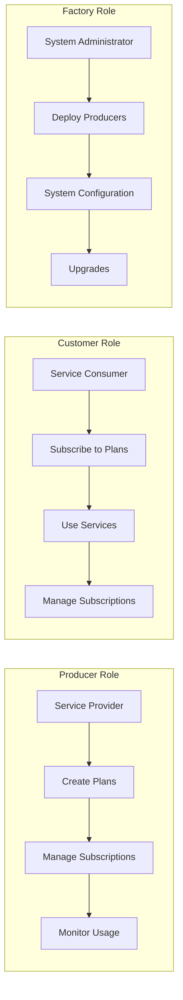
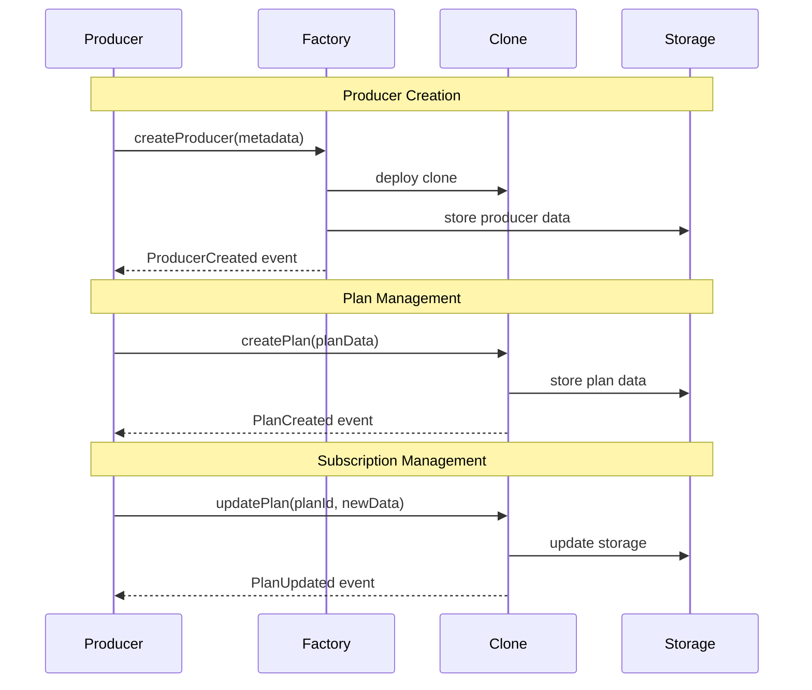
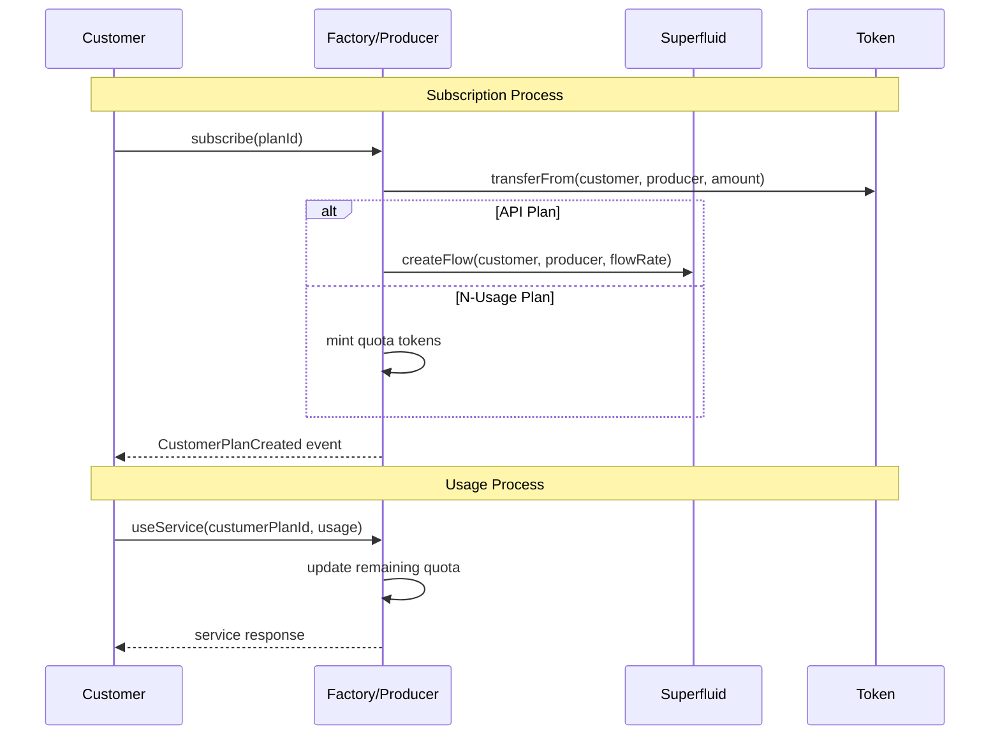

# Integration Guide ve Örnekler

Bu dokümantasyon, BliContract sistemi ile entegrasyon için praktik örnekler, kullanım senaryoları ve best practice'leri içermektedir.

## İçindekiler
- [Genel Bakış](#genel-bakış)
- [Hızlı Başlangıç](#hızlı-başlangıç)
- [Producer Integration](#producer-integration)
- [Customer Integration](#customer-integration)
- [Plan Türü Örnekleri](#plan-türü-örnekleri)
- [Frontend Integration](#frontend-integration)
- [Backend Integration](#backend-integration)
- [Error Handling](#error-handling)
- [Production Checklist](#production-checklist)

---

## Genel Bakış

BliContract sistemi ile entegrasyon 3 ana role göre organize edilir:

### Roller ve Sorumluluklar


### Integration Patterns
| Pattern | Use Case | Complexity | Performance |
|---------|----------|------------|-------------|
| **Direct Contract Calls** | Simple operations | Low | High |
| **Batch Operations** | Multiple actions | Medium | Very High |
| **Event-Driven** | Real-time updates | Medium | High |
| **Proxy Integration** | Custom business logic | High | Medium |

---

## Hızlı Başlangıç

### 1. Environment Setup
```typescript
// Installation
npm install ethers @superfluid-finance/ethereum-contracts

// Contract ABIs import
import { Factory__factory, Producer__factory } from './typechain-types';

// Network configuration
const NETWORK_CONFIG = {
  sepolia: {
    factoryAddress: "0x...",
    rpcUrl: "https://sepolia.infura.io/v3/YOUR_KEY",
    superfluidHost: "0x85Fe79b998509B77BF10A8BD4001D58475D29386"
  }
};
```

### 2. Basic Contract Connection
```typescript
import { ethers } from 'ethers';

class BliContractClient {
  private provider: ethers.providers.Provider;
  private signer: ethers.Signer;
  private factory: ethers.Contract;
  
  constructor(rpcUrl: string, privateKey: string, factoryAddress: string) {
    this.provider = new ethers.providers.JsonRpcProvider(rpcUrl);
    this.signer = new ethers.Wallet(privateKey, this.provider);
    this.factory = Factory__factory.connect(factoryAddress, this.signer);
  }
  
  async getProducer(producerId: number): Promise<ethers.Contract> {
    const producerData = await this.factory.getProducer(producerId);
    return Producer__factory.connect(producerData.cloneAddress, this.signer);
  }
}
```

### 3. Event Listening Setup
```typescript
class EventListener {
  private factory: ethers.Contract;
  
  constructor(factory: ethers.Contract) {
    this.factory = factory;
  }
  
  async startListening() {
    // Producer created events
    this.factory.on('ProducerCreated', (producerId, producer, owner) => {
      console.log(`New producer ${producerId} created by ${owner}`);
      this.handleNewProducer(producerId, producer, owner);
    });
    
    // Customer plan events  
    this.factory.on('CustomerPlanCreated', (custumerPlanId, planId, customer) => {
      console.log(`New subscription ${custumerPlanId} for plan ${planId}`);
      this.handleNewSubscription(custumerPlanId, planId, customer);
    });
  }
  
  private async handleNewProducer(producerId: number, address: string, owner: string) {
    // Business logic for new producer
    await this.notifyProducerCreated(producerId, address, owner);
  }
  
  private async handleNewSubscription(custumerPlanId: number, planId: number, customer: string) {
    // Business logic for new subscription
    await this.updateCustomerDatabase(custumerPlanId, planId, customer);
  }
}
```

---

## Producer Integration

### Producer Workflow


### 1. Producer Registration
```typescript
class ProducerManager {
  private factory: ethers.Contract;
  private signer: ethers.Signer;
  
  async registerAsProducer(metadata: ProducerMetadata): Promise<ProducerResult> {
    try {
      // Prepare producer data
      const producerData = {
        name: metadata.name,
        description: metadata.description,
        image: metadata.imageUrl,
        externalLink: metadata.websiteUrl
      };
      
      // Estimate gas
      const gasEstimate = await this.factory.estimateGas.createProducer(producerData);
      
      // Execute transaction
      const tx = await this.factory.createProducer(producerData, {
        gasLimit: gasEstimate.mul(120).div(100) // 20% buffer
      });
      
      const receipt = await tx.wait();
      
      // Parse events to get producer ID
      const event = receipt.events?.find(e => e.event === 'ProducerCreated');
      const producerId = event?.args?.producerId;
      const cloneAddress = event?.args?.producer;
      
      return {
        success: true,
        producerId: producerId.toNumber(),
        cloneAddress,
        transactionHash: receipt.transactionHash
      };
      
    } catch (error) {
      return {
        success: false,
        error: error.message
      };
    }
  }
}

interface ProducerMetadata {
  name: string;
  description: string;
  imageUrl: string;
  websiteUrl: string;
}

interface ProducerResult {
  success: boolean;
  producerId?: number;
  cloneAddress?: string;
  transactionHash?: string;
  error?: string;
}
```

### 2. Plan Creation Examples

#### API Plan Creation
```typescript
class ApiPlanManager {
  private producer: ethers.Contract;
  
  async createApiPlan(planData: ApiPlanData): Promise<PlanResult> {
    try {
      // Plan basic data
      const plan = {
        planId: planData.planId,
        name: planData.name,
        description: planData.description,
        externalLink: planData.docsUrl,
        totalSupply: planData.maxSubscribers || -1, // -1 = unlimited
        backgroundColor: planData.brandColor || "#007bff",
        image: planData.planImageUrl,
        priceAddress: planData.paymentTokenAddress,
        startDate: Math.floor(Date.now() / 1000) // Current timestamp
      };
      
      // API specific info
      const apiInfo = {
        flowRate: this.calculateFlowRate(planData.monthlyPrice),
        perMonthLimit: planData.monthlyApiLimit
      };
      
      // Create plan
      const tx = await this.producer.createPlan(
        plan,
        apiInfo,
        [], // No N-usage info
        {}, // No vesting info
        0   // API plan type
      );
      
      const receipt = await tx.wait();
      
      return {
        success: true,
        planId: planData.planId,
        transactionHash: receipt.transactionHash
      };
      
    } catch (error) {
      return {
        success: false,
        error: error.message
      };
    }
  }
  
  private calculateFlowRate(monthlyPriceInEth: number): string {
    // Convert monthly price to wei per second
    const monthlyPriceWei = ethers.utils.parseEther(monthlyPriceInEth.toString());
    const secondsInMonth = 30 * 24 * 60 * 60; // 2592000
    return monthlyPriceWei.div(secondsInMonth).toString();
  }
}

interface ApiPlanData {
  planId: number;
  name: string;
  description: string;
  docsUrl: string;
  monthlyPrice: number; // in ETH
  monthlyApiLimit: number;
  maxSubscribers?: number;
  brandColor?: string;
  planImageUrl: string;
  paymentTokenAddress: string;
}
```

#### N-Usage Plan Creation
```typescript
class NUsagePlanManager {
  private producer: ethers.Contract;
  
  async createNUsagePlan(planData: NUsagePlanData): Promise<PlanResult> {
    try {
      const plan = {
        planId: planData.planId,
        name: planData.name,
        description: planData.description,
        externalLink: planData.docsUrl,
        totalSupply: -1, // Usually unlimited for pay-per-use
        backgroundColor: planData.brandColor || "#28a745",
        image: planData.planImageUrl,
        priceAddress: planData.paymentTokenAddress,
        startDate: Math.floor(Date.now() / 1000)
      };
      
      const nUsageInfo = {
        oneUsagePrice: ethers.utils.parseEther(planData.pricePerCall.toString()),
        minUsageLimit: planData.minimumPurchase,
        maxUsageLimit: planData.maximumPurchase || 1000000
      };
      
      const tx = await this.producer.createPlan(
        plan,
        {}, // No API info
        nUsageInfo,
        {}, // No vesting info
        1   // N-Usage plan type
      );
      
      const receipt = await tx.wait();
      
      return {
        success: true,
        planId: planData.planId,
        transactionHash: receipt.transactionHash
      };
      
    } catch (error) {
      return {
        success: false,
        error: error.message
      };
    }
  }
}

interface NUsagePlanData {
  planId: number;
  name: string;
  description: string;
  docsUrl: string;
  pricePerCall: number; // in ETH
  minimumPurchase: number;
  maximumPurchase?: number;
  brandColor?: string;
  planImageUrl: string;
  paymentTokenAddress: string;
}
```

### 3. Subscription Management
```typescript
class SubscriptionManager {
  private producer: ethers.Contract;
  
  async getCustomerSubscriptions(customerAddress: string): Promise<CustomerSubscription[]> {
    try {
      const customer = await this.producer.getCustomer(customerAddress);
      const subscriptions: CustomerSubscription[] = [];
      
      for (const customerPlan of customer.customerPlans) {
        const planData = await this.producer.getPlan(customerPlan.planId);
        
        subscriptions.push({
          custumerPlanId: customerPlan.custumerPlanId.toNumber(),
          planId: customerPlan.planId.toNumber(),
          planName: planData.name,
          status: this.parseStatus(customerPlan.status),
          startDate: new Date(customerPlan.startDate * 1000),
          endDate: customerPlan.endDate > 0 ? new Date(customerPlan.endDate * 1000) : null,
          remainingQuota: customerPlan.remainingQuota.toNumber(),
          planType: this.parsePlanType(customerPlan.planType)
        });
      }
      
      return subscriptions;
      
    } catch (error) {
      throw new Error(`Failed to get subscriptions: ${error.message}`);
    }
  }
  
  async updateCustomerQuota(custumerPlanId: number, newQuota: number): Promise<TransactionResult> {
    try {
      const tx = await this.producer.updateRemainingQuota(custumerPlanId, newQuota);
      const receipt = await tx.wait();
      
      return {
        success: true,
        transactionHash: receipt.transactionHash
      };
      
    } catch (error) {
      return {
        success: false,
        error: error.message
      };
    }
  }
  
  private parseStatus(status: number): string {
    const statuses = ['inactive', 'active', 'expired'];
    return statuses[status] || 'unknown';
  }
  
  private parsePlanType(planType: number): string {
    const types = ['api', 'nUsage', 'vestingApi'];
    return types[planType] || 'unknown';
  }
}

interface CustomerSubscription {
  custumerPlanId: number;
  planId: number;
  planName: string;
  status: string;
  startDate: Date;
  endDate: Date | null;
  remainingQuota: number;
  planType: string;
}
```

---

## Customer Integration

### Customer Workflow


### 1. Plan Discovery
```typescript
class PlanDiscovery {
  private factory: ethers.Contract;
  
  async searchPlans(filters: PlanFilters): Promise<PlanSearchResult[]> {
    try {
      const producerCount = await this.factory.currentPR_ID();
      const plans: PlanSearchResult[] = [];
      
      for (let producerId = 1; producerId <= producerCount; producerId++) {
        const producer = await this.factory.getProducer(producerId);
        const producerContract = Producer__factory.connect(producer.cloneAddress, this.factory.provider);
        
        // Get all plans for this producer
        const planIds = await producerContract.getAllPlanIds();
        
        for (const planId of planIds) {
          const plan = await producerContract.getPlan(planId);
          
          // Apply filters
          if (this.matchesFilters(plan, filters)) {
            plans.push({
              planId: plan.planId.toNumber(),
              producerId: producerId,
              producerName: producer.name,
              planName: plan.name,
              description: plan.description,
              planType: this.parsePlanType(plan.planType),
              priceInfo: await this.getPriceInfo(producerContract, planId, plan.planType),
              status: this.parseStatus(plan.status),
              currentSupply: plan.currentSupply.toNumber(),
              totalSupply: plan.totalSupply.toNumber()
            });
          }
        }
      }
      
      return plans;
      
    } catch (error) {
      throw new Error(`Plan search failed: ${error.message}`);
    }
  }
  
  private async getPriceInfo(producer: ethers.Contract, planId: number, planType: number): Promise<PriceInfo> {
    switch (planType) {
      case 0: // API Plan
        const apiInfo = await producer.getPlanInfoApi(planId);
        return {
          type: 'subscription',
          flowRate: apiInfo.flowRate.toString(),
          monthlyLimit: apiInfo.perMonthLimit.toNumber()
        };
        
      case 1: // N-Usage Plan
        const nUsageInfo = await producer.getPlanInfoNUsage(planId);
        return {
          type: 'pay-per-use',
          oneUsagePrice: nUsageInfo.oneUsagePrice.toString(),
          minLimit: nUsageInfo.minUsageLimit,
          maxLimit: nUsageInfo.maxUsageLimit
        };
        
      case 2: // Vesting Plan
        const vestingInfo = await producer.getPlanInfoVesting(planId);
        return {
          type: 'vesting',
          cliffDate: vestingInfo.cliffDate,
          flowRate: vestingInfo.flowRate.toString(),
          startAmount: vestingInfo.startAmount.toString()
        };
        
      default:
        return { type: 'unknown' };
    }
  }
  
  private matchesFilters(plan: any, filters: PlanFilters): boolean {
    if (filters.planType !== undefined && plan.planType !== filters.planType) return false;
    if (filters.priceRange && !this.inPriceRange(plan, filters.priceRange)) return false;
    if (filters.status !== undefined && plan.status !== filters.status) return false;
    
    return true;
  }
}

interface PlanFilters {
  planType?: number;
  priceRange?: { min: number; max: number };
  status?: number;
  search?: string;
}

interface PlanSearchResult {
  planId: number;
  producerId: number;
  producerName: string;
  planName: string;
  description: string;
  planType: string;
  priceInfo: PriceInfo;
  status: string;
  currentSupply: number;
  totalSupply: number;
}

interface PriceInfo {
  type: string;
  flowRate?: string;
  monthlyLimit?: number;
  oneUsagePrice?: string;
  minLimit?: number;
  maxLimit?: number;
  cliffDate?: number;
  startAmount?: string;
}
```

### 2. Subscription Process
```typescript
class SubscriptionService {
  private factory: ethers.Contract;
  private signer: ethers.Signer;
  
  async subscribeToApiPlan(planId: number, producerId: number): Promise<SubscriptionResult> {
    try {
      // Get producer and plan info
      const producer = await this.factory.getProducer(producerId);
      const producerContract = Producer__factory.connect(producer.cloneAddress, this.signer);
      const plan = await producerContract.getPlan(planId);
      const apiInfo = await producerContract.getPlanInfoApi(planId);
      
      // Check if plan is active and has supply
      if (plan.status !== 1) throw new Error('Plan is not active');
      if (plan.totalSupply > 0 && plan.currentSupply >= plan.totalSupply) {
        throw new Error('Plan is sold out');
      }
      
      // Approve token spending if needed
      const tokenContract = new ethers.Contract(
        plan.priceAddress,
        ['function approve(address spender, uint256 amount) external returns (bool)'],
        this.signer
      );
      
      // For API plans, we need to approve for Superfluid stream
      const monthlyAmount = ethers.BigNumber.from(apiInfo.flowRate).mul(2592000); // 30 days
      await tokenContract.approve(producer.cloneAddress, monthlyAmount.mul(12)); // Approve for 1 year
      
      // Subscribe to plan
      const tx = await producerContract.subscribe(planId);
      const receipt = await tx.wait();
      
      // Parse events to get customer plan ID
      const event = receipt.events?.find(e => e.event === 'CustomerPlanCreated');
      const custumerPlanId = event?.args?.custumerPlanId;
      
      return {
        success: true,
        custumerPlanId: custumerPlanId.toNumber(),
        transactionHash: receipt.transactionHash
      };
      
    } catch (error) {
      return {
        success: false,
        error: error.message
      };
    }
  }
  
  async subscribeToNUsagePlan(planId: number, producerId: number, usageAmount: number): Promise<SubscriptionResult> {
    try {
      const producer = await this.factory.getProducer(producerId);
      const producerContract = Producer__factory.connect(producer.cloneAddress, this.signer);
      const plan = await producerContract.getPlan(planId);
      const nUsageInfo = await producerContract.getPlanInfoNUsage(planId);
      
      // Validate usage amount
      if (usageAmount < nUsageInfo.minUsageLimit || usageAmount > nUsageInfo.maxUsageLimit) {
        throw new Error(`Usage amount must be between ${nUsageInfo.minUsageLimit} and ${nUsageInfo.maxUsageLimit}`);
      }
      
      // Calculate total cost
      const totalCost = nUsageInfo.oneUsagePrice.mul(usageAmount);
      
      // Approve token spending
      const tokenContract = new ethers.Contract(
        plan.priceAddress,
        ['function approve(address spender, uint256 amount) external returns (bool)'],
        this.signer
      );
      await tokenContract.approve(producer.cloneAddress, totalCost);
      
      // Subscribe with usage amount
      const tx = await producerContract.subscribeNUsage(planId, usageAmount);
      const receipt = await tx.wait();
      
      const event = receipt.events?.find(e => e.event === 'CustomerPlanCreated');
      const custumerPlanId = event?.args?.custumerPlanId;
      
      return {
        success: true,
        custumerPlanId: custumerPlanId.toNumber(),
        transactionHash: receipt.transactionHash,
        purchasedQuota: usageAmount,
        totalCost: ethers.utils.formatEther(totalCost)
      };
      
    } catch (error) {
      return {
        success: false,
        error: error.message
      };
    }
  }
}

interface SubscriptionResult {
  success: boolean;
  custumerPlanId?: number;
  transactionHash?: string;
  purchasedQuota?: number;
  totalCost?: string;
  error?: string;
}
```

### 3. Service Usage
```typescript
class ServiceUsage {
  private producer: ethers.Contract;
  
  async useApiService(custumerPlanId: number, apiEndpoint: string, requestData: any): Promise<ApiResponse> {
    try {
      // Check customer plan status and quota
      const customerPlan = await this.producer.getCustomerPlan(custumerPlanId);
      
      if (customerPlan.status !== 1) {
        throw new Error('Subscription is not active');
      }
      
      // For API plans, check monthly limit
      if (customerPlan.planType === 0) {
        const usage = await this.getMonthlyUsage(custumerPlanId);
        const plan = await this.producer.getPlan(customerPlan.planId);
        const apiInfo = await this.producer.getPlanInfoApi(customerPlan.planId);
        
        if (usage >= apiInfo.perMonthLimit) {
          throw new Error('Monthly API limit exceeded');
        }
      }
      
      // For N-Usage plans, check and consume quota
      if (customerPlan.planType === 1) {
        if (customerPlan.remainingQuota <= 0) {
          throw new Error('No remaining quota');
        }
        
        // Consume 1 unit of quota
        const tx = await this.producer.useQuota(custumerPlanId, 1);
        await tx.wait();
      }
      
      // Make actual API call (this would be to your service)
      const response = await this.callService(apiEndpoint, requestData, custumerPlanId);
      
      return {
        success: true,
        data: response,
        remainingQuota: customerPlan.planType === 1 ? customerPlan.remainingQuota - 1 : null
      };
      
    } catch (error) {
      return {
        success: false,
        error: error.message
      };
    }
  }
  
  private async callService(endpoint: string, data: any, custumerPlanId: number): Promise<any> {
    // This would be your actual service call
    // Include custumerPlanId for tracking and authorization
    
    const response = await fetch(endpoint, {
      method: 'POST',
      headers: {
        'Content-Type': 'application/json',
        'X-Customer-Plan-ID': custumerPlanId.toString()
      },
      body: JSON.stringify(data)
    });
    
    return await response.json();
  }
  
  private async getMonthlyUsage(custumerPlanId: number): Promise<number> {
    // This would query your usage tracking system
    // For the scope of this example, we'll return a placeholder
    return 0;
  }
}

interface ApiResponse {
  success: boolean;
  data?: any;
  remainingQuota?: number;
  error?: string;
}
```

---

## Stream-Aware Integration ✨ **YENİ BÖLÜM**

### Stream Entegrasyon Özellikleri

BliContract v2 ile birlikte gelen stream-aware fonksiyonlar, gelişmiş ödeme akışları ve real-time validation sağlar.

#### 1. Enhanced Customer Plan Creation
```typescript
class StreamAwarePlanManager {
  private producer: ethers.Contract;
  
  async createCustomerPlanWithStream(
    planData: CustomerPlanData, 
    streamDuration: number
  ): Promise<StreamPlanResult> {
    try {
      // Enhanced customer plan creation
      const tx = await this.producer.addCustomerPlanWithStream(
        {
          customerAdress: planData.customerAddress,
          planId: planData.planId,
          producerId: planData.producerId,
          cloneAddress: this.producer.address,
          priceAddress: planData.tokenAddress,
          startDate: Math.floor(Date.now() / 1000),
          endDate: planData.endDate || 0,
          remainingQuota: planData.quota,
          status: 1, // Active
          planType: planData.planType
        },
        streamDuration // Stream duration in seconds
      );
      
      const receipt = await tx.wait();
      const [custumerPlanId, streamLockId] = tx.returnValue;
      
      return {
        success: true,
        custumerPlanId: custumerPlanId.toNumber(),
        streamLockId: streamLockId,
        transactionHash: receipt.transactionHash,
        streamActive: streamLockId !== ethers.constants.HashZero
      };
      
    } catch (error) {
      return {
        success: false,
        error: error.message
      };
    }
  }
}

interface CustomerPlanData {
  customerAddress: string;
  planId: number;
  producerId: number;
  tokenAddress: string;
  quota: number;
  endDate?: number;
  planType: number; // 0=api, 1=nUsage, 2=vestingApi
}

interface StreamPlanResult {
  success: boolean;
  custumerPlanId?: number;
  streamLockId?: string;
  transactionHash?: string;
  streamActive?: boolean;
  error?: string;
}
```

#### 2. Real-time Stream Validation
```typescript
class StreamValidator {
  private producer: ethers.Contract;
  
  async validateServiceAccess(custumerPlanId: number): Promise<ServiceAccessInfo> {
    try {
      const [canUse, remainingTime, streamLockId] = await this.producer.validateUsageWithStream(custumerPlanId);
      
      return {
        canUse,
        remainingTime: remainingTime.toNumber(),
        streamLockId,
        accessLevel: this.determineAccessLevel(canUse, remainingTime),
        expiresAt: remainingTime > 0 ? new Date(Date.now() + remainingTime * 1000) : null
      };
      
    } catch (error) {
      throw new Error(`Stream validation failed: ${error.message}`);
    }
  }
  
  private determineAccessLevel(canUse: boolean, remainingTime: number): string {
    if (!canUse) return 'denied';
    if (remainingTime === 0) return 'unlimited';
    if (remainingTime < 86400) return 'expiring_soon'; // Less than 24 hours
    return 'active';
  }
}

interface ServiceAccessInfo {
  canUse: boolean;
  remainingTime: number;
  streamLockId: string;
  accessLevel: string;
  expiresAt: Date | null;
}
```

#### 3. Stream Settlement on Usage
```typescript
class StreamSettlementService {
  private producer: ethers.Contract;
  
  async useServiceWithSettlement(
    custumerPlanId: number, 
    usageAmount: number = 1
  ): Promise<UsageResult> {
    try {
      // First validate access
      const accessInfo = await this.validateServiceAccess(custumerPlanId);
      if (!accessInfo.canUse) {
        throw new Error('Service access denied');
      }
      
      // Settle stream and update usage
      const tx = await this.producer.settleStreamOnUsage(custumerPlanId, usageAmount);
      const receipt = await tx.wait();
      
      // Parse settlement events
      const events = receipt.events?.filter(e => e.event === 'StreamUsageValidated') || [];
      const settlementSuccess = events.length > 0 && events[0].args?.canUse;
      
      return {
        success: true,
        usageConsumed: usageAmount,
        settlementSuccess,
        transactionHash: receipt.transactionHash,
        newAccessInfo: await this.validateServiceAccess(custumerPlanId)
      };
      
    } catch (error) {
      return {
        success: false,
        error: error.message
      };
    }
  }
}

interface UsageResult {
  success: boolean;
  usageConsumed?: number;
  settlementSuccess?: boolean;
  transactionHash?: string;
  newAccessInfo?: ServiceAccessInfo;
  error?: string;
}
```

### Plan Type Specific Stream Implementations

#### API Plans with Stream Payment
```typescript
// Example: Continuous API access with streaming payments
const streamingApiPlan = {
  planId: 3001,
  name: "Streaming API Pro",
  description: "Continuous API access with real-time streaming payments",
  flowRate: "385802469135802", // ~1 DAI per month in wei/second
  perMonthLimit: 50000,
  streamDuration: 2592000, // 30 days
  autoRenewal: true
};

class StreamingApiService {
  async createApiSubscription(planId: number, duration: number): Promise<StreamPlanResult> {
    const customerPlan = {
      customerAddress: await this.signer.getAddress(),
      planId,
      producerId: this.producerId,
      tokenAddress: this.daiAddress,
      quota: Number.MAX_SAFE_INTEGER, // Unlimited for API
      planType: 0 // API plan
    };
    
    return await this.planManager.createCustomerPlanWithStream(customerPlan, duration);
  }
  
  async useStreamingApi(custumerPlanId: number, apiCall: ApiCall): Promise<ApiResponse> {
    // Validate stream before usage
    const accessInfo = await this.validator.validateServiceAccess(custumerPlanId);
    if (!accessInfo.canUse) {
      throw new Error('Stream payment insufficient');
    }
    
    // Make API call
    const response = await this.makeApiCall(apiCall);
    
    // Stream settlement handled automatically by StreamLockManager
    // No explicit quota consumption for API plans
    
    return response;
  }
}
```

#### VestingApi Plans with Cliff + Stream
```typescript
// Example: Premium content access with cliff payment + streaming
const vestingContentPlan = {
  planId: 4001,
  name: "Premium Research Vault",
  description: "1-year access to premium research with initial bonus",
  cliffAmount: ethers.utils.parseEther("1000"), // $1000 immediate access
  monthlyStreamAmount: ethers.utils.parseEther("500"), // $500 per month for 11 months
  cliffDate: Math.floor(Date.now() / 1000) + (24 * 60 * 60), // 24 hours from now
  totalValue: ethers.utils.parseEther("6500") // $6500 total value
};

class VestingContentService {
  async createVestingSubscription(planId: number): Promise<StreamPlanResult> {
    const vestingInfo = await this.producer.getPlanInfoVesting(planId);
    const streamDuration = 11 * 30 * 24 * 60 * 60; // 11 months
    
    const customerPlan = {
      customerAddress: await this.signer.getAddress(),
      planId,
      producerId: this.producerId,
      tokenAddress: this.usdcAddress,
      quota: Number.MAX_SAFE_INTEGER, // Unlimited for vesting
      planType: 2 // VestingApi plan
    };
    
    return await this.planManager.createCustomerPlanWithStream(customerPlan, streamDuration);
  }
  
  async accessPremiumContent(custumerPlanId: number, contentId: string): Promise<ContentAccess> {
    const accessInfo = await this.validator.validateServiceAccess(custumerPlanId);
    
    if (!accessInfo.canUse) {
      throw new Error('Vesting period not started or insufficient payment');
    }
    
    // Check if cliff period has passed
    const customerPlan = await this.producer.getCustomerPlan(custumerPlanId);
    const vestingInfo = await this.producer.getPlanInfoVesting(customerPlan.planId);
    
    if (Date.now() / 1000 < vestingInfo.cliffDate) {
      return {
        access: 'cliff_only',
        content: await this.getCliffContent(contentId),
        fullAccessDate: new Date(vestingInfo.cliffDate * 1000)
      };
    }
    
    return {
      access: 'full',
      content: await this.getFullContent(contentId),
      streamActive: accessInfo.streamLockId !== ethers.constants.HashZero
    };
  }
}

interface ContentAccess {
  access: 'cliff_only' | 'full' | 'denied';
  content?: any;
  fullAccessDate?: Date;
  streamActive?: boolean;
}
```

### Stream Monitoring and Analytics
```typescript
class StreamAnalytics {
  private producer: ethers.Contract;
  private streamLockManager: ethers.Contract;
  
  async getStreamMetrics(custumerPlanId: number): Promise<StreamMetrics> {
    try {
      const streamLockId = await this.producer.getStreamLockIdForCustomerPlan(custumerPlanId);
      
      if (streamLockId === ethers.constants.HashZero) {
        return { hasStream: false };
      }
      
      const [isActive, isExpired, accruedAmount, remainingAmount, remainingTime] = 
        await this.streamLockManager.getStreamStatus(streamLockId);
      
      return {
        hasStream: true,
        streamLockId,
        isActive,
        isExpired,
        accruedAmount: ethers.utils.formatEther(accruedAmount),
        remainingAmount: ethers.utils.formatEther(remainingAmount),
        remainingTime: remainingTime.toNumber(),
        progressPercentage: this.calculateProgress(accruedAmount, remainingAmount),
        estimatedEndDate: new Date(Date.now() + remainingTime.toNumber() * 1000)
      };
      
    } catch (error) {
      throw new Error(`Stream metrics failed: ${error.message}`);
    }
  }
  
  private calculateProgress(accrued: ethers.BigNumber, remaining: ethers.BigNumber): number {
    const total = accrued.add(remaining);
    if (total.isZero()) return 0;
    return accrued.mul(100).div(total).toNumber();
  }
}

interface StreamMetrics {
  hasStream: boolean;
  streamLockId?: string;
  isActive?: boolean;
  isExpired?: boolean;
  accruedAmount?: string;
  remainingAmount?: string;
  remainingTime?: number;
  progressPercentage?: number;
  estimatedEndDate?: Date;
}
```

---

## Plan Türü Örnekleri

### 1. API Subscription Plan (Streaming)
```typescript
// Example: AI Text Generation API
const aiApiPlan = {
  planId: 1001,
  name: "AI Text Pro",
  description: "Professional AI text generation with 100k tokens/month",
  docsUrl: "https://api.example.com/docs",
  monthlyPrice: 29.99, // USD in stablecoin
  monthlyApiLimit: 100000, // tokens
  maxSubscribers: 1000,
  brandColor: "#6366f1",
  planImageUrl: "https://cdn.example.com/ai-pro.png",
  paymentTokenAddress: "0xA0b86a33E6441C05B6f6a4F3BBb6e8a59FE66B75" // USDC
};

// Usage tracking would be handled in your backend:
class ApiUsageTracker {
  async trackApiCall(custumerPlanId: number, tokensUsed: number) {
    // Update usage in your database
    // Check limits
    // Bill accordingly
  }
}
```

### 2. Pay-Per-Use Plan (N-Usage)
```typescript
// Example: Image Processing Service
const imageProcessingPlan = {
  planId: 2001,
  name: "Image Processing Credits",
  description: "Pay-per-image processing with bulk discounts",
  docsUrl: "https://api.example.com/image-docs",
  pricePerCall: 0.10, // $0.10 per image
  minimumPurchase: 10, // Minimum 10 credits
  maximumPurchase: 10000, // Maximum 10k credits
  brandColor: "#10b981",
  planImageUrl: "https://cdn.example.com/image-processing.png",
  paymentTokenAddress: "0xA0b86a33E6441C05B6f6a4F3BBb6e8a59FE66B75" // USDC
};

// Service implementation:
class ImageProcessingService {
  async processImage(custumerPlanId: number, imageData: Buffer): Promise<ProcessedImage> {
    // 1. Verify customer plan and consume 1 quota
    const result = await this.serviceUsage.useApiService(
      custumerPlanId, 
      '/api/process-image', 
      { image: imageData.toString('base64') }
    );
    
    if (!result.success) throw new Error(result.error);
    
    // 2. Process image using your service
    const processedImage = await this.performImageProcessing(imageData);
    
    return {
      originalSize: imageData.length,
      processedSize: processedImage.length,
      processedImage,
      remainingCredits: result.remainingQuota
    };
  }
}
```

### 3. Vesting Plan (Time-Based Access)
```typescript
// Example: Premium Research Access
const researchAccessPlan = {
  planId: 3001,
  name: "Premium Research Vault",
  description: "1-year access to premium research with initial bonus",
  cliffAmount: 1000, // $1000 immediate access
  monthlyStreamAmount: 500, // $500 per month for 11 months
  cliffDate: Math.floor(Date.now() / 1000) + (24 * 60 * 60), // 24 hours from now
  totalValue: 6500, // $6500 total value
  brandColor: "#f59e0b",
  planImageUrl: "https://cdn.example.com/research-vault.png",
  paymentTokenAddress: "0xA0b86a33E6441C05B6f6a4F3BBb6e8a59FE66B75" // USDC
};

// Vesting implementation would use Superfluid streams:
class VestingService {
  async claimCliffAmount(custumerPlanId: number): Promise<ClaimResult> {
    const customerPlan = await this.producer.getCustomerPlan(custumerPlanId);
    const vestingInfo = await this.producer.getPlanInfoVesting(customerPlan.planId);
    
    if (Date.now() / 1000 < vestingInfo.cliffDate) {
      throw new Error('Cliff period not reached yet');
    }
    
    // Trigger cliff payment through Superfluid
    const tx = await this.producer.claimCliff(custumerPlanId);
    const receipt = await tx.wait();
    
    return {
      success: true,
      claimedAmount: vestingInfo.startAmount.toString(),
      transactionHash: receipt.transactionHash
    };
  }
}
```

---

## Frontend Integration

### 1. React Integration Example
```tsx
// React hook for BliContract integration
import { useState, useEffect } from 'react';
import { ethers } from 'ethers';

export function useBliContract() {
  const [client, setClient] = useState<BliContractClient | null>(null);
  const [loading, setLoading] = useState(false);
  const [error, setError] = useState<string | null>(null);
  
  const connect = async () => {
    setLoading(true);
    setError(null);
    
    try {
      if (!window.ethereum) throw new Error('MetaMask not found');
      
      await window.ethereum.request({ method: 'eth_requestAccounts' });
      const provider = new ethers.providers.Web3Provider(window.ethereum);
      const signer = provider.getSigner();
      
      const network = await provider.getNetwork();
      const factoryAddress = NETWORK_CONFIG[network.name]?.factoryAddress;
      
      if (!factoryAddress) throw new Error(`Unsupported network: ${network.name}`);
      
      const bliClient = new BliContractClient(
        provider,
        await signer.getAddress(),
        factoryAddress
      );
      
      setClient(bliClient);
    } catch (err) {
      setError(err.message);
    } finally {
      setLoading(false);
    }
  };
  
  return { client, loading, error, connect };
}

// Plan discovery component
export function PlanDiscovery() {
  const { client } = useBliContract();
  const [plans, setPlans] = useState<PlanSearchResult[]>([]);
  const [loading, setLoading] = useState(false);
  
  useEffect(() => {
    if (client) {
      loadPlans();
    }
  }, [client]);
  
  const loadPlans = async () => {
    setLoading(true);
    try {
      const discovery = new PlanDiscovery(client.factory);
      const results = await discovery.searchPlans({});
      setPlans(results);
    } catch (error) {
      console.error('Failed to load plans:', error);
    } finally {
      setLoading(false);
    }
  };
  
  const subscribe = async (planId: number, producerId: number) => {
    if (!client) return;
    
    try {
      const subscriptionService = new SubscriptionService(client.factory, client.signer);
      const result = await subscriptionService.subscribeToApiPlan(planId, producerId);
      
      if (result.success) {
        alert(`Successfully subscribed! Customer Plan ID: ${result.custumerPlanId}`);
      } else {
        alert(`Subscription failed: ${result.error}`);
      }
    } catch (error) {
      alert(`Error: ${error.message}`);
    }
  };
  
  return (
    <div className="plan-discovery">
      <h2>Available Plans</h2>
      {loading ? (
        <div>Loading plans...</div>
      ) : (
        <div className="plans-grid">
          {plans.map(plan => (
            <div key={`${plan.producerId}-${plan.planId}`} className="plan-card">
              <h3>{plan.planName}</h3>
              <p>{plan.description}</p>
              <div className="plan-details">
                <span>Producer: {plan.producerName}</span>
                <span>Type: {plan.planType}</span>
                <span>Status: {plan.status}</span>
              </div>
              <button onClick={() => subscribe(plan.planId, plan.producerId)}>
                Subscribe
              </button>
            </div>
          ))}
        </div>
      )}
    </div>
  );
}
```

### 2. Vue.js Integration
```vue
<template>
  <div class="subscription-manager">
    <h2>My Subscriptions</h2>
    
    <div v-if="loading">Loading subscriptions...</div>
    
    <div v-else class="subscriptions-list">
      <div 
        v-for="sub in subscriptions" 
        :key="sub.custumerPlanId"
        class="subscription-card"
        :class="sub.status"
      >
        <h3>{{ sub.planName }}</h3>
        <div class="subscription-info">
          <span>Status: {{ sub.status }}</span>
          <span>Type: {{ sub.planType }}</span>
          <span v-if="sub.remainingQuota > 0">
            Remaining: {{ sub.remainingQuota }}
          </span>
        </div>
        
        <button 
          v-if="sub.planType === 'nUsage' && sub.remainingQuota < 10"
          @click="buyMoreCredits(sub.custumerPlanId)"
        >
          Buy More Credits
        </button>
        
        <button 
          v-if="sub.status === 'active'"
          @click="useService(sub.custumerPlanId)"
        >
          Use Service
        </button>
      </div>
    </div>
  </div>
</template>

<script>
import { BliContractClient, SubscriptionManager } from '@/services/blicontract';

export default {
  name: 'SubscriptionManager',
  data() {
    return {
      subscriptions: [],
      loading: false,
      client: null
    };
  },
  
  async mounted() {
    await this.initializeClient();
    await this.loadSubscriptions();
  },
  
  methods: {
    async initializeClient() {
      // Initialize BliContract client
      this.client = new BliContractClient(/* config */);
    },
    
    async loadSubscriptions() {
      this.loading = true;
      try {
        const manager = new SubscriptionManager(this.client);
        this.subscriptions = await manager.getCustomerSubscriptions(
          this.client.userAddress
        );
      } catch (error) {
        console.error('Failed to load subscriptions:', error);
      } finally {
        this.loading = false;
      }
    },
    
    async useService(custumerPlanId) {
      try {
        const serviceUsage = new ServiceUsage(this.client.producer);
        const result = await serviceUsage.useApiService(
          custumerPlanId,
          '/api/my-service',
          { /* request data */ }
        );
        
        if (result.success) {
          // Handle successful service usage
          this.$emit('service-used', result);
          await this.loadSubscriptions(); // Refresh
        } else {
          alert(`Service usage failed: ${result.error}`);
        }
      } catch (error) {
        alert(`Error: ${error.message}`);
      }
    },
    
    async buyMoreCredits(custumerPlanId) {
      // Implementation for buying additional credits
      this.$router.push(`/buy-credits/${custumerPlanId}`);
    }
  }
};
</script>
```

---

## Backend Integration

### 1. Express.js API Server
```typescript
// Express server for BliContract integration
import express from 'express';
import { BliContractClient, ServiceUsage } from './blicontract-client';

const app = express();
app.use(express.json());

// Initialize BliContract client
const bliClient = new BliContractClient(
  process.env.RPC_URL!,
  process.env.PRIVATE_KEY!,
  process.env.FACTORY_ADDRESS!
);

// Middleware to verify customer plan
async function verifyCustomerPlan(req: any, res: any, next: any) {
  try {
    const custumerPlanId = req.headers['x-customer-plan-id'];
    if (!custumerPlanId) {
      return res.status(401).json({ error: 'Customer plan ID required' });
    }
    
    const producer = await bliClient.getProducer(req.producerId);
    const customerPlan = await producer.getCustomerPlan(parseInt(custumerPlanId));
    
    if (customerPlan.status !== 1) {
      return res.status(403).json({ error: 'Subscription not active' });
    }
    
    req.customerPlan = customerPlan;
    next();
  } catch (error) {
    res.status(500).json({ error: 'Failed to verify subscription' });
  }
}

// API endpoint with quota checking
app.post('/api/text-generation', verifyCustomerPlan, async (req, res) => {
  try {
    const { prompt, maxTokens } = req.body;
    const custumerPlanId = parseInt(req.headers['x-customer-plan-id']);
    
    // For N-Usage plans, check and consume quota
    if (req.customerPlan.planType === 1) {
      if (req.customerPlan.remainingQuota <= 0) {
        return res.status(429).json({ error: 'No remaining quota' });
      }
      
      // Consume quota on-chain
      const producer = await bliClient.getProducer(req.producerId);
      const tx = await producer.useQuota(custumerPlanId, 1);
      await tx.wait();
    }
    
    // For API plans, check monthly limits (stored in your DB)
    if (req.customerPlan.planType === 0) {
      const monthlyUsage = await getMonthlyUsage(custumerPlanId);
      const plan = await producer.getPlan(req.customerPlan.planId);
      const apiInfo = await producer.getPlanInfoApi(req.customerPlan.planId);
      
      if (monthlyUsage >= apiInfo.perMonthLimit) {
        return res.status(429).json({ error: 'Monthly limit exceeded' });
      }
    }
    
    // Perform actual service
    const result = await generateText(prompt, maxTokens);
    
    // Track usage
    await trackUsage(custumerPlanId, result.tokensUsed);
    
    res.json({
      success: true,
      result: result.text,
      tokensUsed: result.tokensUsed,
      remainingQuota: req.customerPlan.planType === 1 ? 
        req.customerPlan.remainingQuota - 1 : null
    });
    
  } catch (error) {
    res.status(500).json({ error: 'Service failed' });
  }
});

// Webhook for subscription events
app.post('/webhook/subscription-created', async (req, res) => {
  try {
    const { custumerPlanId, planId, customerAddress } = req.body;
    
    // Store subscription in your database
    await storeSubscription({
      custumerPlanId,
      planId,
      customerAddress,
      createdAt: new Date(),
      usageCount: 0
    });
    
    // Send welcome email
    await sendWelcomeEmail(customerAddress, planId);
    
    res.json({ success: true });
  } catch (error) {
    res.status(500).json({ error: 'Webhook processing failed' });
  }
});

async function generateText(prompt: string, maxTokens: number) {
  // Your AI service integration
  return {
    text: "Generated text...",
    tokensUsed: 150
  };
}

async function trackUsage(custumerPlanId: number, tokensUsed: number) {
  // Store usage in your database for analytics and billing
}

async function getMonthlyUsage(custumerPlanId: number): Promise<number> {
  // Query your database for current month usage
  return 0;
}

app.listen(3000, () => {
  console.log('BliContract API server running on port 3000');
});
```

### 2. Background Jobs and Monitoring
```typescript
// Background job processor for BliContract events
import { Queue, Worker } from 'bullmq';
import IORedis from 'ioredis';

const redis = new IORedis(process.env.REDIS_URL);

// Event processing queue
const eventQueue = new Queue('blicontract-events', { connection: redis });

// Event listener setup
class BliContractEventProcessor {
  private client: BliContractClient;
  
  constructor() {
    this.client = new BliContractClient(/* config */);
    this.setupEventListeners();
    this.setupWorkers();
  }
  
  private setupEventListeners() {
    // Listen for new subscriptions
    this.client.factory.on('CustomerPlanCreated', async (custumerPlanId, planId, customer) => {
      await eventQueue.add('subscription-created', {
        custumerPlanId: custumerPlanId.toNumber(),
        planId: planId.toNumber(),
        customerAddress: customer,
        timestamp: Date.now()
      });
    });
    
    // Listen for subscription updates
    this.client.factory.on('CustomerPlanUpdated', async (custumerPlanId, status) => {
      await eventQueue.add('subscription-updated', {
        custumerPlanId: custumerPlanId.toNumber(),
        newStatus: status,
        timestamp: Date.now()
      });
    });
    
    // Listen for quota usage
    this.client.factory.on('QuotaUsed', async (custumerPlanId, usedAmount, remaining) => {
      await eventQueue.add('quota-used', {
        custumerPlanId: custumerPlanId.toNumber(),
        usedAmount: usedAmount.toNumber(),
        remainingQuota: remaining.toNumber(),
        timestamp: Date.now()
      });
    });
  }
  
  private setupWorkers() {
    // Subscription created worker
    new Worker('blicontract-events', async (job) => {
      switch (job.name) {
        case 'subscription-created':
          await this.handleSubscriptionCreated(job.data);
          break;
          
        case 'subscription-updated':
          await this.handleSubscriptionUpdated(job.data);
          break;
          
        case 'quota-used':
          await this.handleQuotaUsed(job.data);
          break;
      }
    }, { connection: redis });
  }
  
  private async handleSubscriptionCreated(data: any) {
    // Update local database
    await this.updateSubscriptionDatabase(data);
    
    // Send notifications
    await this.sendSubscriptionNotifications(data);
    
    // Initialize usage tracking
    await this.initializeUsageTracking(data);
  }
  
  private async handleQuotaUsed(data: any) {
    // Update usage analytics
    await this.updateUsageAnalytics(data);
    
    // Check for low quota warnings
    if (data.remainingQuota <= 10) {
      await this.sendLowQuotaWarning(data.custumerPlanId);
    }
  }
}

// Monitoring and alerts
class BliContractMonitor {
  async checkSystemHealth(): Promise<HealthStatus> {
    const status = {
      factory: await this.checkFactoryHealth(),
      producers: await this.checkProducersHealth(),
      superfluid: await this.checkSuperfluidHealth(),
      database: await this.checkDatabaseHealth()
    };
    
    return {
      overall: Object.values(status).every(s => s.healthy) ? 'healthy' : 'unhealthy',
      components: status,
      timestamp: new Date()
    };
  }
  
  private async checkFactoryHealth(): Promise<ComponentHealth> {
    try {
      const currentId = await this.client.factory.currentPR_ID();
      const isPaused = await this.client.factory.paused();
      
      return {
        healthy: !isPaused,
        details: {
          currentProducerId: currentId.toNumber(),
          paused: isPaused
        }
      };
    } catch (error) {
      return {
        healthy: false,
        error: error.message
      };
    }
  }
}

interface HealthStatus {
  overall: 'healthy' | 'unhealthy';
  components: Record<string, ComponentHealth>;
  timestamp: Date;
}

interface ComponentHealth {
  healthy: boolean;
  details?: any;
  error?: string;
}
```

---

## Error Handling

### 1. Common Error Patterns
```typescript
// Comprehensive error handling for BliContract operations
class BliContractError extends Error {
  constructor(
    message: string,
    public code: string,
    public details?: any
  ) {
    super(message);
    this.name = 'BliContractError';
  }
}

class ErrorHandler {
  static handle(error: any): BliContractError {
    // Contract revert errors
    if (error.reason) {
      return new BliContractError(
        error.reason,
        'CONTRACT_REVERT',
        { originalError: error }
      );
    }
    
    // Network errors
    if (error.code === 'NETWORK_ERROR') {
      return new BliContractError(
        'Network connection failed',
        'NETWORK_ERROR',
        { network: error.network }
      );
    }
    
    // Insufficient funds
    if (error.code === 'INSUFFICIENT_FUNDS') {
      return new BliContractError(
        'Insufficient funds for transaction',
        'INSUFFICIENT_FUNDS',
        { required: error.value }
      );
    }
    
    // Gas estimation failed
    if (error.code === 'UNPREDICTABLE_GAS_LIMIT') {
      return new BliContractError(
        'Transaction will likely fail - gas estimation failed',
        'GAS_ESTIMATION_FAILED',
        { originalError: error }
      );
    }
    
    // User rejected transaction
    if (error.code === 4001) {
      return new BliContractError(
        'User rejected transaction',
        'USER_REJECTED',
        {}
      );
    }
    
    // Generic error
    return new BliContractError(
      error.message || 'Unknown error occurred',
      'UNKNOWN_ERROR',
      { originalError: error }
    );
  }
}

// Usage in service methods
class RobustSubscriptionService {
  async subscribeWithRetry(planId: number, producerId: number, maxRetries: number = 3): Promise<SubscriptionResult> {
    let lastError: BliContractError;
    
    for (let attempt = 1; attempt <= maxRetries; attempt++) {
      try {
        return await this.subscribeToApiPlan(planId, producerId);
      } catch (error) {
        lastError = ErrorHandler.handle(error);
        
        // Don't retry user rejection or contract reverts
        if (lastError.code === 'USER_REJECTED' || lastError.code === 'CONTRACT_REVERT') {
          break;
        }
        
        // Wait before retry (exponential backoff)
        if (attempt < maxRetries) {
          await this.wait(Math.pow(2, attempt) * 1000);
        }
      }
    }
    
    return {
      success: false,
      error: lastError.message,
      errorCode: lastError.code
    };
  }
  
  private wait(ms: number): Promise<void> {
    return new Promise(resolve => setTimeout(resolve, ms));
  }
}
```

### 2. Error Recovery Strategies
```typescript
// Auto-recovery strategies for different error types
class ErrorRecoveryService {
  async recoverFromError(error: BliContractError, operation: string): Promise<RecoveryResult> {
    switch (error.code) {
      case 'NETWORK_ERROR':
        return await this.handleNetworkError(operation);
        
      case 'GAS_ESTIMATION_FAILED':
        return await this.handleGasError(operation);
        
      case 'INSUFFICIENT_FUNDS':
        return await this.handleInsufficientFunds(operation);
        
      case 'CONTRACT_REVERT':
        return await this.handleContractRevert(error, operation);
        
      default:
        return { canRecover: false, suggestion: 'Manual intervention required' };
    }
  }
  
  private async handleNetworkError(operation: string): Promise<RecoveryResult> {
    // Try different RPC endpoints
    const alternativeRpcs = process.env.ALTERNATIVE_RPCS?.split(',') || [];
    
    for (const rpc of alternativeRpcs) {
      try {
        const provider = new ethers.providers.JsonRpcProvider(rpc);
        await provider.getBlockNumber(); // Test connection
        
        return {
          canRecover: true,
          suggestion: `Switch to alternative RPC: ${rpc}`,
          action: () => this.switchRpcProvider(rpc)
        };
      } catch {
        continue;
      }
    }
    
    return {
      canRecover: false,
      suggestion: 'All RPC endpoints failed - check network status'
    };
  }
  
  private async handleGasError(operation: string): Promise<RecoveryResult> {
    return {
      canRecover: true,
      suggestion: 'Increase gas limit by 50%',
      action: () => this.retryWithHigherGas(operation)
    };
  }
  
  private async handleContractRevert(error: BliContractError, operation: string): Promise<RecoveryResult> {
    const revertReason = error.details?.originalError?.reason;
    
    // Map common revert reasons to user-friendly messages
    const revertMappings = {
      'Plan not active': 'The plan you are trying to subscribe to is not currently active.',
      'Insufficient quota': 'You do not have enough quota remaining for this operation.',
      'Already subscribed': 'You are already subscribed to this plan.',
      'Plan sold out': 'This plan has reached its maximum number of subscribers.'
    };
    
    const userFriendlyMessage = revertMappings[revertReason] || revertReason;
    
    return {
      canRecover: false,
      suggestion: userFriendlyMessage,
      requiresUserAction: true
    };
  }
}

interface RecoveryResult {
  canRecover: boolean;
  suggestion: string;
  action?: () => Promise<any>;
  requiresUserAction?: boolean;
}
```

---

## Production Checklist

### 1. Pre-Launch Security Audit
```typescript
// Automated security checks
class SecurityAuditor {
  async auditDeployment(): Promise<AuditReport> {
    const checks = [
      await this.checkOwnership(),
      await this.checkPauseability(),
      await this.checkUpgradeability(),
      await this.checkTokenApprovals(),
      await this.checkStorageIntegrity()
    ];
    
    return {
      passed: checks.every(check => check.passed),
      checks,
      timestamp: new Date()
    };
  }
  
  private async checkOwnership(): Promise<SecurityCheck> {
    try {
      const factoryOwner = await this.client.factory.owner();
      const isMultisig = await this.isMultisigAddress(factoryOwner);
      
      return {
        name: 'Ownership Security',
        passed: isMultisig,
        message: isMultisig ? 
          'Factory owned by multisig wallet' : 
          'WARNING: Factory owned by EOA - use multisig for production'
      };
    } catch (error) {
      return {
        name: 'Ownership Security',
        passed: false,
        message: `Failed to check ownership: ${error.message}`
      };
    }
  }
  
  private async checkPauseability(): Promise<SecurityCheck> {
    try {
      const isPaused = await this.client.factory.paused();
      const canPause = await this.client.factory.hasRole(
        await this.client.factory.PAUSER_ROLE(),
        await this.client.factory.owner()
      );
      
      return {
        name: 'Pause Functionality',
        passed: !isPaused && canPause,
        message: isPaused ? 
          'System is currently paused' : 
          'Pause functionality available for emergencies'
      };
    } catch (error) {
      return {
        name: 'Pause Functionality',
        passed: false,
        message: `Failed to check pause functionality: ${error.message}`
      };
    }
  }
}

interface AuditReport {
  passed: boolean;
  checks: SecurityCheck[];
  timestamp: Date;
}

interface SecurityCheck {
  name: string;
  passed: boolean;
  message: string;
}
```

### 2. Performance Optimization
```typescript
// Performance monitoring and optimization
class PerformanceOptimizer {
  async optimizeGasUsage(): Promise<OptimizationReport> {
    const optimizations = [
      await this.analyzeBatchOperations(),
      await this.analyzeStorageAccess(),
      await this.analyzeEventEmission(),
      await this.analyzeProxyPatterns()
    ];
    
    return {
      totalSavings: optimizations.reduce((sum, opt) => sum + opt.gasSavings, 0),
      optimizations,
      recommendations: this.generateRecommendations(optimizations)
    };
  }
  
  private async analyzeBatchOperations(): Promise<Optimization> {
    // Analyze whether operations can be batched
    const singleOpGas = await this.estimateGas('createPlan', [/* single plan */]);
    const batchOpGas = await this.estimateGas('createPlans', [/* multiple plans */]);
    
    const avgPerPlan = batchOpGas / 5; // Assume 5 plans in batch
    const savings = singleOpGas - avgPerPlan;
    
    return {
      name: 'Batch Operations',
      gasSavings: savings,
      description: 'Batch multiple plan creations in single transaction',
      implementation: 'Use multicall pattern for bulk operations'
    };
  }
  
  async monitorTransactionCosts(): Promise<CostReport> {
    const operations = [
      'createProducer',
      'createPlan',
      'subscribe',
      'useQuota',
      'updatePlan'
    ];
    
    const costs = await Promise.all(
      operations.map(async op => ({
        operation: op,
        gasUsed: await this.getAverageGasUsage(op),
        costInUSD: await this.calculateCostInUSD(op)
      }))
    );
    
    return {
      totalDailyCost: costs.reduce((sum, cost) => sum + cost.costInUSD, 0),
      operationCosts: costs,
      recommendations: this.generateCostRecommendations(costs)
    };
  }
}

interface OptimizationReport {
  totalSavings: number;
  optimizations: Optimization[];
  recommendations: string[];
}

interface Optimization {
  name: string;
  gasSavings: number;
  description: string;
  implementation: string;
}
```

### 3. Monitoring and Alerting
```typescript
// Production monitoring setup
class ProductionMonitor {
  private metrics: Map<string, number> = new Map();
  
  async setupMonitoring() {
    // Set up event monitoring
    this.monitorContractEvents();
    
    // Set up performance monitoring
    this.monitorPerformance();
    
    // Set up error monitoring
    this.monitorErrors();
    
    // Set up business metrics
    this.monitorBusinessMetrics();
  }
  
  private monitorContractEvents() {
    // Monitor critical events
    this.client.factory.on('ProducerCreated', (producerId, producer, owner) => {
      this.incrementMetric('producers.created');
      this.sendMetric('producer.created', {
        producerId: producerId.toNumber(),
        owner,
        timestamp: Date.now()
      });
    });
    
    this.client.factory.on('CustomerPlanCreated', (custumerPlanId, planId, customer) => {
      this.incrementMetric('subscriptions.created');
      this.sendMetric('subscription.created', {
        custumerPlanId: custumerPlanId.toNumber(),
        planId: planId.toNumber(),
        customer,
        timestamp: Date.now()
      });
    });
    
    // Monitor error events
    this.client.factory.on('Error', (error) => {
      this.incrementMetric('errors.contract');
      this.sendAlert('contract_error', {
        error: error.toString(),
        severity: 'high'
      });
    });
  }
  
  private monitorBusinessMetrics() {
    // Daily business metrics
    setInterval(async () => {
      const metrics = await this.calculateBusinessMetrics();
      
      this.sendMetric('business.daily_revenue', metrics.dailyRevenue);
      this.sendMetric('business.active_subscriptions', metrics.activeSubscriptions);
      this.sendMetric('business.new_producers', metrics.newProducers);
      
      // Check for anomalies
      if (metrics.dailyRevenue < metrics.expectedRevenue * 0.8) {
        this.sendAlert('revenue_low', {
          actual: metrics.dailyRevenue,
          expected: metrics.expectedRevenue,
          severity: 'medium'
        });
      }
    }, 24 * 60 * 60 * 1000); // Daily
  }
  
  private async calculateBusinessMetrics(): Promise<BusinessMetrics> {
    // This would query your database and on-chain data
    return {
      dailyRevenue: 0,
      activeSubscriptions: 0,
      newProducers: 0,
      expectedRevenue: 0
    };
  }
}

interface BusinessMetrics {
  dailyRevenue: number;
  activeSubscriptions: number;
  newProducers: number;
  expectedRevenue: number;
}
```

---

## Sonuç

Bu entegrasyon guide'ı BliContract sistemi ile kapsamlı entegrasyon için gerekli tüm bilgileri sağlar:

### ✅ Kapsanan Konular
- **Multi-role Integration**: Producer, Customer, Factory rolleri
- **Plan Type Examples**: API, N-Usage, Vesting plan örnekleri
- **Frontend Integration**: React, Vue.js örnekleri
- **Backend Integration**: Express.js, monitoring
- **Error Handling**: Kapsamlı error recovery
- **Production Readiness**: Security, performance, monitoring

### 🎯 Best Practices
1. **Error Handling**: Her seviyede error handling implement edin
2. **Gas Optimization**: Batch operations kullanın
3. **Monitoring**: Comprehensive monitoring ve alerting kurun
4. **Security**: Multi-sig ownership ve security audit
5. **Performance**: Gas cost tracking ve optimization

### 📋 Production Checklist
- [ ] Security audit tamamlandı
- [ ] Multi-sig ownership kuruldu
- [ ] Monitoring ve alerting aktif
- [ ] Error handling test edildi
- [ ] Performance optimization yapıldı
- [ ] Documentation hazır
