# Token Kilitleme ve Stream Sistemi

Bu dokümantasyon, Superfluid entegrasyonunu değiştirerek oluşturulacak yeni token kilitleme ve ödeme akışı sistemini detaylarıyla açıklamaktadır.

## İçindekiler
- [Sistem Genel Bakış](#sistem-genel-bakış)
- [Token Kilitleme Mekanizması](#token-kilitleme-mekanizması)
- [Stream Akışı Sistemi](#stream-akışı-sistemi)
- [Otomatik Settlement](#otomatik-settlement)
- [Kontrat Mimarisi](#kontrat-mimarisi)
- [Implementation Plan](#implementation-plan)
- [Migration Stratejisi](#migration-stratejisi)
- [Security Considerations](#security-considerations)

---

## Sistem Genel Bakış

### Mevcut Problem
Kullanıcı tarafından tanımlanan yeni sistemin gereksinimleri:

1. **Token Kilitleme**: Kullanıcı ödeme akışına izin verdiğinde, izin verdiği miktar kilitlenmeli
2. **Hesapta Kalma**: Kilitli tokenlar kullanıcının hesabında durmalı, transfer edilmemeli
3. **Erken İptal**: Kullanıcı kilidi kaldırdığında akış bitsin ve accrued amount transfer edilsin
4. **Otomatik Settlement**: Akışın doğal bitiş zamanında otomatik ödeme
5. **Dual Trigger**: Producer veya Consumer tarafından settlement tetiklenebilir

### Yeni Sistem Özellikleri

```mermaid
graph TB
    subgraph "Kullanıcı Hesabı"
        UB[Unlocked Balance]
        LB[Locked Balance]
        TB[Total Balance = UB + LB]
    end
    
    subgraph "Stream Contract"
        SA[Stream Agreement]
        AT[Accrued Tracker]
        ST[Settlement Trigger]
    end
    
    subgraph "Settlement Mekanizması"
        PS[Producer Settlement]
        CS[Consumer Settlement]
        AS[Auto Settlement]
    end
    
    UB --> LB
    LB --> SA
    SA --> AT
    AT --> ST
    ST --> PS
    ST --> CS
    ST --> AS
    PS --> UB
    CS --> UB
    AS --> UB
```


### Temel İlkeler
1. **Non-Custodial**: Tokenlar kullanıcı adresinde kalır
2. **Time-Based Accrual**: Zaman bazlı birikime göre ödeme hesaplanır
3. **Dual Authorization**: İki taraflı settlement yetkisi
4. **Gas Efficiency**: Minimum gas ile settlement
5. **Atomic Operations**: Tüm işlemler atomic olarak gerçekleşir

---

## Token Kilitleme Mekanizması

### 1. Lock Data Structure
```solidity
struct TokenLock {
    address user;               // Token sahibi
    address recipient;          // Akışın alıcısı
    address token;             // ERC20 token adresi
    uint256 totalAmount;       // Toplam kilitli miktar
    uint256 streamRate;        // Saniye başına akış miktarı (wei/sec)
    uint256 startTime;         // Akış başlangıç zamanı
    uint256 endTime;          // Akış bitiş zamanı
    uint256 lastClaimTime;    // Son çekim zamanı
    bool isActive;            // Akış aktif mi?
    bytes32 lockId;           // Benzersiz lock ID
}

mapping(bytes32 => TokenLock) public tokenLocks;
mapping(address => bytes32[]) public userLocks;  // Kullanıcının lock'ları
mapping(address => bytes32[]) public recipientLocks; // Producer'ın aldığı lock'lar
```

### 2. Virtual Balance System
```solidity
contract VirtualBalance {
    // Kullanıcının gerçek token balance'ı
    mapping(address => uint256) private actualBalance;
    
    // Kullanıcının kilitli token miktarı
    mapping(address => uint256) private lockedBalance;
    
    function getUnlockedBalance(address user) external view returns (uint256) {
        return actualBalance[user] - lockedBalance[user];
    }
    
    function getTotalBalance(address user) external view returns (uint256) {
        return actualBalance[user];
    }
    
    function getLockedBalance(address user) external view returns (uint256) {
        return lockedBalance[user];
    }
    
    modifier onlyUnlocked(address user, uint256 amount) {
        require(getUnlockedBalance(user) >= amount, "Insufficient unlocked balance");
        _;
    }
}
```

### 3. Lock Creation Process
```solidity
function createStreamLock(
    address recipient,
    address token,
    uint256 totalAmount,
    uint256 duration
) external returns (bytes32 lockId) {
    require(totalAmount > 0, "Amount must be positive");
    require(duration > 0, "Duration must be positive");
    
    // ERC20 token'ı kontrata transfer et (ama hala user'ın olarak say)
    IERC20(token).transferFrom(msg.sender, address(this), totalAmount);
    
    // Stream rate hesapla
    uint256 streamRate = totalAmount / duration;
    require(streamRate > 0, "Stream rate too low");
    
    // Lock ID oluştur
    lockId = keccak256(abi.encodePacked(
        msg.sender,
        recipient,
        token,
        totalAmount,
        block.timestamp,
        block.number
    ));
    
    // Lock'ı kaydet
    tokenLocks[lockId] = TokenLock({
        user: msg.sender,
        recipient: recipient,
        token: token,
        totalAmount: totalAmount,
        streamRate: streamRate,
        startTime: block.timestamp,
        endTime: block.timestamp + duration,
        lastClaimTime: block.timestamp,
        isActive: true,
        lockId: lockId
    });
    
    // Mapping'leri güncelle
    userLocks[msg.sender].push(lockId);
    recipientLocks[recipient].push(lockId);
    
    // Locked balance'ı güncelle
    lockedBalance[msg.sender] += totalAmount;
    
    emit StreamLockCreated(lockId, msg.sender, recipient, totalAmount, duration);
    
    return lockId;
}
```

---

## Stream Akışı Sistemi

### 1. Accrued Amount Calculation
```solidity
function calculateAccruedAmount(bytes32 lockId) public view returns (uint256) {
    TokenLock storage lock = tokenLocks[lockId];
    
    if (!lock.isActive) return 0;
    
    uint256 currentTime = block.timestamp;
    if (currentTime >= lock.endTime) {
        currentTime = lock.endTime;
    }
    
    uint256 timeElapsed = currentTime - lock.lastClaimTime;
    uint256 accruedAmount = timeElapsed * lock.streamRate;
    
    // Toplam miktarı aşmasın
    uint256 totalAccrued = (currentTime - lock.startTime) * lock.streamRate;
    if (totalAccrued > lock.totalAmount) {
        totalAccrued = lock.totalAmount;
    }
    
    return totalAccrued;
}

function calculateRemainingAmount(bytes32 lockId) public view returns (uint256) {
    TokenLock storage lock = tokenLocks[lockId];
    uint256 accrued = calculateAccruedAmount(lockId);
    return lock.totalAmount - accrued;
}

function getStreamStatus(bytes32 lockId) external view returns (
    bool isActive,
    bool isExpired,
    uint256 accruedAmount,
    uint256 remainingAmount,
    uint256 remainingTime
) {
    TokenLock storage lock = tokenLocks[lockId];
    
    isActive = lock.isActive;
    isExpired = block.timestamp >= lock.endTime;
    accruedAmount = calculateAccruedAmount(lockId);
    remainingAmount = calculateRemainingAmount(lockId);
    
    if (isExpired) {
        remainingTime = 0;
    } else {
        remainingTime = lock.endTime - block.timestamp;
    }
}
```

### 2. Stream Rate Management
```solidity
library StreamRateCalculator {
    uint256 constant PRECISION = 1e18;
    
    function calculateStreamRate(
        uint256 totalAmount,
        uint256 duration
    ) internal pure returns (uint256) {
        require(duration > 0, "Duration cannot be zero");
        
        // Precision'lı hesaplama için
        uint256 rate = (totalAmount * PRECISION) / duration;
        return rate / PRECISION;
    }
    
    function calculateAmountForTime(
        uint256 streamRate,
        uint256 timeElapsed
    ) internal pure returns (uint256) {
        return streamRate * timeElapsed;
    }
    
    function getMaxDuration(
        uint256 totalAmount,
        uint256 minStreamRate
    ) internal pure returns (uint256) {
        require(minStreamRate > 0, "Min stream rate cannot be zero");
        return totalAmount / minStreamRate;
    }
}
```

### 3. Multi-Stream Management
```solidity
contract MultiStreamManager {
    using StreamRateCalculator for uint256;
    
    function getUserActiveStreams(address user) external view returns (bytes32[] memory) {
        bytes32[] memory userStreamIds = userLocks[user];
        bytes32[] memory activeStreams = new bytes32[](userStreamIds.length);
        uint256 activeCount = 0;
        
        for (uint256 i = 0; i < userStreamIds.length; i++) {
            if (tokenLocks[userStreamIds[i]].isActive) {
                activeStreams[activeCount] = userStreamIds[i];
                activeCount++;
            }
        }
        
        // Resize array
        bytes32[] memory result = new bytes32[](activeCount);
        for (uint256 i = 0; i < activeCount; i++) {
            result[i] = activeStreams[i];
        }
        
        return result;
    }
    
    function getProducerIncomingStreams(address producer) external view returns (bytes32[] memory) {
        bytes32[] memory producerStreamIds = recipientLocks[producer];
        bytes32[] memory activeStreams = new bytes32[](producerStreamIds.length);
        uint256 activeCount = 0;
        
        for (uint256 i = 0; i < producerStreamIds.length; i++) {
            if (tokenLocks[producerStreamIds[i]].isActive) {
                activeStreams[activeCount] = producerStreamIds[i];
                activeCount++;
            }
        }
        
        bytes32[] memory result = new bytes32[](activeCount);
        for (uint256 i = 0; i < activeCount; i++) {
            result[i] = activeStreams[i];
        }
        
        return result;
    }
}
```

---

## Otomatik Settlement

### 1. Settlement Triggers
```solidity
enum SettlementTrigger {
    UserCancellation,    // Kullanıcı iptal etti
    ProducerClaim,       // Producer talep etti
    AutoExpiration,      // Otomatik süre dolumu
    ConsumerUsage        // Consumer hak kullanımı sırasında
}

event StreamSettled(
    bytes32 indexed lockId,
    address indexed user,
    address indexed recipient,
    uint256 settledAmount,
    uint256 returnedAmount,
    SettlementTrigger trigger
);
```

### 2. Settlement Implementation
```solidity
function settleStream(
    bytes32 lockId,
    SettlementTrigger trigger
) internal returns (uint256 settledAmount, uint256 returnedAmount) {
    TokenLock storage lock = tokenLocks[lockId];
    require(lock.isActive, "Stream not active");
    
    // Accrued amount hesapla
    uint256 accrued = calculateAccruedAmount(lockId);
    uint256 remaining = lock.totalAmount - accrued;
    
    // Stream'i deaktif et
    lock.isActive = false;
    
    // Locked balance'ı azalt
    lockedBalance[lock.user] -= lock.totalAmount;
    
    // Transfer işlemleri
    if (accrued > 0) {
        IERC20(lock.token).transfer(lock.recipient, accrued);
    }
    
    if (remaining > 0) {
        IERC20(lock.token).transfer(lock.user, remaining);
    }
    
    emit StreamSettled(lockId, lock.user, lock.recipient, accrued, remaining, trigger);
    
    return (accrued, remaining);
}
```

### 3. User Cancellation
```solidity
function cancelStream(bytes32 lockId) external {
    TokenLock storage lock = tokenLocks[lockId];
    require(msg.sender == lock.user, "Only stream owner can cancel");
    require(lock.isActive, "Stream not active");
    
    settleStream(lockId, SettlementTrigger.UserCancellation);
}

function emergencyWithdraw(bytes32 lockId) external {
    TokenLock storage lock = tokenLocks[lockId];
    require(msg.sender == lock.user, "Only stream owner");
    require(lock.isActive, "Stream not active");
    
    // Emergency durumunda tüm parayı kullanıcıya geri ver
    lock.isActive = false;
    lockedBalance[lock.user] -= lock.totalAmount;
    
    IERC20(lock.token).transfer(lock.user, lock.totalAmount);
    
    emit EmergencyWithdraw(lockId, lock.user, lock.totalAmount);
}
```

### 4. Producer Settlement
```solidity
function claimStreamsByProducer() external {
    bytes32[] memory producerStreams = recipientLocks[msg.sender];
    uint256 totalClaimed = 0;
    
    for (uint256 i = 0; i < producerStreams.length; i++) {
        bytes32 lockId = producerStreams[i];
        TokenLock storage lock = tokenLocks[lockId];
        
        if (!lock.isActive) continue;
        
        // Eğer stream expired ise settle et
        if (block.timestamp >= lock.endTime) {
            (uint256 settled,) = settleStream(lockId, SettlementTrigger.AutoExpiration);
            totalClaimed += settled;
        }
        // Eğer önemli bir miktar accrued ise partial claim
        else {
            uint256 accrued = calculateAccruedAmount(lockId);
            uint256 threshold = lock.totalAmount / 10; // %10 threshold
            
            if (accrued >= threshold) {
                _partialClaim(lockId, accrued);
                totalClaimed += accrued;
            }
        }
    }
    
    emit ProducerBatchClaim(msg.sender, totalClaimed, producerStreams.length);
}

function _partialClaim(bytes32 lockId, uint256 amount) internal {
    TokenLock storage lock = tokenLocks[lockId];
    
    // Last claim time'ı güncelle
    lock.lastClaimTime = block.timestamp;
    
    // Transfer
    IERC20(lock.token).transfer(lock.recipient, amount);
    
    emit PartialClaim(lockId, lock.recipient, amount);
}
```

### 5. Consumer-Triggered Settlement
```solidity
function checkAndSettleOnUsage(address consumer, bytes32 lockId) external returns (bool canUse) {
    TokenLock storage lock = tokenLocks[lockId];
    require(lock.user == consumer, "Not stream owner");
    
    if (!lock.isActive) {
        return false;
    }
    
    // Eğer stream expired ise settle et
    if (block.timestamp >= lock.endTime) {
        settleStream(lockId, SettlementTrigger.ConsumerUsage);
        return false; // Artık kullanamaz
    }
    
    return true; // Hala kullanabilir
}

function validateStreamAccess(address user, bytes32 lockId) external view returns (
    bool hasAccess,
    uint256 remainingTime,
    uint256 accruedAmount
) {
    TokenLock storage lock = tokenLocks[lockId];
    
    if (lock.user != user || !lock.isActive) {
        return (false, 0, 0);
    }
    
    if (block.timestamp >= lock.endTime) {
        return (false, 0, calculateAccruedAmount(lockId));
    }
    
    return (
        true,
        lock.endTime - block.timestamp,
        calculateAccruedAmount(lockId)
    );
}
```

---

## Kontrat Mimarisi

### 1. Contract Structure
```solidity
// Ana stream management kontratı
contract StreamLockManager is VirtualBalance, MultiStreamManager {
    using StreamRateCalculator for uint256;
    using SafeERC20 for IERC20;
    
    // State variables
    mapping(bytes32 => TokenLock) public tokenLocks;
    mapping(address => bytes32[]) public userLocks;
    mapping(address => bytes32[]) public recipientLocks;
    
    // Admin controls
    address public admin;
    bool public paused;
    uint256 public minStreamDuration = 1 hours;
    uint256 public maxStreamDuration = 365 days;
    
    modifier onlyAdmin() {
        require(msg.sender == admin, "Only admin");
        _;
    }
    
    modifier whenNotPaused() {
        require(!paused, "Contract paused");
        _;
    }
}

// Factory entegrasyonu için interface
interface IStreamLockManager {
    function createStreamLock(
        address recipient,
        address token,
        uint256 totalAmount,
        uint256 duration
    ) external returns (bytes32 lockId);
    
    function settleStream(bytes32 lockId) external;
    function cancelStream(bytes32 lockId) external;
    function claimStreamsByProducer() external;
    function checkAndSettleOnUsage(address consumer, bytes32 lockId) external returns (bool);
}
```

### 2. Integration with Existing System
```solidity
// Producer contract'a stream management eklenmesi
contract Producer {
    IStreamLockManager public streamManager;
    
    // Subscription'a stream lock ID eklenmesi
    struct CustomerPlan {
        address customerAdress;
        uint256 planId;
        uint256 custumerPlanId;
        uint256 producerId;
        address cloneAddress;
        address priceAddress;
        uint32 startDate;
        uint32 endDate;
        uint256 remainingQuota;
        Status status;
        PlanTypes planType;
        bytes32 streamLockId;  // YENİ: Stream lock referansı
    }
    
    function subscribeWithStream(
        uint256 planId,
        uint256 streamDuration
    ) external {
        // Plan bilgilerini al
        Plan storage plan = plans[planId];
        PlanInfoApi storage apiInfo = planInfoApis[planId];
        
        // Stream total amount hesapla
        uint256 totalAmount = apiInfo.flowRate * streamDuration;
        
        // Stream lock oluştur
        bytes32 lockId = streamManager.createStreamLock(
            address(this), // Producer
            plan.priceAddress,
            totalAmount,
            streamDuration
        );
        
        // Customer plan oluştur
        _createCustomerPlan(planId, msg.sender, lockId);
    }
    
    function useService(uint256 custumerPlanId) external {
        CustomerPlan storage customerPlan = customerPlans[custumerPlanId];
        
        // Stream hala aktif mi kontrol et
        bool canUse = streamManager.checkAndSettleOnUsage(
            customerPlan.customerAdress,
            customerPlan.streamLockId
        );
        
        require(canUse, "Stream expired or inactive");
        
        // Service logic...
    }
}
```

### 3. Event System
```solidity
// Stream events
event StreamLockCreated(
    bytes32 indexed lockId,
    address indexed user,
    address indexed recipient,
    uint256 totalAmount,
    uint256 duration
);

event StreamSettled(
    bytes32 indexed lockId,
    address indexed user,
    address indexed recipient,
    uint256 settledAmount,
    uint256 returnedAmount,
    SettlementTrigger trigger
);

event PartialClaim(
    bytes32 indexed lockId,
    address indexed recipient,
    uint256 amount
);

event ProducerBatchClaim(
    address indexed producer,
    uint256 totalClaimed,
    uint256 streamCount
);

event EmergencyWithdraw(
    bytes32 indexed lockId,
    address indexed user,
    uint256 amount
);

// Integration events
event CustomerPlanStreamCreated(
    uint256 indexed custumerPlanId,
    bytes32 indexed streamLockId,
    uint256 planId,
    address customer
);
```

---

## Implementation Plan

### Phase 1: Core Stream Contracts (2-3 hafta)


#### 1.1 StreamLockManager Contract
```solidity
// contracts/stream/StreamLockManager.sol
pragma solidity ^0.8.19;

import "@openzeppelin/contracts/security/ReentrancyGuard.sol";
import "@openzeppelin/contracts/security/Pausable.sol";
import "@openzeppelin/contracts/access/Ownable.sol";
import "@openzeppelin/contracts/token/ERC20/utils/SafeERC20.sol";

contract StreamLockManager is ReentrancyGuard, Pausable, Ownable {
    using SafeERC20 for IERC20;
    
    // ... contract implementation
}
```

#### 1.2 Interface Definitions
```solidity
// contracts/interfaces/IStreamLockManager.sol
interface IStreamLockManager {
    struct TokenLock {
        address user;
        address recipient;
        address token;
        uint256 totalAmount;
        uint256 streamRate;
        uint256 startTime;
        uint256 endTime;
        uint256 lastClaimTime;
        bool isActive;
        bytes32 lockId;
    }
    
    function createStreamLock(
        address recipient,
        address token,
        uint256 totalAmount,
        uint256 duration
    ) external returns (bytes32 lockId);
    
    // ... other functions
}
```

### Phase 2: Integration (2 hafta)

#### 2.1 Producer Contract Updates
```solidity
// Producer contract modification
contract Producer {
    // Add stream functionality
    IStreamLockManager public streamManager;
    
    // Update subscription functions
    function subscribeWithStream(uint256 planId, uint256 duration) external;
    function useServiceWithStreamCheck(uint256 custumerPlanId) external;
}
```

#### 2.2 Factory Contract Updates
```solidity
// Factory contract modification
contract Factory {
    // Add stream manager reference
    IStreamLockManager public streamManager;
    
    // Update producer creation
    function createProducerWithStream(
        ProducerData memory producerData
    ) external returns (uint256 producerId, address cloneAddress);
}
```

### Phase 3: Testing & Deployment (2 hafta)

#### 3.1 Test Suite
```typescript
// test/StreamLockManager.test.ts
describe("StreamLockManager", () => {
  describe("Lock Creation", () => {
    it("should create stream lock correctly");
    it("should lock tokens in user account");
    it("should calculate stream rate properly");
  });
  
  describe("Settlement", () => {
    it("should settle on user cancellation");
    it("should settle on producer claim");
    it("should auto-settle on expiration");
  });
  
  describe("Integration", () => {
    it("should work with Producer contract");
    it("should work with existing subscription flow");
  });
});
```

#### 3.2 Deployment Scripts
```typescript
// scripts/deploy-stream-system.ts
async function deployStreamSystem() {
  // 1. Deploy StreamLockManager
  const StreamLockManager = await ethers.getContractFactory("StreamLockManager");
  const streamManager = await StreamLockManager.deploy();
  
  // 2. Update Factory to use stream manager
  const factory = await ethers.getContractAt("Factory", FACTORY_ADDRESS);
  await factory.setStreamManager(streamManager.address);
  
  // 3. Update existing producers
  await updateExistingProducers(streamManager.address);
}
```

---

## Migration Stratejisi

### 1. Backward Compatibility
```solidity
contract Producer {
    // Legacy support
    bool public legacyMode = true;
    mapping(uint256 => bool) public planUsesStream;
    
    function subscribeStream(uint256 planId, uint256 duration) external {
        require(planUsesStream[planId], "Plan doesn't support streams");
        _subscribeWithStream(planId, duration);
    }
    
    function subscribeLegacy(uint256 planId) external {
        require(!planUsesStream[planId], "Plan requires stream");
        _subscribeTraditional(planId);
    }
    
    function migratePlanToStream(uint256 planId) external onlyOwner {
        planUsesStream[planId] = true;
        emit PlanMigratedToStream(planId);
    }
}
```

### 2. Data Migration
```solidity
contract DataMigrator {
    function migrateExistingSuperfluidStreams() external onlyOwner {
        // Mevcut Superfluid stream'leri yeni sisteme migrate et
        // Bu function manuel olarak çalıştırılacak
    }
    
    function createStreamFromExistingSubscription(
        uint256 custumerPlanId,
        uint256 duration
    ) external {
        // Mevcut subscription'ı stream'e çevir
        CustomerPlan storage customerPlan = customerPlans[custumerPlanId];
        require(customerPlan.streamLockId == bytes32(0), "Already has stream");
        
        // Stream oluştur
        bytes32 lockId = streamManager.createStreamLock(
            customerPlan.cloneAddress,
            customerPlan.priceAddress,
            _calculateStreamAmount(customerPlan.planId, duration),
            duration
        );
        
        customerPlan.streamLockId = lockId;
    }
}
```

### 3. Phased Rollout


---

## Security Considerations

### 1. Reentrancy Protection
```solidity
contract StreamLockManager is ReentrancyGuard {
    function settleStream(bytes32 lockId) external nonReentrant {
        // Settlement logic with reentrancy protection
    }
    
    function createStreamLock(
        address recipient,
        address token,
        uint256 totalAmount,
        uint256 duration
    ) external nonReentrant returns (bytes32) {
        // Lock creation with protection
    }
}
```

### 2. Access Control
```solidity
contract StreamLockManager is AccessControl {
    bytes32 public constant ADMIN_ROLE = keccak256("ADMIN_ROLE");
    bytes32 public constant SETTLER_ROLE = keccak256("SETTLER_ROLE");
    
    modifier onlyAuthorizedSettler(bytes32 lockId) {
        TokenLock storage lock = tokenLocks[lockId];
        require(
            msg.sender == lock.user || 
            msg.sender == lock.recipient ||
            hasRole(SETTLER_ROLE, msg.sender),
            "Unauthorized settler"
        );
        _;
    }
}
```

### 3. Economic Security
```solidity
contract StreamLockManager {
    uint256 public constant MIN_STREAM_AMOUNT = 1000; // Minimum 1000 wei
    uint256 public constant MIN_STREAM_DURATION = 1 hours;
    uint256 public constant MAX_STREAM_DURATION = 365 days;
    
    function createStreamLock(/*...*/) external {
        require(totalAmount >= MIN_STREAM_AMOUNT, "Amount too small");
        require(duration >= MIN_STREAM_DURATION, "Duration too short");
        require(duration <= MAX_STREAM_DURATION, "Duration too long");
        
        // Prevent dust attacks
        uint256 streamRate = totalAmount / duration;
        require(streamRate > 0, "Stream rate too small");
    }
}
```

### 4. Emergency Mechanisms
```solidity
contract StreamLockManager is Pausable {
    mapping(address => bool) public emergencyWithdrawEnabled;
    
    function enableEmergencyWithdraw() external onlyOwner {
        emergencyWithdrawEnabled[msg.sender] = true;
    }
    
    function emergencyPause() external onlyOwner {
        _pause();
    }
    
    function emergencySettleAll(address user) external onlyOwner whenPaused {
        bytes32[] memory userStreamIds = userLocks[user];
        for (uint256 i = 0; i < userStreamIds.length; i++) {
            if (tokenLocks[userStreamIds[i]].isActive) {
                settleStream(userStreamIds[i], SettlementTrigger.Emergency);
            }
        }
    }
}
```

---

## Gas Optimization

### 1. Batch Operations
```solidity
function batchSettleStreams(bytes32[] calldata lockIds) external {
    for (uint256 i = 0; i < lockIds.length; i++) {
        bytes32 lockId = lockIds[i];
        TokenLock storage lock = tokenLocks[lockId];
        
        if (lock.isActive && block.timestamp >= lock.endTime) {
            settleStream(lockId, SettlementTrigger.AutoExpiration);
        }
    }
}

function batchCreateStreams(
    StreamParams[] calldata params
) external returns (bytes32[] memory lockIds) {
    lockIds = new bytes32[](params.length);
    
    for (uint256 i = 0; i < params.length; i++) {
        lockIds[i] = createStreamLock(
            params[i].recipient,
            params[i].token,
            params[i].totalAmount,
            params[i].duration
        );
    }
}
```

### 2. Storage Optimization
```solidity
// Packed struct for gas efficiency
struct PackedTokenLock {
    address user;               // 20 bytes
    address recipient;          // 20 bytes
    address token;             // 20 bytes
    uint128 totalAmount;       // 16 bytes (enough for most tokens)
    uint128 streamRate;        // 16 bytes
    uint64 startTime;          // 8 bytes (Unix timestamp)
    uint64 endTime;           // 8 bytes
    uint64 lastClaimTime;     // 8 bytes
    bool isActive;            // 1 byte
    // Total: ~137 bytes, fits in 5 storage slots
}
```

### 3. Event Optimization
```solidity
// Use indexed parameters efficiently
event StreamLockCreated(
    bytes32 indexed lockId,
    address indexed user,
    address indexed recipient,
    uint256 totalAmount // Not indexed to save gas
);

// Batch event for multiple operations
event BatchSettlement(
    address indexed settler,
    uint256 settledCount,
    uint256 totalAmount
);
```

---

## Monitoring ve Analytics

### 1. Stream Analytics
```solidity
contract StreamAnalytics {
    struct SystemStats {
        uint256 totalActiveStreams;
        uint256 totalLockedValue;
        uint256 totalSettledValue;
        uint256 averageStreamDuration;
        mapping(address => uint256) tokenVolume;
    }
    
    SystemStats public stats;
    
    function updateStreamCreated(bytes32 lockId) external {
        TokenLock storage lock = tokenLocks[lockId];
        stats.totalActiveStreams++;
        stats.totalLockedValue += lock.totalAmount;
        stats.tokenVolume[lock.token] += lock.totalAmount;
    }
    
    function updateStreamSettled(bytes32 lockId, uint256 settledAmount) external {
        stats.totalActiveStreams--;
        stats.totalSettledValue += settledAmount;
        // Update other stats...
    }
}
```

### 2. Health Monitoring
```solidity
contract StreamHealthMonitor {
    function getSystemHealth() external view returns (
        uint256 activeStreams,
        uint256 expiredStreams,
        uint256 totalLockedValue,
        bool systemHealthy
    ) {
        // Calculate system health metrics
        activeStreams = _countActiveStreams();
        expiredStreams = _countExpiredStreams();
        totalLockedValue = _calculateTotalLockedValue();
        
        systemHealthy = expiredStreams < activeStreams / 10; // <10% expired
    }
    
    function getProducerHealth(address producer) external view returns (
        uint256 incomingStreams,
        uint256 totalIncomingValue,
        uint256 averageStreamDuration
    ) {
        bytes32[] memory streams = recipientLocks[producer];
        // Calculate producer-specific metrics
    }
}
```

---

## API Documentation

### 1. Core Functions
```typescript
interface IStreamLockManager {
  // Stream Creation
  createStreamLock(
    recipient: string,
    token: string,
    totalAmount: BigNumber,
    duration: number
  ): Promise<string>; // Returns lockId
  
  // Stream Management
  cancelStream(lockId: string): Promise<void>;
  settleStream(lockId: string): Promise<void>;
  
  // Batch Operations
  batchSettleStreams(lockIds: string[]): Promise<void>;
  claimStreamsByProducer(): Promise<void>;
  
  // View Functions
  getStreamStatus(lockId: string): Promise<{
    isActive: boolean;
    isExpired: boolean;
    accruedAmount: BigNumber;
    remainingAmount: BigNumber;
    remainingTime: number;
  }>;
  
  calculateAccruedAmount(lockId: string): Promise<BigNumber>;
  getUserActiveStreams(user: string): Promise<string[]>;
  getProducerIncomingStreams(producer: string): Promise<string[]>;
}
```

### 2. Integration Examples
```typescript
// Producer kullanımı
class ProducerService {
  async createStreamSubscription(
    planId: number,
    duration: number,
    customer: string
  ) {
    const plan = await this.producerContract.getPlan(planId);
    const totalAmount = plan.apiInfo.flowRate.mul(duration);
    
    const lockId = await this.streamManager.createStreamLock(
      this.producerContract.address,
      plan.priceAddress,
      totalAmount,
      duration
    );
    
    await this.producerContract.createCustomerPlanWithStream(
      planId,
      customer,
      lockId
    );
    
    return lockId;
  }
  
  async claimEarnings() {
    await this.streamManager.claimStreamsByProducer();
  }
}

// Consumer kullanımı
class ConsumerService {
  async subscribeToService(
    producerId: number,
    planId: number,
    duration: number
  ) {
    const producer = await factory.getProducer(producerId);
    const producerContract = Producer__factory.connect(producer.cloneAddress, signer);
    
    await producerContract.subscribeWithStream(planId, duration);
  }
  
  async cancelSubscription(custumerPlanId: number) {
    const customerPlan = await producerContract.getCustomerPlan(custumerPlanId);
    await streamManager.cancelStream(customerPlan.streamLockId);
  }
}
```

---

## Sonuç

Bu yeni token kilitleme ve stream sistemi, mevcut Superfluid entegrasyonunu değiştirerek daha kontrollü ve esnek bir ödeme akışı mekanizması sağlar:

### ✅ Sistem Avantajları
- **Non-Custodial**: Tokenlar kullanıcı hesabında kalır
- **Flexible Settlement**: Multiple trigger mechanisms
- **Gas Efficient**: Optimized batch operations
- **Backward Compatible**: Gradual migration support
- **Producer Friendly**: Easy claim mechanisms

### 🎯 Key Features
- **Token Locking**: Kullanıcı tokenleri kilitlenir ama hesabında kalır
- **Time-Based Streaming**: Zaman bazlı ödeme hesaplaması
- **Dual Settlement**: Producer ve consumer tarafından tetiklenebilir
- **Auto Settlement**: Süre dolumu otomatik settlement
- **Emergency Controls**: Acil durum mekanizmaları

### 📋 Implementation Roadmap
1. **Core Contracts** (3 hafta): StreamLockManager ve temel logic
2. **Integration** (2 hafta): Mevcut sistem entegrasyonu
3. **Testing** (2 hafta): Comprehensive testing ve optimization
4. **Migration** (4 hafta): Phased migration from Superfluid

Bu sistem, kullanıcıların token kontrolünü kaybetmeden stream ödeme yapabilmelerini sağlar ve producer'ların da düzenli gelir elde etmelerini mümkün kılar.