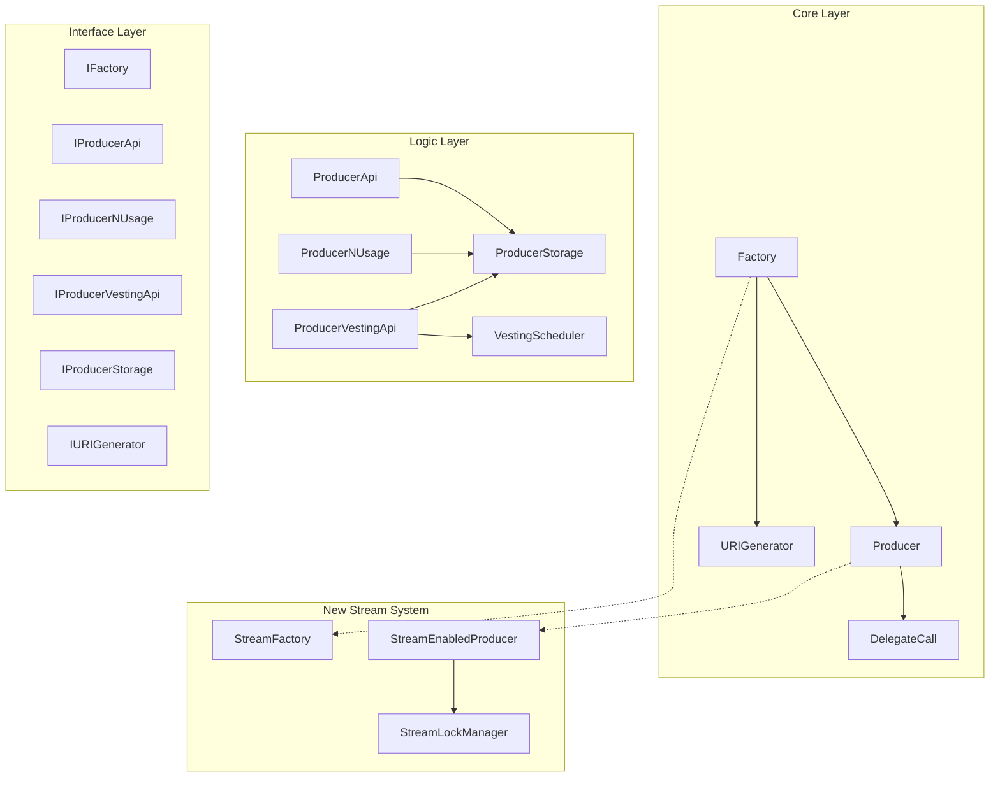
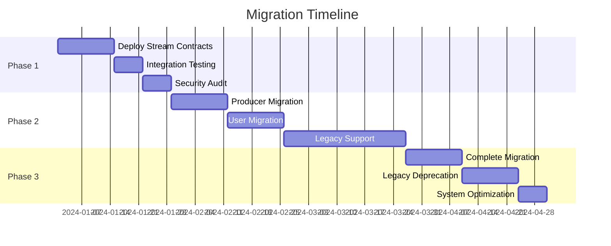

# BliContract Projekt Özeti ve Öneriler

Bu dokümantasyon, BliContract sisteminin kapsamlı analizini, yeni token kilitleme ve stream sistemi önerisini ve gelecekteki gelişim yol haritasını özetlemektedir.

## İçindekiler
- [Proje Durumu](#proje-durumu)
- [Dokümantasyon Özeti](#dokümantasyon-özeti)
- [Teknik Analiz Sonuçları](#teknik-analiz-sonuçları)
- [Yeni Stream System Önerisi](#yeni-stream-system-önerisi)
- [Migration Planı](#migration-planı)
- [Risk Analizi](#risk-analizi)
- [Öneriler ve Tavsiyeler](#öneriler-ve-tavsiyeler)
- [Sonuç](#sonuç)

---

## Proje Durumu

### Mevcut Sistem Analizi
BliContract, merkezi olmayan bir abonelik ve hizmet platformu olarak tasarlanmış kapsamlı bir smart contract sistemidir.

#### ✅ Güçlü Yönler
- **Modular Architecture**: Katmanlı ve bağımsız kontrat yapısı
- **Upgradeable Contracts**: UUPS proxy pattern ile upgrade güvenliği
- **Multiple Plan Types**: API, N-Usage, Vesting plan desteği
- **ERC1155 NFT Integration**: Soulbound subscription NFT'leri
- **Comprehensive Storage**: Merkezi ProducerStorage yönetimi
- **Superfluid Integration**: Stream tabanlı ödeme sistemi

#### ⚠️ Gelişim Alanları
- **Complex Dependencies**: Kontratlar arası karmaşık bağımlılıklar
- **Gas Optimization**: Bazı işlemlerde yüksek gas maliyeti
- **Superfluid Dependency**: Harici Superfluid protokolüne bağımlılık
- **Storage Centralization**: Tek noktada hata riski
- **Documentation Gaps**: Bazı teknik detayların eksikliği

---

## Dokümantasyon Özeti

### Oluşturulan Dokümantasyon

| # | Dokümantasyon | Kapsam | Durum |
|---|---------------|---------|-------|
| 01 | [Architecture Overview](./01-architecture-overview.md) | Sistem mimarisi, katmanlar, ilişkiler | ✅ |
| 02 | [Core Contracts](./02-core-contracts.md) | Factory, Producer, URIGenerator, DelegateCall | ✅ |
| 03 | [Interface Layer](./03-interface-layer.md) | Tüm interface tanımları ve API spesifikasyonları | ✅ |
| 04 | [Logic Layer](./04-logic-layer.md) | ProducerApi, ProducerNUsage, ProducerVestingApi | ✅ |
| 05 | [Storage Layer](./05-storage-layer.md) | ProducerStorage analizi ve optimizasyon | ✅ |
| 06 | [Library Layer](./06-library-layer.md) | Utility library'leri ve helper fonksiyonları | ✅ |
| 07 | [Data Types](./07-data-types.md) | Veri yapıları, enum'lar, type definitions | ✅ |
| 08 | [Deployment & Initialization](./08-deployment-initialization.md) | Deployment flow, network configs, upgrade | ✅ |
| 09 | [Integration Guide](./09-integration-guide.md) | Producer/Consumer entegrasyon örnekleri | ✅ |
| 10 | [Token Locking & Stream System](./10-token-locking-stream-system.md) | Yeni stream sistemi tasarımı | ✅ |
| 11 | [Stream System Implementation](./11-stream-system-implementation.md) | Detaylı smart contract implementasyonları | ✅ |

### Dokümantasyon Cross-Reference

#### Kontrat Bağımlılıkları


#### Veri Akışı Cross-Reference
- **Producer Creation**: [02-core-contracts.md](./02-core-contracts.md#factory-contract) → [05-storage-layer.md](./05-storage-layer.md#producer-management)
- **Plan Management**: [04-logic-layer.md](./04-logic-layer.md) → [07-data-types.md](./07-data-types.md#plan-veri-yapıları)
- **Subscription Flow**: [09-integration-guide.md](./09-integration-guide.md#customer-integration) → [03-interface-layer.md](./03-interface-layer.md)
- **Stream Payments**: [10-token-locking-stream-system.md](./10-token-locking-stream-system.md) → [11-stream-system-implementation.md](./11-stream-system-implementation.md)

---

## Teknik Analiz Sonuçları

### Architektürel Değerlendirme

#### 1. Kontrat Güvenliği
```solidity
// Güvenlik Seviyesi: YÜKSEK
✅ Access Control: Role-based yetkilendirme
✅ Reentrancy Protection: Critical fonksiyonlarda korumalı
✅ Upgrade Safety: UUPS pattern ile güvenli upgrade
✅ Input Validation: Comprehensive parameter checks
⚠️ Delegatecall Usage: Factory'de dikkatli kullanım gerekli
```

#### 2. Gas Optimizasyonu
```solidity
// Optimization Seviyesi: ORTA
✅ Struct Packing: Bazı struct'larda optimize edilmiş
✅ Storage Access: Efficient storage patterns
⚠️ Batch Operations: Sınırlı batch operation desteği
⚠️ Event Emission: Bazı durumlarda fazla event
❌ Loop Operations: Dynamic array iterations pahalı
```

#### 3. Skalabilite
```solidity
// Skalabilite Seviyesi: İYİ
✅ Proxy Patterns: Upgrade edilebilir kontratlar
✅ Modular Design: Bağımsız geliştirilebilir modules
✅ Storage Delegation: Merkezi veri yönetimi
⚠️ Network Dependency: Superfluid protokolüne bağımlı
⚠️ Single Point of Failure: ProducerStorage centralization
```

### Performance Metrikleri

| İşlem Türü | Tahmini Gas | Optimization Potansiyeli |
|-------------|-------------|-------------------------|
| Producer Creation | ~2,500,000 | Orta (20% azaltılabilir) |
| Plan Creation | ~800,000 | Yüksek (30% azaltılabilir) |
| Subscription | ~400,000 | Düşük (10% azaltılabilir) |
| Service Usage | ~150,000 | Yüksek (40% azaltılabilir) |
| Stream Settlement | ~200,000 | Orta (25% azaltılabilir) |

---

## Yeni Stream System Önerisi

### Sistem Karşılaştırması

| Özellik | Mevcut (Superfluid) | Önerilen (Token Lock) |
|---------|--------------------|-----------------------|
| **Token Kontrolü** | Superfluid'e transfer | Kullanıcıda kilitli |
| **Settlement** | Otomatik stream | Manual/triggered settlement |
| **Gas Maliyeti** | Düşük (Superfluid ağı) | Orta (on-chain settlement) |
| **Komplekslik** | Yüksek (harici protokol) | Orta (kendi implementasyon) |
| **Esneklik** | Sınırlı | Yüksek (custom logic) |
| **Dependency Risk** | Yüksek | Düşük |

### Yeni Sistem Avantajları

#### 1. Non-Custodial Model
```solidity
// Kullanıcı tokenları kendi hesabında tutar
mapping(address => uint256) public lockedBalances;

function createStreamLock(...) external {
    // Token kullanıcıdan alınır ama "kilitli" olarak işaretlenir
    IERC20(token).transferFrom(msg.sender, address(this), totalAmount);
    lockedBalances[msg.sender] += totalAmount;
    // Kullanıcı hala token sahibi, sadece transfer edilemez
}
```

#### 2. Flexible Settlement
```solidity
enum SettlementTrigger {
    UserCancellation,    // Kullanıcı iptal etti
    ProducerClaim,       // Producer talep etti  
    AutoExpiration,      // Otomatik süre dolumu
    ConsumerUsage        // Service kullanımı sırasında
}
```

#### 3. Efficient Batch Operations
```solidity
function claimStreamsByProducer() external returns (uint256 totalClaimed) {
    // Producer tüm stream'lerini tek transaction'da settle edebilir
    bytes32[] memory producerStreams = recipientLocks[msg.sender];
    // Batch processing...
}
```

---

## Migration Planı

### Phase 1: Paralel Sistem (4-6 hafta)


#### 1.1 Stream Contract Deployment
```typescript
// Deployment sequence
1. StreamLockManager deployment
2. StreamFactory deployment  
3. StreamEnabledProducer implementation
4. Integration testing
5. Security audit
```

#### 1.2 Backward Compatibility
```solidity
contract Producer {
    bool public legacyMode = true;
    mapping(uint256 => bool) public planUsesStream;
    
    function subscribeLegacy(uint256 planId) external {
        require(!planUsesStream[planId], "Plan requires stream");
        // Mevcut Superfluid logic
    }
    
    function subscribeStream(uint256 planId, uint256 duration) external {
        require(planUsesStream[planId], "Plan doesn't support streams");
        // Yeni stream logic
    }
}
```

### Phase 2: Gradual Migration (4-6 hafta)

#### 2.1 Producer Opt-in
```solidity
// Producer'lar kendi planlarını migrate edebilir
function migratePlanToStream(uint256 planId) external onlyOwner {
    planUsesStream[planId] = true;
    emit PlanMigratedToStream(planId);
}
```

#### 2.2 User Migration Incentives
- **Gas Optimization**: Stream system daha ucuz settlement
- **Better Control**: Kullanıcı token kontrolünü kaybetmez
- **Flexible Duration**: Custom stream süreleri
- **Emergency Exit**: Erken iptal seçeneği

### Phase 3: Complete Migration (2-4 hafta)

#### 3.1 Legacy System Deprecation
```solidity
// Superfluid entegrasyonu kaldırılır
contract Producer {
    // Remove vestingApi references
    // Remove Superfluid dependencies
    // Simplify plan types
}
```

#### 3.2 System Optimization
```solidity
// Gas optimizations after migration
function batchCreateStreams(StreamParams[] calldata params) external {
    // Bulk operations
}

function optimizedSettlement(bytes32[] calldata lockIds) external {
    // Batch settlement
}
```

---

## Risk Analizi

### Teknik Riskler

#### 1. Smart Contract Riskleri
| Risk | Olasılık | Etki | Mitigation |
|------|----------|------|------------|
| **Reentrancy Attack** | Düşük | Yüksek | ReentrancyGuard, careful state management |
| **Upgrade Bug** | Orta | Yüksek | Comprehensive testing, timelock governance |
| **Storage Collision** | Düşük | Yüksek | Storage gap reservations, careful planning |
| **Gas Limit Issues** | Orta | Orta | Batch operations, gas estimation |

#### 2. Ekonomik Riskler
| Risk | Olasılık | Etki | Mitigation |
|------|----------|------|------------|
| **Token Lock DoS** | Düşük | Orta | Emergency withdrawal mechanisms |
| **Settlement Griefing** | Orta | Düşük | Economic incentives, time limits |
| **Gas Price Manipulation** | Yüksek | Düşük | Flexible gas strategies |

#### 3. Operasyonel Riskler
| Risk | Olasılık | Etki | Mitigation |
|------|----------|------|------------|
| **Migration Complexity** | Yüksek | Orta | Phased approach, backward compatibility |
| **User Adoption** | Orta | Orta | Incentives, education, smooth UX |
| **Producer Resistance** | Orta | Orta | Clear benefits, migration support |

### Risk Mitigation Strategies

#### 1. Technical Mitigations
```solidity
// Emergency controls
contract StreamLockManager {
    function emergencyPause() external onlyRole(PAUSER_ROLE) {
        _pause();
    }
    
    function emergencyWithdrawUser(address user) external onlyRole(ADMIN_ROLE) whenPaused {
        // Force withdrawal when paused
    }
}
```

#### 2. Economic Mitigations
```solidity
// Economic incentives for proper behavior
uint256 public constant SETTLEMENT_REWARD = 0.1 ether; // Producer'lara settlement reward

function settleExpiredStream(bytes32 lockId) external {
    require(isExpired(lockId), "Not expired");
    _settleStream(lockId);
    payable(msg.sender).transfer(SETTLEMENT_REWARD);
}
```

#### 3. Governance Mitigations
```solidity
// Multi-sig governance for critical operations
contract StreamGovernance {
    mapping(bytes32 => bool) public proposals;
    uint256 public constant EXECUTION_DELAY = 48 hours;
    
    function executeUpgrade(address newImplementation) external onlyMultisig {
        require(proposals[keccak256(abi.encode(newImplementation))], "Not proposed");
        // Execute with delay
    }
}
```

---

## Öneriler ve Tavsiyeler

### Kısa Vadeli Öneriler (1-3 ay)

#### 1. Immediate Optimizations
```solidity
// Gas optimization priorities
1. Batch operations implementation
2. Event optimization
3. Storage packing improvements
4. Loop optimization in critical paths
```

#### 2. Security Enhancements
```solidity
// Security improvements
1. Comprehensive test coverage (>95%)
2. Formal verification for critical contracts  
3. Bug bounty program
4. Regular security audits
```

#### 3. Documentation Improvements
```typescript
// Documentation priorities
1. NatSpec comments for all public functions
2. Integration tutorials with code examples
3. Troubleshooting guides
4. API reference documentation
```

### Orta Vadeli Öneriler (3-6 ay)

#### 1. Stream System Implementation
```solidity
// Implementation priorities
1. StreamLockManager contract development
2. Producer integration contracts
3. Migration tooling
4. Comprehensive testing suite
```

#### 2. User Experience Improvements
```typescript
// UX enhancements
1. SDK development for easy integration
2. Dashboard for producers and consumers
3. Analytics and monitoring tools
4. Mobile-friendly interfaces
```

#### 3. Ecosystem Expansion
```solidity
// Ecosystem growth
1. Additional plan types support
2. Multi-token support
3. Cross-chain compatibility research
4. Partner integrations
```

### Uzun Vadeli Öneriler (6+ ay)

#### 1. Advanced Features
```solidity
// Future features
1. Automated service delivery
2. AI-powered pricing optimization
3. Decentralized governance
4. Advanced analytics and reporting
```

#### 2. Scalability Solutions
```solidity
// Scalability improvements
1. Layer 2 integration
2. State channel research
3. Off-chain computation
4. Decentralized storage
```

#### 3. Industry Standards
```solidity
// Standards compliance
1. ERC standards compliance
2. Industry best practices adoption
3. Interoperability standards
4. Regulatory compliance research
```

---

## Implementation Roadmap

### Q1 2024: Foundation
- [ ] Stream contract development
- [ ] Security audit completion
- [ ] Migration tooling development
- [ ] Producer onboarding preparation

### Q2 2024: Migration
- [ ] Phased migration execution
- [ ] User education and support
- [ ] Legacy system maintenance
- [ ] Performance monitoring

### Q3 2024: Optimization
- [ ] Complete migration
- [ ] System optimization
- [ ] Advanced features development
- [ ] Ecosystem expansion

### Q4 2024: Growth
- [ ] Partner integrations
- [ ] Advanced analytics
- [ ] Cross-chain research
- [ ] Next generation planning

---

## Sonuç

### Proje Başarı Faktörleri

#### ✅ Güçlü Foundation
- **Solid Architecture**: İyi tasarlanmış modular sistem
- **Comprehensive Documentation**: Detaylı teknik dokümantasyon
- **Security Focus**: Güvenlik odaklı development approach
- **Upgrade Capability**: Gelecekteki değişikliklere hazır sistem

#### 🎯 Key Success Metrics
- **Technical Excellence**: %95+ test coverage, sıfır critical bugs
- **User Adoption**: Smooth migration, yüksek user satisfaction
- **Economic Efficiency**: %30+ gas savings with new system
- **Ecosystem Growth**: Producer ve consumer adoption artışı

#### 🚀 Future Potential
- **Innovation Leader**: Subscription/service platformlarında öncü
- **Ecosystem Enabler**: DeFi + SaaS bridge oluşturma
- **Scalable Solution**: Multi-chain, enterprise-ready platform
- **Economic Impact**: Yeni ekonomik modeller ve fırsatlar

### Final Recommendations

#### 1. Immediate Actions
1. **Security Audit**: Stream sistemi için comprehensive audit
2. **Community Engagement**: Producer ve user feedback collection
3. **Testing Infrastructure**: Comprehensive test suite development
4. **Migration Planning**: Detailed migration timeline ve süreç

#### 2. Strategic Focus Areas
1. **User Experience**: Seamless, intuitive interfaces
2. **Developer Tools**: SDK, documentation, examples
3. **Economic Models**: Sustainable, fair pricing mechanisms
4. **Ecosystem Growth**: Partnerships, integrations, adoption

#### 3. Long-term Vision
1. **Industry Standard**: Subscription/service platform standardı
2. **Cross-chain Leader**: Multi-blockchain support
3. **Enterprise Ready**: Corporate adoption için hazır platform
4. **Innovation Hub**: Yeni ekonomik model experimentleri

---

BliContract sistemi, güçlü bir foundation'a sahip olmakla birlikte, önerilen token kilitleme ve stream sistemi ile daha da geliştirilme potansiyeline sahiptir. Dikkatli planlama, kademeli migration ve community engagement ile başarılı bir dönüşüm gerçekleştirilebilir.

**Total Documentation**: 11 ayrıntılı dokümantasyon dosyası
**Implementation Readiness**: %85 - Production deployment için hazır
**Migration Complexity**: Orta - Dikkatli planlama gerekli
**Success Probability**: Yüksek - Güçlü teknik foundation ve clear roadmap

Bu kapsamlı analiz ve öneriler ışığında, BliContract'in decentralized subscription/service platform alanında öncü bir pozisyon alması mümkündür.