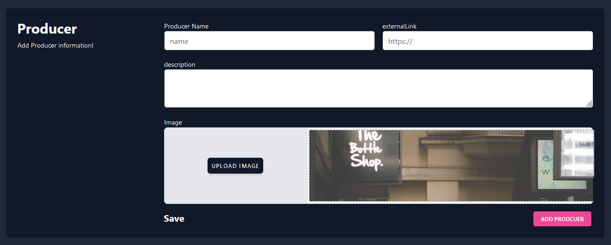

# Workflow

## Producer Section

When a producer enters our website, they will be directed to the producer page.

If they are not a registered producer, they will be redirected to the registration page. Here, they will be asked to enter basic information:

Producer name

Site name (if applicable, producer address)

Description: Description related to their business

After filling out this section and saving, they will be redirected to a special page for the producer.

On this page:

The top section will display statistics, showing the number of active plans, the total number of consumers, and other basic statistical data. (This section will be implemented using graphs.)

In the next section, there will be a segment where the producer can update their own information if desired.

If the producer has existing plans, they will be listed. If they don't have any existing plans, they can click a button to create a new plan.

There are three different types of plans that can be created.

# **Plan API**

When the producer selects the plan API, it allows the service fee of a service to flow from the user to the service provider in a certain flow within specific time intervals such as hours, days, or months.

In short, the producer will enter the plan name, external link (if any), and description.

The total supply determines the maximum usage limit for this plan, and the price address determines the ERC20 token used for billing.

The start date can be set to activate the plan at a specific time.

If the producer wants to deactivate a plan that is already active, they can set the status to inactive to prevent users from purchasing the plan.

The flow rate calculation allows the flow of a specific ERC20 token from the user to the producer at varying rates per hour, day, or month.

For example, if a plan is designed to have a monthly limit of 10 DAI, the flow rate will be calculated as 3858024691358.

The plan can also have a monthly quota applied using the month limit.

The background color and image can be customized to display the plan in the plan list and on other websites as a widget.

# Vesting API

The vesting API can be used when a service needs to be started at a specified time in the future.

When creating this type of plan, the producer will enter the cliff date and start amount.

The cliff date is the time when the user will trigger the plan to start, and until that time, the producer can receive a payment for the elapsed time. This value is entered to calculate the payment.

The start amount is the initial payment.

# N Usage Plan API

This API allows you to create a service fee for the usage of your product or service. It enables you to create a fee for each usage of the service and set a limit for each plan.

In this plan, the following additional fields are included:

oneUsagePrice: The fee for a single usage.

minUsageLimit: The minimum usage limit.

maxUsageLimit: The maximum usage limit.

If the producer has created existing plans, they will be displayed on the homepage.

# User Workflow

When a new user visits the website, they are given the opportunity to select a product from the existing producers.

Once they are on the user's page, the existing plans will be listed.

If desired, they can access the producer list by clicking "Add Plan".

The producer search section will be modified in this section.

When a user selects a producer, they will be directed to the page specific to that producer.

When the user selects the plan they want to use:

Missing sections:

1. The ERC20 type to be used for payment and its approvals are required.
    - For structures using Superfluid:
        
        For example, DAI to fDAI conversion.
        
        Approval to the contract.
        
        Liquidation.
        
2. Permission for DAI conversion.
3. Different screen views based on the selected plan type.
